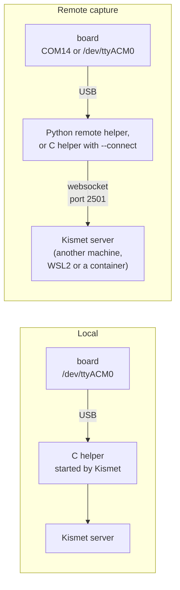

This page helps you decide where the Kismet server runs and how your ESP32-C5 boards reach it. Read it before you pick an install page: each setup below says what it costs, what was tested, and which page walks you through it.

## Two routes from a board to Kismet

Every setup is one of two routes:

- **Local:** the boards are plugged into the machine that runs the Kismet server. Kismet starts the C helper (`kismet_cap_esp32c5`) once for each source.
- **Remote capture:** the boards are plugged into another machine, or into Windows on the same PC with the Kismet server in WSL2 or Docker Desktop. A helper where the boards are opens them and sends them to the Kismet server over Kismet's remote capture, on the server's web port (2501). This is the route for boards on a Windows PC.

Either way, the Kismet server has to know the `esp32c5` source type. No Kismet release includes it yet, so the server is either Kismet built from source with this project's [`kismet/add-to-kismet.sh`](https://github.com/oshri-almog/esp32c5-kismet-wifi-interface/blob/main/kismet/add-to-kismet.sh) applied, or this project's Docker image, which is built the same way. A Kismet from a distribution package cannot use these boards.

Every setup also needs this project's firmware on the boards, and that part is the same for all of them: the [web flasher](https://oshri-almog.github.io/esp32c5-kismet-wifi-interface/) installs it from Chrome or Edge 89 or newer on any desktop computer, with nothing to install, and the board can then go to whichever machine it is to feed. [Flashing the Firmware](Flashing-the-Firmware) also has esptool, for a machine without a desktop browser such as a Pi with no screen, and the ESP-IDF build.

## Setups at a glance

| Setup | Boards plug into | Kismet server runs on | Helper | Tested | Install page |
|---|---|---|---|---|---|
| Raspberry Pi or Linux, boards attached | the Pi or PC | the same machine, built from source | C helper, started by Kismet | Yes: Raspberry Pi 4, four boards on the hub, four sources at once | [Install on Raspberry Pi](Install-on-Raspberry-Pi), [Install on Linux](Install-on-Linux) |
| Raspberry Pi or Linux with Docker | the Pi or PC | a container on the same machine | C helper, inside the container | Yes: Raspberry Pi 4 (arm64), four boards in the container, with the current image. amd64: the fake board only | [Install with Docker](Install-with-Docker) |
| Windows boards, Kismet in WSL2 or Docker Desktop | the Windows PC, as COM ports | WSL2 or Docker Desktop on the same PC | Python remote helper | Yes: Windows 11 with boards on COM ports, into WSL2 and Docker Desktop (Docker Desktop with an earlier version of the helper) | [Install on Windows](Install-on-Windows) |
| WSL2 with boards attached by usbipd | the Windows PC, passed into WSL2 | WSL2 | C helper, started by Kismet | No. WSL2 was tested with the fake board only | [Install on WSL2](Install-on-WSL2) |
| Remote boards feeding a central Kismet | one or more other machines | one central Linux machine or container | C helper with `--connect`, the Docker image's `helper` role, or the Python remote helper | Yes: from a Windows PC to a Pi across a LAN, and on one Pi to its own Kismet. Two Linux machines: not yet | [Remote Capture](Remote-Capture) |
| No hardware | nothing | a Docker container | C helper, reading the fake board | Yes: the current image on amd64 and arm64, and Docker Desktop on Windows 11 (an earlier build of the image) | [Try It Without Hardware](Try-It-Without-Hardware) |

"An earlier build of the image" means an image built from earlier versions of the helpers, the image's start-up script and `compose.yaml`. The current image passes its smoke test in the project's CI on amd64 and arm64 with the fake board, in all three radios and in the `helper` role, and ran with the Pi's four boards on 2026-10-02. The first runs with real boards on 2026-10-02, on the Pi and on Windows, used the helpers as of commit `f8e6792`. Later that day the current helpers, with their changes since then (to redirects, proxies, the websocket's `Host` header, some messages and stopping), ran with the Pi's boards, four sources at once among them; and the current Python remote helper ran on Windows with a board, feeding Kismet in WSL2 (not yet the Pi across the LAN).

The sections below give the pros and cons of each.

## Raspberry Pi or Linux, boards attached

The boards plug into the Pi or Linux PC that runs Kismet. You write one source definition per board, such as `esp32c5-ttyACM0` or `esp32c5zigbee-ttyACM1`, and Kismet does the rest.

**Pros**

- Everything is on one machine. Kismet starts and stops the C helper itself; there is no second program to keep running.
- Kismet re-opens a local source by itself 5 s after an error. Measured on the Pi: the helper was killed, and the source was capturing again 6.4 s later.
- A source is capturing soon after Kismet launches it: after 1 to 1.5 s when the board was already on the requested radio, and about 1.5 s when it had to switch radio first.
- Boards keep stable names under `/dev/serial/by-id/`, whichever `ttyACM` number they get.
- A source whose board is not plugged in yet waits for it: Kismet shows the reason as the source's error and tries again every 5 s, so a board plugged in later is picked up.

**Cons**

- Kismet has to be built from source. On a Raspberry Pi 4 with 8 GB, `make -j4` took about 78 minutes. At its peak, three large files were compiling at once and left about 1.1 GB of the 8 GB free, so a Pi with less memory needs fewer parallel jobs (see [Building Kismet with ESP32-C5 Support](Building-Kismet-with-ESP32-C5-Support)).
- The build has been run on Debian 13 (the Pi) and Ubuntu 24.04 (in WSL2) only. Fedora, Arch and other distributions are untested.

**Tested:** a Raspberry Pi 4, 8 GB, Debian 13 "trixie" arm64, with four boards on a powered USB hub. Kismet captured Wi-Fi on both bands, Zigbee/Thread (200 of 200 test frames sent by a second board), and BLE advertising. Four sources ran at once, two on Wi-Fi, one on 802.15.4 and one on BLE; this was last run on 2026-10-02, with the current helpers and this project's firmware (image 01a50bd6), and ran clean apart from one board that sometimes hangs on its switch to BLE at a start where other boards switch radio too (see [Troubleshooting](Troubleshooting#a-board-stops-answering-after-a-radio-switch)).

**Install:** [Install on Raspberry Pi](Install-on-Raspberry-Pi) or [Install on Linux](Install-on-Linux).

## Raspberry Pi or Linux with Docker

The project's image holds Kismet with the C helper built in. [`compose.yaml`](https://github.com/oshri-almog/esp32c5-kismet-wifi-interface/blob/main/compose.yaml) gives the container the boards' USB serial devices, a web login, and volumes for the logs and the login.

**Pros**

- No Kismet build on the host: the images are published at `ghcr.io/oshri-almog/esp32c5-kismet`, for amd64 and arm64, and pull without a login.
- With no source definitions given, the container makes one Wi-Fi source for each board it finds.
- A board that is plugged in again, or comes back as another `ttyACM` number, gets its device node in the container within about a second, along with the same `/dev/serial/by-id/` link as on the host, so definitions written with those links work in the container too.
- No extra privileges: `compose.yaml` adds no capability to Docker's default set and lets the container use only the boards' USB serial device classes (166 and 188). The C helper drops all of its own capabilities.
- While the container captures from a board, the host and other containers cannot open it: another capture is refused with `... is already in use by another capture ...`, and esptool cannot open the port.
- Updating is a pull and a restart instead of a rebuild.

**Cons**

- Changing the image, or trying another Kismet commit, means building it yourself. The first build took 18.5 minutes on a fast Windows PC (20 cores, 16 GB) and about 80 minutes on a Raspberry Pi 4 with 8 GB, almost all of it compiling Kismet. Later builds reuse the compiled Kismet.
- Kismet runs as root inside the container.
- A program run with `sudo`, such as `sudo esptool`, is not kept out of a board the container is using. Stop the container before you flash its boards.
- A Raspberry Pi needs a 64-bit OS; there is no 32-bit ARM image.
- On the test Pi, Debian's `docker.io` packages did not include Docker Compose. [Install with Docker](Install-with-Docker) gives the plain `docker` commands for that case, and how to get Docker's own packages, which include Compose.

**Tested:** on the Raspberry Pi 4 (arm64), with the current image on 2026-10-02: the container found the four boards by itself and all four captured Wi-Fi; four sources named by their `/dev/serial/by-id/` links, on Wi-Fi, 802.15.4 and BLE, all ran; the host could not open a board the container held; and the `helper` role fed two boards to a Kismet outside Docker. The image also passes its smoke test with the fake board on amd64 and arm64 in the project's CI.

**Install:** [Install with Docker](Install-with-Docker); every setting is in [Docker Reference](Docker-Reference).

## Windows boards, Kismet in WSL2 or Docker Desktop

Kismet does not run on Windows, and Docker Desktop's containers cannot see COM ports. So the Python remote helper runs on Windows, opens the boards on their COM ports, and sends them over remote capture to a Kismet server in WSL2 or in a Docker Desktop container on the same PC.

**Pros**

- The boards stay ordinary COM ports; nothing has to be passed through to Linux.
- Nothing to compile on Windows: the helper needs Python 3.10 or newer and three packages (pyserial, msgpack, websocket-client).
- A Docker Desktop container that only receives remote sources needs no device rules.
- The helper reconnects by itself, 5 s after each failed attempt (on Windows a refused attempt takes about 2 s of its own, so they come about 7 s apart). After a `docker restart` of the Kismet container on Windows, it was capturing again 7 s later; after Kismet in WSL2 was restarted, 2.4 to 4.5 s after Kismet's port answered; on the Pi, after Kismet was restarted, 2 to 5 s after Kismet was back.

**Cons**

- Two things to run: the Kismet server and the helper.
- Remote capture needs a login or an API key with the `datasource` role. The helpers send either in an HTTP header, so any password works, `&`, spaces and `%` included. The one login that cannot work is a user name containing `:` together with an `&` anywhere in the login; the helper warns about it, and an API key is the way round it.
- Now and then Windows puts a board into a state where it reports error 31, "A device attached to the system is not functioning". Unplugging the board and plugging it back in cleared it.

**Tested:** Windows 11 with two boards on COM30 and COM32, feeding Kismet in WSL2 (Ubuntu 24.04) and in Docker Desktop (an earlier build of the image), with a login and with an API key. Wi-Fi on both bands and BLE captured; an 802.15.4 source ran and hopped, and received nothing, as expected with no Zigbee or Thread equipment nearby. These runs used an earlier version of the Python remote helper. On 2026-10-02 the helper as of commit `f8e6792` ran again with one board, from PowerShell, cmd and Git Bash, into Kismet in WSL2 (Wi-Fi) and on a Raspberry Pi across the LAN (all three radios). Later that day the current helper, with its changes since then, ran on Windows with the same board, feeding Kismet in WSL2: all three radios, a Kismet restart, a refused login, two helpers on one board, and stopping; it has not yet fed the Pi across the LAN.

**Install:** [Install on Windows](Install-on-Windows) for the helper, and [Install on WSL2](Install-on-WSL2) or [Install with Docker](Install-with-Docker) for the Kismet server. If the server is a Raspberry Pi instead, follow [Guide: Windows Boards to a Pi](Guide-Windows-Boards-to-a-Pi).

## WSL2 with boards attached by usbipd

[usbipd-win](https://github.com/dorssel/usbipd-win) passes a USB device from Windows into WSL2. A board attached this way would appear in WSL2 as `/dev/ttyACM0`, and Kismet and the C helper would run as on any Linux machine.

**Pros**

- A single Linux setup inside a Windows PC, with local sources that Kismet re-opens after errors.
- No Python remote helper on the Windows side.

**Cons**

- Not tested: nobody has attached a board with usbipd for this project yet.
- Every board has to be attached with usbipd, and how the attachment behaves when a board reboots to change radio has not been checked. On the Pi, some radio switches made a board's USB device drop off and come back within about 0.3 to 2.5 s; through usbipd such a board may need attaching again.
- Kismet has to be built in WSL2. There, a plain `make install` fails because WSL2 has no `kismet` group, and `make -j20` ran the PC out of memory; use `-j4` at most. [Install on WSL2](Install-on-WSL2) has the fixes.

**Tested:** Kismet was built in WSL2 Ubuntu 24.04 and tested with the fake board. Boards through usbipd: not tested.

**Install:** [Install on WSL2](Install-on-WSL2).

## Remote boards feeding a central Kismet

Boards on one or more machines, say a Pi in another room and a laptop, each with a helper that connects to one Kismet server.

**Pros**

- One Kismet sees boards spread over several places.
- A source keeps its identity across reconnects. Its UUID is made from the board's MAC and the radio, so Kismet recognises it when it comes back.
- Three choices of helper on the machine with the boards:
  - the Python remote helper, which needs no build;
  - the Docker image in its `helper` role, which runs the C helper;
  - the C helper from a Kismet source build on that machine.
- Quick to start: on the Pi, the first packet reached Kismet about 1.2 s after the C helper was started with `--connect` over the websocket, about 1.6 s over the legacy TCP port, and about 1.4 s after the Python remote helper was started; packets then came every second.

**Cons**

- Kismet never re-opens a remote source itself; the helper has to reconnect. All three do.
- Kismet's controls reach a remote source less far. Closing it in Kismet lasts only until its helper reconnects, 5 s later: to stop it, stop the helper. And a source that reconnects keeps any option of its earlier definition that the new one leaves out: a source once locked with `channel_hop=false` in its definition stays locked after the definition drops that option, until Kismet restarts. A channel set live in Kismet is lost when the helper reconnects.
- The websocket on port 2501 needs a login or an API key with the `datasource` role.
- Kismet's legacy TCP remote capture port, 3501, has no authentication and listens on 127.0.0.1 only by default.

**Tested:** on the Pi, both helpers fed the Pi's own Kismet over the websocket, and the C helper also over the legacy TCP port; the Docker `helper` role of the current image fed it two boards on 2026-10-02, with an API key and with logins, and passes the smoke test with the fake board, from one container to another. On 2026-10-02 both current helpers fed it with the Pi's boards again, through a logging relay and an HTTP proxy, and the C helper also through TLS. The project's end-to-end tests run both current helpers against a real Kismet and the fake board over the websocket, and the Python remote helper also over the legacy TCP port; they passed in WSL2 and on the Pi. The Windows setups above use the same remote capture, and a Windows PC fed Kismet on the Pi across a LAN on 2026-10-02. Two separate Linux machines have not been tested.

**Install:** [Remote Capture](Remote-Capture); the `helper` role is in [Install with Docker](Install-with-Docker).

## No hardware: the demo

The demo image runs Kismet with a fake board. Like a real board it runs one radio at a time, chosen when the container starts: on Wi-Fi it makes up access points on both bands, on Zigbee two 802.15.4 nodes, on BLE one advertiser.

**Pros**

- No board and no flashing. You see what Kismet shows for each radio before you buy or flash anything.
- It should run wherever Docker runs, since no USB device is involved. It has run on Docker Desktop for Windows, on the Raspberry Pi, and in the project's CI on amd64 and arm64 Linux.

**Cons**

- The traffic is made up; nothing is received from the air.
- The first run downloads the demo image, about 60 MB.

**Tested:** the current image in the project's CI, all three radios, on amd64 and arm64 Linux. Docker Desktop on Windows 11, all three radios, with an earlier build of the image and with the published `v0.1.0` image. The Raspberry Pi 4, Wi-Fi, with the current image. Not run on macOS yet.

**Install:** [Try It Without Hardware](Try-It-Without-Hardware).

## macOS and the BSDs

Neither helper has been run on macOS or a BSD, and Kismet has not been built there for this project. [Install on macOS and BSD](Install-on-macOS-and-BSD) says what is expected to work and what is not.

## Which helper do I need

| | C helper | Python remote helper |
|---|---|---|
| Program | `kismet_cap_esp32c5` | `python -m esp32c5_kismet.remote` |
| What it is | C, on Kismet's capture framework, from [`kismet/capture_esp32c5/`](https://github.com/oshri-almog/esp32c5-kismet-wifi-interface/blob/main/kismet/capture_esp32c5/capture_esp32c5.c) | Python, from [`esp32c5_kismet/`](https://github.com/oshri-almog/esp32c5-kismet-wifi-interface/blob/main/esp32c5_kismet/remote.py) |
| Where you get it | Built with Kismet after `add-to-kismet.sh`; also in the Docker image | The repository, with `pip install -r requirements.txt` |
| Runs on | Linux (tested on the Pi, WSL2 and in Docker). Other POSIX systems untested | Any OS with Python 3.10 or newer. Tested on Windows 11 and Linux |
| Local sources, started by Kismet | Yes | No |
| Remote capture | Yes, with `--connect` | Yes; it is all it does |
| Finds boards without being told the port | On Linux only | On Windows and Linux; macOS untested |

Rules of thumb:

- **Boards plugged into the Linux machine that runs Kismet:** the C helper. Kismet runs it for you; you only write source definitions.
- **Boards on a Windows PC:** the Python remote helper.
- **Boards on another Linux machine:** whichever is easiest there. With Kismet built on that machine, the C helper with `--connect`. With Docker, the image's `helper` role. With neither, the Python remote helper, which needs no build.

Both helpers use the same source names (`esp32c5-ttyACM0`, `esp32c5zigbee-COM14`, `esp32c5btle-ttyACM1`), give a board the same UUID for each radio, and follow the same channel rules, so Kismet treats a board the same whichever helper feeds it; on the Pi both gave each board the same UUID per radio and the same hardware label. A board captures with one radio at a time, so it can be the source of only one helper at a time. [Source Definitions](Source-Definitions) explains the names, and [Command-Line Reference](Command-Line-Reference) lists both helpers' options.
