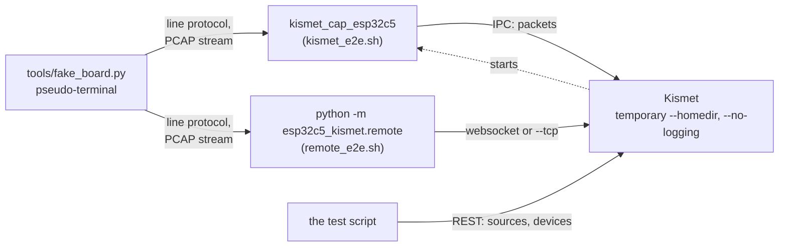

This page is for contributors: how the repository is laid out, which tests exist, what each one needs and checks, and how to test on real boards. How to report a problem or send a change is on [Contributing](Contributing).

## Repository layout

```text
firmware/                      ESP-IDF 5.5 project: the board's firmware
  main/esp32c5_sniffer.c       the whole firmware, in one file
  main/Kconfig.projbuild       the menuconfig options ("Packet Sniffer Configuration")
  sdkconfig.defaults           the build settings a fresh clone starts from
  partitions.csv               the partition table (needs 2 MB of flash or more)
kismet/                        the Kismet side, GPL-2.0-or-later (COPYING.md says why)
  datasource_esp32c5.h         the server-side source type "esp32c5"
  capture_esp32c5/             the C helper kismet_cap_esp32c5: capture_esp32c5.c, Makefile.in
  add-to-kismet.sh             copies both into a Kismet source tree and wires them into its build
esp32c5_kismet/                the Python remote helper (python -m esp32c5_kismet.remote)
  board.py                     the serial link to a board: port lock, handshake, stream parser
  kismet_v3.py                 Kismet's external capture protocol, version 3
  remote.py                    the command line, source definitions and connections to Kismet
docker/                        Dockerfile, entrypoint.sh, kismet_site.conf
compose.yaml                   the kismet, demo and helper services
tools/fake_board.py            a pseudo-terminal that behaves like a board
tests/
  test_board.py                offline: the Python remote helper's link to a board
  test_kismet_v3.py            offline: the Python remote helper's Kismet side
  c/run.sh, c/test_parser.c    the C parser harness for the C helper
  kismet_e2e.sh                fake board -> C helper -> a real Kismet
  remote_e2e.sh                fake board -> Python remote helper -> a real Kismet
  docker_smoke.sh              the demo image, no hardware
docs/wiki/                     the pages of this wiki
.github/workflows/docker.yml   CI: builds, smoke-tests and publishes the Docker image
.github/dependabot.yml         monthly updates of the pinned GitHub Actions
requirements.txt               the Python remote helper's packages
README.md, CREDITS.md, LICENSE the overview, credits and prior art, the MIT licence
```

- There is no Python package to install: no `setup.py`, no `pyproject.toml`. The Python remote helper and its tests run from the repository root.
- `firmware/build/`, `firmware/sdkconfig`, `.venv/` and capture files (`*.pcap`, `*.pcapng`, `*.kismet`) are git-ignored.
- `.gitattributes` keeps every text file LF on checkout, whatever `core.autocrlf` says. The scripts run on Linux and inside the Docker image, and a script with CRLF line endings does not start there.

## The tests at a glance

| Test | What it checks | Needs | Runs on | Last recorded result |
|---|---|---|---|---|
| `tests/test_board.py` | The Python remote helper's link to a board: stream framing, channel specs, port names, the port lock, the handshake against a fake board inside the test, finding a board by its MAC | Python and pyserial | Windows, Linux | 218 checks, `ALL OK` |
| `tests/test_kismet_v3.py` | The Python remote helper's Kismet side: protocol bytes, UUIDs compared with the C helper's, source definitions, one board per source, the 802.15.4 rewrap, the BTLE CRC fix-up, hopping, the command line, whole sessions against a fake Kismet over TCP and over a websocket, and over TLS when `openssl` is available <!-- VERIFY: the TLS (wss) session case is still in the final test_kismet_v3.py --> | Python and `requirements.txt`; `openssl` on the `PATH` for the TLS session | Windows, Linux | 254 checks, `ALL OK`, before the TLS session was added |
| `tests/c/run.sh` | The C helper: stream parser, 802.15.4 and BTLE handling, source names, `channel=`, the probe, `--list`, finding a board by MAC, the port lock, the remote login | gcc, and a Kismet tree patched with `add-to-kismet.sh` and built | Linux | 237 checks, `ALL OK` |
| `tests/kismet_e2e.sh` | The fake board, through the C helper, into a real Kismet | Kismet built with the esp32c5 source, python3, curl, port 2501 free | Linux | 46 checks, `ALL OK`, in two runs |
| `tests/remote_e2e.sh` | The fake board, through the Python remote helper, into a real Kismet, over the websocket and over legacy TCP | The same, plus a Python with `requirements.txt`; ports 2511 and 3511 free | Linux | 78 checks, `ALL OK` |
| `tests/docker_smoke.sh` | The demo image: each radio, then the `helper` role feeding Kismet in a second container | Docker, curl, Python | Linux, Windows (Git Bash) | 19 checks, `ALL OK`, on an older image |
| Real boards | What no fake can show: the radios, the USB port, `TXTEST` between boards | Two or more flashed boards | See [Testing on real hardware](#testing-on-real-hardware) | See that section |

Only the last row needs a board. CI runs only the Docker smoke test ([CI](#ci)); run the others yourself. The counts grow as tests are added.

### Which tests to run for a change

| You changed | Run |
|---|---|
| `esp32c5_kismet/` | `test_board.py` and `test_kismet_v3.py`; on Linux also `remote_e2e.sh` |
| `kismet/capture_esp32c5/capture_esp32c5.c` | `tests/c/run.sh`, `kismet_e2e.sh`, `remote_e2e.sh` (it checks that the C helper is refused a board the Python remote helper holds), the Docker smoke test |
| `kismet/datasource_esp32c5.h`, `kismet/add-to-kismet.sh`, `kismet/capture_esp32c5/Makefile.in` | Rebuild Kismet with the script, then everything in the row above |
| `tools/fake_board.py` | `kismet_e2e.sh`, `remote_e2e.sh`, the Docker smoke test |
| `docker/`, `compose.yaml`, `.dockerignore` | The Docker smoke test, and a check of each compose profile: `docker compose config -q`, `docker compose --profile demo config -q` and `docker compose --profile helper config -q` |
| `firmware/` | Build it, then the hardware checks. Nothing automated runs the firmware: every other test uses a fake board. |
| The line protocol or the stream format | All of the above, with the change made in both helpers and in the fake board |

## Setting up

### Python

On Linux, use a virtual environment in the repository root (`.venv` is git-ignored):

```bash
cd esp32c5-kismet-wifi-interface
python3 -m venv .venv
.venv/bin/python -m pip install -r requirements.txt
```

On Windows, in PowerShell:

```powershell
cd esp32c5-kismet-wifi-interface
python -m pip install -r requirements.txt
```

- `requirements.txt` asks for pyserial, msgpack and websocket-client 1.9.1 or newer. websocket-client 1.9.1 needs Python 3.10 or newer. <!-- VERIFY: the minimum Python version; only Python 3.12 (WSL2) and 3.13 (Windows, Pi) have run the helper -->
- On Debian and Ubuntu, install with pip into a virtual environment (`sudo apt install python3-venv` if `venv` is missing), not from apt. The packaged `python3-websocket` is 1.7.0 on Ubuntu 24.04 and 1.8.0 on Debian 13. Versions before 1.9.1 raise an error on Linux when Kismet resets the connection. The helper now recovers from that error, but install with pip so that you get 1.9.1 or newer. <!-- VERIFY: the final Python remote helper recovers from a connection reset with websocket-client 1.7.0 and 1.8.0, and requirements.txt still asks for >=1.9.1 -->

### Linux tools for the C harness and the end-to-end tests

- A Kismet source tree at commit cfe427074, patched with `kismet/add-to-kismet.sh`, configured, built and installed. Follow [Building Kismet with ESP32-C5 Support](Building-Kismet-with-ESP32-C5-Support). The examples on this page use the layout of the Raspberry Pi that was tested: the tree in `~/src/kismet`, Kismet installed to `~/kismet-install`.
- gcc (Debian's `build-essential`), python3 and curl.
- WSL2 works for all of it: the C harness and both end-to-end tests have run on WSL2. See [Install on WSL2](Install-on-WSL2).

> **Warning:** Build Kismet in WSL2 with `make -j4` at most. A `make -j20` there used up the host's memory, and the WSL distribution had to be terminated. On a Raspberry Pi 4 with 8 GB, `make -j4` took about 78 minutes.

## The offline Python tests

From the repository root, on Linux:

```bash
.venv/bin/python tests/test_board.py
.venv/bin/python tests/test_kismet_v3.py
```

On Windows:

```powershell
python tests/test_board.py
python tests/test_kismet_v3.py
```

- Neither file opens a serial port or needs Kismet. `test_board.py` has a fake board of its own inside the test. `test_kismet_v3.py` also plays Kismet, over TCP and over a websocket, and over a websocket with TLS when `openssl` is on the `PATH` to make a test certificate.
- `test_board.py` feeds the Python remote helper the same streams that `tests/c/test_parser.c` feeds the C helper, so both helpers are held to one parser rule.
- `test_kismet_v3.py` compares the Python remote helper's UUIDs with values compiled from the C helper's code.
- Each check prints a `PASS` line. The first `FAIL` stops the file with exit status 1. A clean run ends with `ALL OK` and exit status 0.

These `SKIP` lines are expected:

| Line | File | Why |
|---|---|---|
| `SKIP pseudo-terminal and lock tests (POSIX only)` | `test_board.py`, on Windows | Pseudo-terminals and `flock` exist only on POSIX |
| `SKIP port key through a symbolic link (no permission to make one here)` | `test_board.py` | Windows without the right to make symbolic links |
| `SKIP a real symbolic link (no permission to make one here)` | `test_kismet_v3.py` | The same |
| `SKIP wss to localhost with a certificate for localhost (no openssl to make one)` | `test_kismet_v3.py` | No `openssl` on the `PATH` to make a test certificate <!-- VERIFY: this SKIP line and its text in the final test_kismet_v3.py --> |

Before you send a change to `board.py`, also run both files on Linux: the pseudo-terminal and lock cases run only there. <!-- VERIFY: the recorded 218/254 run included the POSIX-only cases (218 = the Windows run's 213 plus 5 POSIX-only checks; 254 = 253 plus the symbolic-link check). Re-run both files on Linux after the Python remote helper's review, since test_kismet_v3.py has changed since that run -->

Several cases in `test_kismet_v3.py` make the helper log errors on purpose, so its log is hidden. `TEST_DEBUG=1` shows it:

```bash
TEST_DEBUG=1 .venv/bin/python tests/test_kismet_v3.py
```

## The C parser harness

`tests/c/run.sh` compiles `tests/c/test_parser.c`, which includes this repository's `kismet/capture_esp32c5/capture_esp32c5.c` as it is. It builds against a Kismet tree's `config.h`, `capture_framework.h` and `libkismetdatasource.a`. The calls that would reach a Kismet server are replaced by stubs that record what they are given; the rest of the capture framework is Kismet's own. Linux only.

1. Build Kismet with the source once: the tree must have been through `add-to-kismet.sh`, `./configure` and `make`.
2. Run the harness against that tree:

   ```bash
   sh tests/c/run.sh ~/src/kismet
   ```

   Without an argument it uses `$KISMET_SRC`, then `~/src/kismet`. Set `CC` to use a compiler other than gcc.

It compiles the repository's copy of the helper, not the tree's, so you can re-run it after every edit without copying anything into the tree or rebuilding Kismet.

| Part | What it checks |
|---|---|
| `test_framing` | The stream parser: start markers with and without the helper's nonce, the PCAP header, records, damaged records; fed in chunks of 1, 3, 7, 11, 64 and 4096 bytes and all at once |
| `test_injection` | Frames whose payload holds the whole restart signature (`<<START>>` and a PCAP header) are passed on as data |
| `test_154` | The 802.15.4 TAP header rewrapped as link type 230, with channel and signal |
| `test_btle` | The CRC fix-up for older firmware (flags `0x0013` against `0x0C13`), with a CRC vector that Wireshark's BTLE dissector accepts |
| `test_definitions` | Source names, `mode=`, `channel=` |
| `test_sysfs` | `--list` and finding a board by its MAC |
| `test_probe` | Which definitions the helper claims when Kismet probes |
| `test_open` | Opening a port, and the port lock |
| `test_login` | The remote login from `KISMET_CAP_APIKEY`, `KISMET_CAP_USER` and `KISMET_CAP_PASSWORD` |

- The boards it lists and finds sit on a sysfs tree the test makes up under `/tmp`, and their ports are pseudo-terminals. Boards plugged into the machine make no difference.
- Each check prints `PASS` or `FAIL`. The harness runs every check, then prints `ALL OK` (exit status 0) or `<n> FAILED` (exit status 1).
- A tree without the files it needs gives `<tree>/<file> is missing: give a Kismet tree patched with kismet/add-to-kismet.sh and built` and exit status 2.
- With the final C helper it ran 237 checks, `ALL OK`. In the helper's final review, 11 deliberate bugs (mutations) were put into it one at a time, and the C tests caught every one.

## The fake board

`tools/fake_board.py` makes a pseudo-terminal that speaks the firmware's line protocol and streams made-up traffic that depends on the channel it is tuned to. The end-to-end tests, the Docker demo image and [Try It Without Hardware](Try-It-Without-Hardware) all use it instead of a board. It needs only Python's standard library, and it runs on POSIX systems only: Linux, WSL2.

```bash
python3 tools/fake_board.py /tmp/esp32c5-fake
```

It puts a link to a new `/dev/pts/N` at the path you give, starts in Wi-Fi mode and prints what it does on its standard output:

```text
[fake] booted in wifi mode on /tmp/esp32c5-fake -> /dev/pts/3
```

In a second terminal, give it to Kismet as a source. `/tmp/esp32c5-fake` is the path from the first command:

```bash
kismet -c esp32c5:device=/tmp/esp32c5-fake
```

The C helper also accepts the pseudo-terminal by name, for example `esp32c5-pts/3`.

### Options

```text
python3 tools/fake_board.py PATH [MODE] [--garble N] [--inject N] [--restart-every N] [--vanish] [--old-firmware]
```

| Option | What it does |
|---|---|
| `PATH` | Where the port appears. It is a symbolic link to the pseudo-terminal. |
| `MODE` | The radio it boots with: `WIFI` (the default), `802154` (also `ZIGBEE`, `THREAD`) or `BLE` (also `BT`, `BLUETOOTH`) |
| `--garble N` | Every Nth record gets a header no stream can contain, so the helper has to resynchronise |
| `--inject N` | Every Nth record is a frame whose payload holds the whole restart signature, `<<START>>` and a PCAP header, as anyone on the air could send |
| `--restart-every N` | Every Nth record the board restarts its stream in place, as after a reset that keeps the port: alternately right after a record and after a record cut short |
| `--vanish` | On a radio change the port goes away for 2 s and comes back as a new pseudo-terminal behind the same path. Without it the port stays open through the reboot, as it did on the real boards. |
| `--old-firmware` | BTLE records the way older firmware sends them: no CRC flags, CRC zeroed |

The Nth record is counted from the last `START` the fake answered, so each of these lands in a stream a helper asked for and is reading.

### What it sends

| Radio | Traffic | What Kismet shows |
|---|---|---|
| Wi-Fi | Beacons from three access points: `ESP32C5-FAKE-24` on channel 6, `ESP32C5-FAKE-5LOW` on 36, `ESP32C5-FAKE-5HIGH` on 149 | The three access points, once hopping reaches their channels |
| 802.15.4 | Data frames to broadcast from node `0x1001` on channel 15 and node `0x2501` on channel 25 | Devices `10:01`, `25:01` and `FF:FF` |
| BTLE | Advertisements from `C6:00:00:C5:E5:5A`, named `ESP32C5-FAKE` | The advertiser `ESP32C5-FAKE` |

It sends about 100 records a second while tuned to a channel with traffic, and nothing on other channels.

### How it differs from a real board

- **A radio change reboots it in 0.53 s**, the time measured on the real board from `MODE` to the boot marker. Anything sent during the reboot is lost, and the fake logs it as `[fake] rebooting, lost: <line>`. The end-to-end tests use that line to check that no `START` is lost.
- **It remembers its radio only while it runs.** Each start boots in the `MODE` on its command line.
- **It reads command words in any case.** The firmware's are case-sensitive: it refuses `start`.
- **It ignores `TXTEST`** and any command it does not know, and it has no UART log and no drop counters.
- **It prints `ESP-ROM:esp32c5-fake` before its first boot marker**, so the helpers' handling of boot text gets exercised.

## The Kismet end-to-end tests

Both scripts start their own Kismet with a login in a temporary `--homedir` and logging off, feed it from the fake board, and check what Kismet reports through its REST API.



- Both need a Kismet built with the esp32c5 source and installed, with `kismet_cap_esp32c5` next to `kismet`. Kismet starts helpers only from the bin directory it was configured with (`--prefix` or `--bindir`), not from the directory the `kismet` binary runs from. Point `KISMET` at an installed `kismet`: one left in the source tree runs whatever `kismet_cap_esp32c5` is installed under its prefix.
- Both print a `== <case>` heading, a few lines of what Kismet reported, `PASS` or `FAIL` for each check, and `ALL OK` at the end.
- On a failure they exit with status 1, keep their logs in a temporary directory and print where it is (`--- logs kept in <dir>`).
- Each case runs for 15 to 40 seconds, so a full run takes several minutes.

### `tests/kismet_e2e.sh`: the C helper

```bash
KISMET=~/kismet-install/bin/kismet sh tests/kismet_e2e.sh
```

Without `KISMET` it runs the `kismet` on the `PATH`. It starts Kismet on port 2501, so stop any other Kismet first. It needs python3 and curl, but no Python packages. The cases:

1. Wi-Fi on 2.4 and 5 GHz with Kismet hopping, and a damaged record every 50.
2. Frames whose payload holds the whole restart signature.
3. A board that restarts its stream in place every 40 records.
4. 802.15.4 as `esp32c5zigbee-<port>`, with the board booting in Wi-Fi and rebooting, its port staying open.
5. 802.15.4 with `--vanish`: the port goes away in the reboot and comes back as another.
6. Wi-Fi locked with `channel=36,channel_hop=false`, and a second source on the same board, which must be refused as in use.
7. BTLE.
8. BTLE from older firmware, which the helper fixes up.
9. A bare `esp32c5` with no board plugged in. Kismet has to hand it to the helper and keep retrying, instead of giving up with `Unable to find driver`. This case is skipped when an Espressif USB-Serial-JTAG device (USB ID 303a:1001) is plugged in.

With the final C helper, all 46 checks passed, in two runs.

### `tests/remote_e2e.sh`: the Python remote helper

```bash
KISMET=~/kismet-install/bin/kismet PYTHON="$PWD/.venv/bin/python" sh tests/remote_e2e.sh
```

- `PYTHON` must have pyserial, msgpack and websocket-client. Otherwise the script stops with `the helper needs pyserial, msgpack and websocket-client for <python>`. Give it as an absolute path: the script starts the helper from a temporary directory.
- It also needs `python3` on the `PATH` for its own checks, and curl.
- Its Kismet listens on port 2511 for the web and on 3511 for legacy TCP remote capture, so a Kismet on 2501 and 3501 is left alone. Set `HTTP_PORT` and `TCP_PORT` to use other ports.
- It stops only the processes it started.

The cases:

1. Wi-Fi over the websocket, the helper stopped with SIGTERM.
2. Wi-Fi over legacy TCP as `esp32c5-<port>`, stopped with SIGINT.
3. 802.15.4 as `esp32c5zigbee-<port>`, with the board rebooting in place.
4. BTLE, with the login from `KISMET_CAP_USER` and `KISMET_CAP_PASSWORD`; the password must not appear on the helper's command line.
5. BTLE from older firmware, with an API key (role `datasource`) from `KISMET_CAP_APIKEY`.
6. Frames whose payload holds the restart signature.
7. A board that restarts its stream in place.
8. `channel=36,channel_hop=false` on a source Kismet already knows as hopping. Then a second source on the same board: from a second Python remote helper, from `kismet_cap_esp32c5`, and twice in one helper, which must refuse to start.
9. Kismet killed and started again: the helper must reconnect with the same UUID.

Every time the helper is stopped it must exit with status 0. The recorded run, on WSL2 as root, passed all 78 checks. <!-- VERIFY: re-run tests/remote_e2e.sh once the Python remote helper's review has finished, and confirm ALL OK -->

## The Docker smoke test

`tests/docker_smoke.sh` runs the demo image with its fake board in each radio. Then it runs the `helper` role in one container, feeding Kismet in a second one over remote capture. No hardware is needed.

1. Build the demo image from the repository root:

   ```bash
   docker build -f docker/Dockerfile --target demo -t esp32c5-kismet:demo .
   ```

2. Run the test on Linux:

   ```bash
   sh tests/docker_smoke.sh esp32c5-kismet:demo
   ```

   On Windows, in Git Bash, where Python is `python`:

   ```bash
   PYTHON=python sh tests/docker_smoke.sh esp32c5-kismet:demo
   ```

   Where your user is not in the `docker` group, as on the tested Pi, both commands fail with a permission error on `/var/run/docker.sock`. Run both with sudo there:

   ```bash
   sudo docker build -f docker/Dockerfile --target demo -t esp32c5-kismet:demo .
   sudo sh tests/docker_smoke.sh esp32c5-kismet:demo
   ```

   <!-- VERIFY: sudo sh tests/docker_smoke.sh has run on the Pi; the recorded smoke-test runs were on Docker Desktop -->

- It needs Docker, curl and Python on the host (`PYTHON`, default `python3`).
- It uses host port 2599 and containers and a network named `esp32c5-smoke*`, and removes them afterwards with their volumes. Set `SMOKE_PORT` and `SMOKE_NAME` to run it beside another copy.
- It gives its demo and helper containers `--cap-add NET_ADMIN`. The server that only takes remote sources runs without it, which checks that it needs none. See [Docker Reference](Docker-Reference) for why. <!-- VERIFY: NET_ADMIN removed? -->
- It prints `PASS` or `FAIL` for each check and `ALL OK` at the end; the exit status is 0 or 1.
- The first build of the demo image took about 18.5 minutes on a fast Windows PC, and rebuilds from cache took seconds. On a Raspberry Pi 4 (8 GB), building both images took about 80 minutes, almost all of it the Kismet compile.
- The last recorded run passed all 19 checks in 132 s on Docker Desktop, with an image built before the latest changes to the Docker files. <!-- VERIFY: rebuild the image from the current Docker files and re-run tests/docker_smoke.sh -->

## CI

The only workflow is `.github/workflows/docker.yml`, named "Docker image".

| | |
|---|---|
| **When** | Pushes to `main` and pull requests that change `kismet/**`, `docker/**`, `.dockerignore`, `tools/fake_board.py`, `tests/docker_smoke.sh` or the workflow itself; version tags such as `v1.2.3` and `v1.2.3-rc.1`; manual runs <!-- VERIFY: the tag patterns in .github/workflows/docker.yml (they changed from v* to version tags only while this page was written) --> |
| **Where** | Each architecture on its own native runner: linux/amd64 on `ubuntu-24.04` (120-minute limit), linux/arm64 on `ubuntu-24.04-arm` (180-minute limit). Under emulation the Kismet build would take hours. |
| **What** | Build the demo image with the GitHub Actions cache, run `tests/docker_smoke.sh` on it, then build the Kismet image |
| **Publishing** | Only for version tags and manual runs: both architectures are pushed by digest, then joined under the image tags listed on [Docker Reference](Docker-Reference) |
| **Actions** | Pinned to commit SHAs; `.github/dependabot.yml` updates them monthly |

CI does **not** run the Python offline tests, the C harness, the end-to-end tests or a firmware build. A pull request that only touches `esp32c5_kismet/`, `firmware/`, `compose.yaml`, `requirements.txt`, or files in `tests/` other than `docker_smoke.sh` runs no CI at all. Run the tests for your change yourself, and say in the pull request which ones you ran.

CI has not run yet: the repository is not on GitHub. <!-- VERIFY: CI has run on GitHub (both architectures, smoke test, publishing on a version tag) -->

## Working on the C helper

1. Build Kismet with the source once ([Building Kismet with ESP32-C5 Support](Building-Kismet-with-ESP32-C5-Support)).
2. Edit `kismet/capture_esp32c5/capture_esp32c5.c`, and run the harness after each change:

   ```bash
   sh tests/c/run.sh ~/src/kismet
   ```

3. Get the changed helper into the tree and build it. Run the commands from the repository root.

   For a change to `capture_esp32c5.c` alone, copy only that file into the tree and build the helper by itself:

   ```bash
   cp kismet/capture_esp32c5/capture_esp32c5.c ~/src/kismet/capture_esp32c5/
   make -C ~/src/kismet/capture_esp32c5
   ```

   <!-- VERIFY: copying capture_esp32c5.c alone and running make -C ~/src/kismet/capture_esp32c5 rebuilds the helper, and the make install in step 4 then leaves kismet alone -->

   If you also changed `datasource_esp32c5.h`, `capture_esp32c5/Makefile.in` or `add-to-kismet.sh`, run the script again and build the whole tree:

   ```bash
   sh kismet/add-to-kismet.sh ~/src/kismet
   make -C ~/src/kismet
   ```

   After a change to `capture_esp32c5/Makefile.in`, run `./configure` in the tree again, with the flags you used the first time, before `make`: the helper's Makefile is made from it by `configure`.

   The script copies `datasource_esp32c5.h` into the tree every time it runs, changed or not, and `kismet_server.cc` includes it. So `make` recompiles `kismet_server.cc` and relinks `kismet` (about 490 MB with its debug information), which takes a few minutes on a Raspberry Pi 4. <!-- VERIFY: time the kismet_server.cc recompile and kismet relink after re-running add-to-kismet.sh on the Pi --> The first time the script runs on a tree it also fixes `capture_framework.c`, and every helper relinks once. If you run the script and then build only the helper, the `make install` in step 4 recompiles and relinks `kismet` instead, because it installs `kismet` too.

4. Install it next to `kismet`, the way you installed Kismet. The example is for a Kismet installed under your home directory without sudo, as on the tested Pi:

   ```bash
   make -C ~/src/kismet install INSTUSR=$(id -un) INSTGRP=$(id -gn) SUIDGROUP=$(id -gn)
   ```

   `make install` never replaces configuration files that are already installed.

5. Run the end-to-end tests:

   ```bash
   KISMET=~/kismet-install/bin/kismet sh tests/kismet_e2e.sh
   ```

> **Note:** After every run of the script, `make` prints `'Makefile.in' or 'configure' are more current than this Makefile.  You should re-run 'configure'.`, because the script regenerates `configure`. It is only a notice, and `make` carries on. Run `./configure` again, with the flags you used the first time, after a change to `capture_esp32c5/Makefile.in` (step 3) and on a tree configured before the script's first run, which otherwise builds without the helper.
<!-- VERIFY: that make on a tree configured before add-to-kismet.sh builds without kismet_cap_esp32c5 (the notice itself was checked: Kismet's Makefile rule only echoes it, and GNU Make 4.3 printed it on every run, carried on and exited 0) -->

For the Docker image, rebuild the demo target and run the smoke test. The image keeps the Kismet build in a layer of its own. A change to `capture_esp32c5.c` alone should rebuild only the helper, in about a minute on a Raspberry Pi 4. <!-- VERIFY: time a helper-only docker build on the Pi, and check that Kismet stays cached --> A change to `datasource_esp32c5.h`, `add-to-kismet.sh` or `Makefile.in` rebuilds Kismet.

## Moving to a newer Kismet commit

No Kismet release has the esp32c5 source yet, so the project pins Kismet commit cfe427074. On the Pi, `kismet --version` printed `Kismet 2026.09.0-cfe427074`. To try another commit (change `<commit>` to the one you want):

1. Clone Kismet into a fresh directory, check out the commit and add the source. Run the last command from the repository root:

   ```bash
   git clone https://github.com/kismetwireless/kismet.git ~/src/kismet-next
   git -C ~/src/kismet-next checkout <commit>
   sh kismet/add-to-kismet.sh ~/src/kismet-next
   ```

2. If the script stops with `anchor not found, Kismet has changed: <anchor>`, Kismet has moved the CatSniffer helper's lines that the script anchors its edits on. Update the anchors in `add-to-kismet.sh`.
3. The fix for the upstream leak in `capture_framework.c` is skipped once Kismet frees the metadata holder itself. If the function has changed shape, the script prints `capture_framework.c: cf_commit_packet has changed, its metadata leak not fixed` (or `not found`) and carries on.
4. Configure the tree with a prefix of its own, build it and install it there. Kismet starts helpers from the bin directory it was configured with, so the new `kismet` has to be installed before it runs its own `kismet_cap_esp32c5`. With the same prefix as your working Kismet, `make install` would overwrite that install. The `configure` flags are the ones from [Building Kismet with ESP32-C5 Support](Building-Kismet-with-ESP32-C5-Support) with another `--prefix`. The example installs into `~/kismet-next-install` without sudo:

   ```bash
   cd ~/src/kismet-next
   ./configure --prefix=$HOME/kismet-next-install --disable-python-tools --disable-librtlsdr \
       --disable-ubertooth --disable-bladerf --disable-btgeiger
   make -j4
   make install INSTUSR=$(id -un) INSTGRP=$(id -gn) SUIDGROUP=$(id -gn)
   ```

5. From the repository root, run the C harness and both end-to-end tests against the new tree and its install:

   ```bash
   sh tests/c/run.sh ~/src/kismet-next
   KISMET=~/kismet-next-install/bin/kismet sh tests/kismet_e2e.sh
   KISMET=~/kismet-next-install/bin/kismet PYTHON="$PWD/.venv/bin/python" sh tests/remote_e2e.sh
   ```

   <!-- VERIFY: a second Kismet installed under ~/kismet-next-install runs its own kismet_cap_esp32c5 in both end-to-end tests; this layout has not been run -->

6. For the image, pass the commit as a build argument and run the smoke test. The default is `KISMET_REF` in `docker/Dockerfile`.

   ```bash
   docker build -f docker/Dockerfile --target demo --build-arg KISMET_REF=<commit> -t esp32c5-kismet:demo .
   ```

## Building the firmware

From an ESP-IDF 5.5 shell:

```bash
cd firmware
idf.py set-target esp32c5
idf.py build
idf.py merge-bin -o esp32c5-kismet-merged.bin
```

- `set-target` is needed once. `merge-bin` builds first and writes `firmware/build/esp32c5-kismet-merged.bin`, which flashes at offset 0x0. Flashing, backups and board quirks are on [Flashing the Firmware](Flashing-the-Firmware).
- `warning: ignoring malformed line` is harmless: `sdkconfig.defaults` starts with a UTF-8 byte order mark, and the line it names is a comment.
- The app version is what `git describe` prints. In a tree with no commits it is `1`, with a `Could not use 'git describe' to determine PROJECT_VER` warning. In a tree with uncommitted changes it ends in `-dirty`. Build any firmware you publish from a clean, committed tree.
- The build options are under `idf.py menuconfig` → *Packet Sniffer Configuration*.

## Testing on real hardware

Only capture on networks and devices you own or are authorised to test.

### What has been tested

| Setup | What ran |
|---|---|
| Raspberry Pi 4, 8 GB, Debian 13 (trixie) arm64; four ESP32-C5 boards on a powered USB hub, as `/dev/ttyACM0` to `/dev/ttyACM3` | The native Kismet build; backups and flashing of all four boards; each radio into Kismet through the C helper; `TXTEST` between every pair of boards; the C helper and the Python remote helper as remote sources; the Docker build of both images (about 80 minutes) |
| Windows 11; two of the same boards, as COM30 and COM32 | The Python remote helper feeding Kismet in WSL2 and in Docker Desktop |
| Not run | Four boards as Kismet sources at once; real boards inside a Docker container; macOS, the BSDs, Fedora and Arch |

Every hardware result on this wiki was measured with the helpers and the firmware as they were before the latest changes. [Still to check on hardware](#still-to-check-on-hardware) lists what needs a new run.

### Seeing what the firmware does

The board's native USB port carries only the capture stream and your command lines. The firmware answers nothing on USB except `START`: whether a command was accepted or refused shows only in its log on UART0.

- UART0 runs at 115200 baud, 8N1, TX on GPIO11 and RX on GPIO12. On a devkit it is the USB connector marked UART. A board with only the native USB-C port, such as the Seeed Studio XIAO ESP32C5, needs a USB-UART adapter on those two pins. <!-- VERIFY: which header pins of the XIAO ESP32C5 carry GPIO11 and GPIO12, and a serial terminal that reads UART0 without resetting a devkit -->
- A status line comes every 10 s, with the drop counters that are reported nowhere else:

  ```text
  I (123456) sniffer: Wi-Fi ch   6 of 1 (250 ms) | captured 1234 | dropped: buffer 0, usb 0, oversize 0
  ```

- The boot log has an `App version:` line. It is the only way to read the firmware version.

The commands and every log message are listed on [Firmware Protocol](Firmware-Protocol).

### Talking to a board by hand

Do not open a board's native USB port with a serial terminal. On this port DTR and RTS drive reset and boot mode, and a program that raises them can reboot the board or leave it in its ROM download mode.

Use `open_serial()` from the Python remote helper's `board.py` instead. It clears DTR and RTS in the order that does not reset the chip: on Windows before the port opens, elsewhere RTS and then DTR right after it opens (opening the port raises both lines there). It also takes the same port lock as the helpers. When a source holds the board, it is refused with `... is already in use by another capture ...`. The next section uses it.

### `TXTEST` between two boards

`TXTEST [n]` makes a board send n IEEE 802.15.4 test frames, 20 ms apart. It works only in 802.15.4 mode, on the channel the board is on at that moment. A second board then proves the receive path without any Zigbee or Thread equipment nearby.

> **Warning:** `TXTEST` is the only command that makes a board transmit. Use it only where you are allowed to transmit on 2.4 GHz, and on an 802.15.4 channel that none of your own Zigbee or Thread networks uses.

The example uses board A on `/dev/ttyACM0` as the receiver (a Kismet source) and board B on `/dev/ttyACM1` as the sender (not a source). Change the ports to yours.

1. Start Kismet with board A on 802.15.4, locked to channel 20:

   ```bash
   ~/kismet-install/bin/kismet --no-ncurses --no-logging -c 'esp32c5:device=/dev/ttyACM0,mode=zigbee,channel=20,channel_hop=false,name=c5-rx'
   ```

   <!-- VERIFY: channel=20 with channel_hop=false keeps an 802.15.4 source on channel 20 on real hardware (fixed in both helpers, not re-run on a board) -->
   If the source is not on channel 20, lock it through Kismet's REST API, as the Pi test did. Take the source's UUID from `/datasource/all_sources.json`: it starts with `E5C50002` for 802.15.4 and ends with the board's MAC. In the command, replace the UUID with yours and `admin:PASSWORD` with your Kismet login:

   ```bash
   curl -s -u admin:PASSWORD --data-urlencode 'json={"channel":"20"}' http://localhost:2501/datasource/by-uuid/E5C50002-0000-0000-0000-F0F5BD010203/set_channel.cmd
   ```

2. From the repository root, send board B its commands:

   ```bash
   .venv/bin/python - /dev/ttyACM1 <<'EOF'
   import sys
   import time
   from esp32c5_kismet import board

   ser = board.open_serial(sys.argv[1])  # clears DTR and RTS without a reset; refused if a source holds the board
   ser.write(b"MODE 802154\n")           # reboots the board if it is on another radio
   time.sleep(1.5)                       # the reboot takes about 0.5 s; anything sent meanwhile is lost
   ser.write(b"CHANNELS 20\n")           # one channel is a lock; the default 802.15.4 list hops 11-26
   time.sleep(0.5)                       # let the board retune before it transmits
   ser.write(b"TXTEST 200\n")            # 200 frames, 20 ms apart: about 4 s
   time.sleep(5)
   board.close_serial(ser)
   EOF
   ```

   <!-- VERIFY: this script is composed from board.py and the firmware protocol and has not been run as written; the field tests used their own scripts -->
   The pause after `CHANNELS` matters: the firmware handles commands in a task with a higher priority than the one that changes channel, so without it `TXTEST` starts before the board has left the channel it was hopping on, and the first frame goes out there.

   On the tested boards the USB port stayed open through the reboot. If it goes away, the write after `MODE` fails. Run the script again: the board is now in 802.15.4 mode and does not reboot.

3. Check what board A received:

   ```bash
   curl -s -u admin:PASSWORD http://localhost:2501/datasource/all_sources.json | python3 -m json.tool | grep -E '"kismet.datasource.(name|channel|hopping|num_packets)"'
   ```

   `c5-rx` should show channel `"20"`, hopping `0` and `num_packets` 200, plus anything else that transmits on channel 20. In the web UI the 802.15.4 devices `00:01` (the sender) and `FF:FF` (the broadcast address) appear.

4. Board B now remembers 802.15.4. The next time a helper opens it for another radio, it reboots once.

Results on the Pi: `TXTEST 200` into Kismet gave 200 of 200 packets, with device `00:01` at 200 packets on channel 20 and +9 dBm at close range. Board to board, all 12 ordered pairs of the four boards received 50 of 50 frames on channel 20. On channel 15, with no Zigbee or Thread equipment nearby, every board received nothing, as expected.

### Other checks worth repeating

| Check | How | Result on the Pi (earlier code) |
|---|---|---|
| Time to capture | Kismet's log: `Data source '...' launched successfully`, then `<name> capturing (<radio>)` | 0.50 s when the board was already on the radio; 1.50 s when it had to switch |
| Recovery from a killed local helper | Take the source's `kismet.datasource.ipc_pid` from `/datasource/all_sources.json` and `kill -9` it. A helper's command line holds no port name, so `pkill -f /dev/ttyACM0` finds nothing. | Error at once, `Attempting to re-open source` after 5.8 s, capturing after 6.4 s |
| Two Wi-Fi boards | Two Wi-Fi sources in one Kismet | `Splitting channels for interfaces using 'esp32c5' among 2 interfaces`; the two boards were never on the same channel at once |
| BLE records | Records read from the boards directly | 757 of 757 with a valid CRC and the "CRC checked" and "CRC valid" flags |
| Remote capture start | Kismet's log, from the helper connecting to `<name> capturing` | C helper over the websocket: 2.96 to 5.38 s; over `--tcp`: 0.51 s; the Python remote helper over the websocket: 0.35 s |

### Still to check on hardware

These are fixed or changed in the code but have not run on a board since:

- `channel=` with `channel_hop=false`, in both helpers.
- A bare `esp32c5` with no board, and with two boards: Kismet should show the helper's reason and retry every 5 s.
- `kismet_cap_esp32c5 --list 2>&1`, with the boards idle and with one of them in use: a board in use should be left out.
- The time to switch radio with the 0.8 s wait between `MODE` and `START`.
- Finding a board again by its MAC when two boards swap tty names.
- Four boards at once: two on Wi-Fi, one on 802.15.4 and one on BTLE.
- The current Python remote helper on Windows and on the Pi, including stopping it with Ctrl+Break, and with `kill -INT` from Git Bash.
- Boards flashed with the current firmware, which scans all 42 Wi-Fi channels in one list.
- Real boards inside a Docker container, on the Pi.
- Once the helpers also set `TIOCEXCL` on the port: that a board used inside a container is refused on the host, and the other way round. Today the lock does not cross the container boundary.

<!-- VERIFY: remove each item above once it has been run on hardware with the final code -->

## Results that look like failures but are not

Scripts should check the text of these, not the exit status.

| What you see | Why |
|---|---|
| `kismet --version` exits with status 1 | Kismet does that by design |
| `kismet_cap_esp32c5 --help` exits with status 255 | The capture framework does that |
| `kismet_cap_esp32c5 --list` prints to stderr and exits with status 2 | The capture framework does that; use `kismet_cap_esp32c5 --list 2>&1` |
| `python -m esp32c5_kismet.remote --list` exits with status 1 | No board was found |
| `ERROR: Tried to re-register duplicate alert FLIPPERZERO` at every Kismet start | An upstream quirk of Kismet cfe427074; harmless. Do not treat `ERROR` lines in Kismet's log as failures by themselves. |
| A source shows an old error text while it runs | Kismet keeps the last `error_reason` after a reconnect or re-open |
