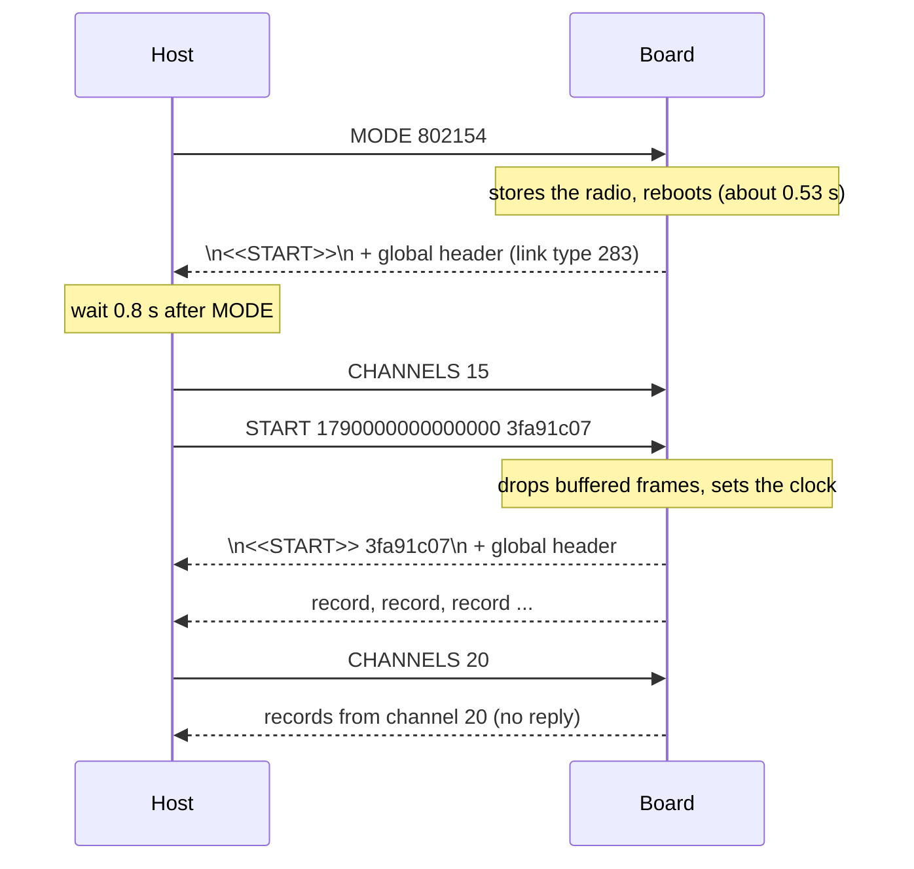

The board speaks a small line protocol over its native USB port: text commands in, a PCAP stream out. This page is for people who write their own host software for the board, or debug one with a serial terminal. It covers the commands, what the board sends back, the byte layout of the stream for each radio, and the board's habits: the reboot on a change of radio, the reset lines, throughput and the remembered radio. The C helper and the Python remote helper are two implementations of the host side; the rules they follow are summed up in [Syncing on the stream](#syncing-on-the-stream).

The firmware is one C file: [firmware/main/esp32c5_sniffer.c](https://github.com/oshri-almog/esp32c5-kismet-wifi-interface/blob/main/firmware/main/esp32c5_sniffer.c). The protocol is the same as in the sibling project esp32c5-wireshark-sniffer, so a board flashed for one is expected to work with the other. A board on the sibling's published 1.2.0 firmware captured all three radios under this project's helpers in the tests; a board on this project's firmware has not been tried in the sibling's Wireshark extcap. Differences in older builds are listed below.

## The link

| | |
|---|---|
| Port | The board's native USB port: Espressif's USB-Serial-JTAG, USB ID `303a:1001` |
| Port names | `COM14` (Windows), `/dev/ttyACM0` (Linux), `/dev/cu.usbmodem1101` (macOS), `/dev/cuaU0` (FreeBSD, OpenBSD) |
| Line settings | Ignored. Any baud rate works. |
| Board identity | The board reports its MAC as its USB serial number. |
| Logs | Not on this port. They go to UART0 (see [UART0 log](#uart0-log)). |

- **Every Espressif chip with a native USB-Serial-JTAG port has the ID `303a:1001`**: the ESP32-C3, C5, C6, H2, S3, P4 and others. A host cannot tell a sniffer from another ESP32 by its USB ID. If there is no answer to `START`, it is not a sniffer (or not a current one).
- The USB port carries only the capture stream (board to host) and your command lines (host to board). No logs, replies or status messages share it, so the stream stays parseable.

### DTR and RTS reset the board

On this port the DTR and RTS lines drive the chip's reset and boot-mode pins. Releasing DTR while RTS is still asserted resets the chip. A program that opens the port with its default line settings can reboot the board, or leave it in the ROM download mode.

Open the port with both lines low:

- **Linux, macOS:** open the port, then clear RTS first and DTR second. Clearing them in the other order passes through "DTR released, RTS asserted", which resets the chip. Do not set HUPCL (hang up on close). The C helper opens with `O_RDWR | O_NOCTTY | O_NONBLOCK`, sets raw mode with `CLOCAL | CREAD`, no flow control, and 115200 baud as a placeholder.
- **Windows:** set DTR and RTS low before the port is opened. With pyserial, set `ser.dtr = False` and `ser.rts = False` on an unopened `serial.Serial()`, then call `open()`. On Windows, the last test saw two boards briefly vanish from the bus after an open with pyserial's defaults.
- A pseudo-terminal (the fake board, socat, ser2net) has no modem lines. Ignore the `EINVAL` or `ENOTTY` you get when you try to clear them.

Serial terminals and monitors differ in what they do with these lines. In a test on Linux, none of pyserial's miniterm, picocom 3.1, screen 4.9.1 and minicom 2.10 reset an idle board when it opened the port; PuTTY and `idf.py monitor` have not been tried. If a board resets or stops answering when a terminal opens it, this is why. [esp32c5_kismet/board.py](https://github.com/oshri-almog/esp32c5-kismet-wifi-interface/blob/main/esp32c5_kismet/board.py) (`open_serial`) is a working example of both recipes.

### One program at a time

A board can serve one host at a time. On Linux and the other POSIX systems, both helpers take an exclusive `flock` on the device node before they touch the port, and then put the tty in exclusive mode (`TIOCEXCL`; on Linux, not on a pseudo-terminal, which it skips). On Linux the kernel keeps that mode with the tty, so every other open of the port fails with `EBUSY` while a helper has it, even through another device node for the same tty, as in a container. A process with `CAP_SYS_ADMIN`, such as esptool run with sudo, is let in all the same. All of this was tried on Linux only; nothing has been tried on macOS or the BSDs. Both helpers report a locked or busy port as "already in use".

In your own host, take the same `flock`, and treat `EBUSY` on open as "in use", so that it and the helpers keep out of each other's way. If you set `TIOCEXCL` too, end it with `TIOCNXCL` before you close the port. On Windows a COM port is exclusive anyway: a second open fails with "Access is denied".

Serial terminals differ here too. In the Linux test above, picocom and miniterm took the `flock` and screen set the exclusive mode, so a helper was refused while one of them had the board. minicom takes neither: a helper opens the board under it, and the capture fails. With a helper holding the board, all four terminals were refused.

## Commands (host to board)

Commands are ASCII lines ending in `\n`.

- Tokens are separated by spaces or tabs. A trailing `\r` is ignored, so CRLF line ends work. Empty lines are ignored.
- **Command words are case-sensitive**: `START`, `CHANNELS` (or `CHANNEL`), `DWELL`, `MODE`, `TXTEST`. A lower-case `start` is refused as `unknown command 'start'`. The arguments of `MODE`, and `AUTO`, are not case-sensitive.
- A line may hold up to **255 characters** before the `\n`. A longer line is ignored entirely, without a word.
- **The board answers only `START`.** Every other result, accepted or refused, shows up only as a log line on UART0. A refused command leaves the previous state unchanged.
- One task handles the commands, in the order they arrive. `TXTEST` holds that task while it transmits.

| Command | What it does | Answer on USB |
|---|---|---|
| `START [<unix time in µs>\|0] [<nonce>]` | Restart the stream: marker line, PCAP global header, records. Optionally set the clock. | yes |
| `CHANNELS <spec>` (also `CHANNEL`) | Set the channel list: one channel locks, several hop. `0` or `AUTO` restores the built-in list. | no |
| `DWELL <ms>` | Time on each channel of a list: 20 to 60000 ms. | no |
| `MODE WIFI\|802154\|BLE` | Choose the radio. Another radio than the current one reboots the board. | no (the board reboots and restarts the stream) |
| `TXTEST [n]` | Transmit `n` 802.15.4 test frames. 802.15.4 mode only. | no |

### START

```text
START [<unix time in µs>|0] [<nonce>]
```

- **Time**: decimal digits only, non-zero. When valid, packet timestamps are wall-clock time from now on. When it is absent, `0` or invalid, the clock is left as it was: counting from boot after a reset, or from the last valid `START` time.
- **Nonce**: 1 to 16 characters, letters and digits only. Anything else is ignored, and the answer then carries no nonce. To send a nonce without a time, write `START 0 <nonce>`.

What happens:

1. The request goes into a queue that holds one. Of several `START`s close together, only the last one counts.
2. The board's writer task picks it up within about 100 ms.
3. It **discards every frame already buffered**: those belong to the previous stream.
4. It applies the time.
5. It sends the answer, in one USB write:

```text
\n<<START>> <nonce>\n  followed by the 24-byte PCAP global header
\n<<START>>\n          (without a nonce)
```

Note the **leading `\n`** before the marker. PCAP records follow. The last test measured about 0.11 s from `START` to the answer.

Use a fresh nonce for every `START`, and sync only on the marker with your own nonce. Anything before it is boot text, or an older stream. The helpers send 8 lower-case hex characters.

UART0 logs `stream restarted by host` (or `..., clock synchronised`). If the answer cannot be written because nobody reads the port, it logs `start marker not sent, is the host reading the port?`.

### CHANNELS

```text
CHANNELS <spec>
CHANNELS 0
CHANNELS AUTO
```

`CHANNELS` with no argument, `0` or `AUTO` restores the built-in list of the current radio. Otherwise the spec **replaces the channel list at once**: the board starts again at its first entry and logs `scanning <n> channel(s): <list>`. A spec that does not parse is logged as `cannot use channel list '<spec>'`, and the old list stays.

- **One channel is a lock.** The board tunes once and stays. If the radio refuses the channel, the board retries every second, with a `channel <n> not set: <error>` warning each time.
- **Several channels hop**, `DWELL` ms on each, in the order given. A channel the radio refuses is logged once and skipped for the rest of that list.
- The list is not stored: every boot starts with the built-in list.

**Spec grammar:**

```text
spec  = item { "," item }
item  = N | N "-" M
```

| Rule | Example |
|---|---|
| Decimal numbers, 1 to 177. `0` inside a list, or a number over 177, refuses the whole spec. | `CHANNELS 1,0` is refused |
| No spaces inside the spec: the command is split on spaces. | `CHANNELS 1, 6` reads only `1,` and gives `[1]` |
| A single number must be a channel of the current radio, or the whole spec is refused. | Wi-Fi: `CHANNELS 1,6,20` is refused |
| A range keeps only the valid channels inside it. It needs `M >= N`. | Wi-Fi: `36-64` gives 36, 40, ..., 64 |
| A range with no valid channel adds nothing. The spec is refused only if the final list is empty. | 802.15.4: `1-177` gives 11-26 |
| Duplicates are dropped; the order given is kept. | `6,1,6,11` gives 6, 1, 11 |
| A trailing comma is accepted. | `1,6,11,` |
| At most 42 channels. More refuses the spec rather than cutting it short (with duplicates removed this cannot happen). | |

Examples in Wi-Fi mode: `6`, `1,6,11`, `1-11`, `1-13,36,149-165`, `1-177` (all 42). In 802.15.4 mode: `15`, `11-26`.

**Channels per radio:**

| Radio | Channels | Frequency |
|---|---|---|
| Wi-Fi 2.4 GHz | 1-14 | 2407 + 5 × ch MHz; channel 14 is 2484 MHz |
| Wi-Fi 5 GHz | 36-64, 100-144, 149-177, in steps of 4 (28 channels) | 5000 + 5 × ch MHz (36 is 5180, 177 is 5885) |
| 802.15.4 | 11-26, page 0 | 2405 + 5 × (ch − 11) MHz |
| Bluetooth LE | 37 only | stands for all three advertising channels |

- Wi-Fi is 20 MHz wide on 2.4 GHz. On 5 GHz the driver picks the secondary channel itself.
- In one field test Kismet's channel tracker on the Pi reported frequencies up to 2484 MHz (channel 14); no packet on 2484 MHz is in the kept logs. Whether the board tunes to channels 144 and 169–177 and receives on them has not been tested (no traffic was ever seen there).
- 802.15.4 channels outside 11-26 are refused by the parser, because the radio driver would assert and panic the board.
- Bluetooth LE: the controller scans advertising channels 37, 38 and 39 together and cannot be restricted to one. `CHANNELS 37` is the only valid list; `38` and `39` are refused.

**Built-in lists** (what the board uses after boot, and what `0` or `AUTO` restores), as built with this project's settings:

| Radio | Built-in list | At boot |
|---|---|---|
| Wi-Fi | `6` | locked on 6 |
| 802.15.4 | `11-26` | hopping 11, 12, ..., 26 at 250 ms each |
| Bluetooth LE | `37` | all three advertising channels |

A host that never sends `CHANNELS` gets exactly this. The Kismet helpers send one channel at a time, and Kismet does the hopping.

### DWELL

```text
DWELL <ms>
```

- 20 to 60000, decimal digits only (`250ms` is refused). Default 250, set at build time.
- It takes effect at once. UART0 logs `dwell time <ms> ms`, or `DWELL needs a time in ms between 20 and 60000`.
- Not stored: 250 again after every boot.
- It has no effect on a single-channel lock.

### MODE

```text
MODE WIFI
MODE 802154
MODE BLE
```

| Radio | Words accepted (any case) | Link type after the switch |
|---|---|---|
| Wi-Fi | `WIFI` | 127 |
| 802.15.4 (Zigbee, Thread) | `802154`, `ZIGBEE`, `THREAD` | 283 |
| Bluetooth LE advertising | `BLE`, `BT`, `BLUETOOTH` | 256 |

`802.15.4` with dots is not accepted by the firmware (`unknown mode '802.15.4'`). The helpers accept it in source definitions and send `802154`.

- **The radio already running:** nothing happens, no reboot.
- **Another radio:** the board shuts the current radio down cleanly, stores the new one, logs `restarting to capture with the <radio> radio`, waits 50 ms and reboots.
- The board comes back about **0.53 s** after the `MODE` line (0.53 to 0.54 s on four boards) and sends its boot marker, `\n<<START>>\n` without a nonce, and a PCAP global header with the new link type.
- **Its USB port usually stays enumerated through the reboot.** But in the tests a switch sometimes made a board drop off USB and come back 0.5 to 2.5 s later, so handle a port that goes away and comes back, possibly under another name.
- **A known firmware issue:** on one of the four test boards, about one Wi-Fi → BLE switch in five hung the board. It dropped off USB, came back, and then never answered `START` until it was reset or unplugged. The Kismet helpers give up after 15 s and try again, which does not cure it. The board itself stops answering, which points to the firmware, but the hang was seen only under the C helper (the Python remote helper made 5 such switches on the same board without one), so the cause is not proven.
- **Anything sent while the board reboots is lost.** Send `MODE`, wait until the board is back, then send `START`. The helpers wait 0.8 s.
- Send `MODE` before `START`: the radio decides the link type of the stream.
- If the new radio cannot be stored, the board logs `cannot open NVS to remember the mode: <error>` or `cannot remember the mode: <error>`, **still reboots**, and comes back in the old radio. Check the link type in the global header.

Why a reboot: switching the radio at run time left the radio in a state that no reset clears. Two boards switched to 802.15.4 and back captured no Wi-Fi at all until they were unplugged. So the firmware picks its radio once, at boot.

### TXTEST

```text
TXTEST [n]
```

> **Warning:** This is the only command that makes the board transmit. Nothing else ever transmits: Wi-Fi runs receive-only, Bluetooth LE scans passively, and 802.15.4 receives in promiscuous mode. Use `TXTEST` only where you are allowed to transmit on the 2.4 GHz band, and only on networks and devices you own or are authorised to test.

It sends 802.15.4 test frames, so that a second board can prove its receive path when there is no Zigbee or Thread equipment around.

- **802.15.4 mode only.** In another radio it logs `TXTEST only works in 802.15.4 mode` and sends nothing.
- `n` defaults to 10. Anything outside 1 to 1000, a non-number included, becomes 10.
- Frames go out 20 ms apart, without a clear-channel check, on the channel the board is on at that moment. The built-in 802.15.4 list hops, so lock a channel first: `CHANNELS 20`.
- It holds the command task for n × 20 ms, up to 20 s. A transmit error stops it with `transmit failed: <error>`. At the end it logs `sent <n> test frames on channel <ch>`, with the count asked for even if it stopped early.

Each frame:

| Field | Value |
|---|---|
| Frame control | `41 88`: data frame, PAN ID compression, short destination and source addresses |
| Sequence number | the frame's index, 0, 1, 2, ... |
| Destination PAN | `0x1234` |
| Destination address | `0xFFFF` (broadcast) |
| Source address | `0x0001` |
| Payload | `esp32c5-wireshark-sniffer self test` and its terminating NUL, 36 bytes |
| FCS | added by the radio |

Measured: four boards on channel 20, each receiving `TXTEST 50` from each of the other three, gave 50 of 50 frames for all 12 pairs. Into Kismet, `TXTEST 200` gave 200 of 200 packets. See [Guide: Zigbee and Thread Networks](Guide-Zigbee-and-Thread-Networks).

## The stream (board to host)

```text
"\n<<START>>[ <nonce>]\n"      marker line
PCAP global header             24 bytes, once per stream
PCAP record header + payload   16 bytes + incl_len bytes, once per frame
PCAP record header + payload
...
```

Everything is little-endian. A stream starts:

- **at boot**, with `\n<<START>>\n` and no nonce, timestamps counting from boot;
- **on every `START`**, with your nonce.

**Every record is sent whole or dropped whole**, by one task, and a stream only restarts between records or at a reboot. The stream never loses its framing on the board's side.

### PCAP global header (24 bytes)

| Offset | Size | Field | Value |
|---|---|---|---|
| 0 | 4 | magic | `0xA1B2C3D4` (bytes `d4 c3 b2 a1`): microsecond timestamps |
| 4 | 2 | version major | 2 |
| 6 | 2 | version minor | 4 |
| 8 | 4 | thiszone | 0 |
| 12 | 4 | sigfigs | 0 |
| 16 | 4 | snaplen | 65535 |
| 20 | 4 | network (link type) | **127** Wi-Fi, **283** 802.15.4, **256** Bluetooth LE |

### PCAP record header (16 bytes)

| Offset | Size | Field |
|---|---|---|
| 0 | 4 | ts_sec |
| 4 | 4 | ts_usec |
| 8 | 4 | incl_len |
| 12 | 4 | orig_len |

`incl_len` always equals `orig_len`: frames are never truncated. Timestamps are taken when the frame reaches the firmware (the Wi-Fi callback, the 802.15.4 interrupt, the Bluetooth host task), not the time on air. They count from boot until a `START` with a time makes them wall-clock time.

### Wi-Fi records (link type 127, radiotap)

Each record is a 16-byte radiotap header and the 802.11 frame **without its FCS**.

| Offset | Size | Field | Value |
|---|---|---|---|
| 0 | 1 | it_version | 0 |
| 1 | 1 | it_pad | 0 |
| 2 | 2 | it_len | 16 |
| 4 | 4 | it_present | `0x0000006A`: Flags, Channel, dBm antenna signal, dBm antenna noise |
| 8 | 1 | Flags | 0 (no FCS in the frame) |
| 9 | 1 | pad | 0 (aligns Channel) |
| 10 | 2 | Channel frequency | MHz |
| 12 | 2 | Channel flags | 2.4 GHz: `0x0080` plus `0x0020` (CCK, 802.11b frames) or `0x0040` (OFDM); 5 GHz: `0x0100` plus `0x0040` |
| 14 | 1 | dBm antenna signal | signed |
| 15 | 1 | dBm antenna noise | signed, the noise floor |

- Captured: management, data and control frames (ACK, RTS, CTS, Block Ack, PS-Poll, CF-End).
- Not captured: frames the radio received with errors, including every frame with a bad FCS. A capture never holds bad-FCS frames.
- No rate, MCS, bandwidth, HT/VHT/HE, TSFT or antenna fields.
- Frames over 11454 bytes (after the FCS is removed) are dropped and counted as "oversize". The longest record is 11486 bytes.

### 802.15.4 records (link type 283, IEEE 802.15.4 TAP)

Each record is a 48-byte TAP header and the MAC frame **without its FCS**: the radio checks the FCS and never hands it over. The frame is at most 125 bytes.

The TAP header is a 4-byte preamble and five TLVs. Each TLV is a type (2 bytes), a length (2 bytes) and a value, padded to 4 bytes. `tap_len` counts the preamble too.

| Offset | Content |
|---|---|
| 0 | version (1 byte) = 0, reserved (1 byte) = 0, tap_len (2 bytes) = 48 |
| 4 | TLV type 0, **FCS type**, length 1: value 0 (no FCS), 3 bytes padding |
| 12 | TLV type 1, **RSS**, length 4: float32, dBm |
| 20 | TLV type 3, **channel assignment**, length 3: channel (2 bytes), page (1 byte) = 0, 1 byte padding |
| 28 | TLV type 10, **LQI**, length 1: value, 3 bytes padding |
| 36 | TLV type 5, **start-of-frame timestamp**, length 8: nanoseconds (uint64) |

- The start-of-frame timestamp is the radio driver's microsecond clock times 1000. It counts from boot and is **not** shifted by `START <time>`, unlike the PCAP record time.
- Why TAP and not a plain 802.15.4 link type: with no FCS in the frame, a link type that claims one makes Wireshark mark every frame bad; and a plain link type has nowhere to record the channel.
- Kismet reads a TAP header as a fixed 28 bytes and would misread this one. The Kismet helpers therefore take the channel and signal out of the TLVs and pass the bare frame to Kismet as link type 230 (802.15.4 without FCS). Kismet's own pcapng stream held the test frames as link type 230 in the hardware run. Wireshark reads link type 283 as it is.

### Bluetooth LE records (link type 256, LE link layer with pseudo-header)

Each record is a 10-byte pseudo-header, the 4-byte access address, the PDU (2-byte header and payload) and the 3-byte CRC: 10 + 4 + n + 3 bytes, with n at most 45, so at most 62 bytes. The pseudo-header is the one Nordic's nRF Sniffer produces, so Wireshark's Bluetooth dissectors read it as they are.

| Offset | Size | Field | Value |
|---|---|---|---|
| 0 | 1 | RF channel | **0** always: the RF index of advertising channel 37 |
| 1 | 1 | signal | dBm, signed, from the scan report |
| 2 | 1 | noise | 0 (not valid) |
| 3 | 1 | access address offenses | 0 |
| 4 | 4 | reference access address | `0x8E89BED6` |
| 8 | 2 | flags | **`0x0C13`**: dewhitened (0x0001), signal valid (0x0002), reference access address valid (0x0010), **CRC checked** (0x0400), **CRC valid** (0x0800) |

Then the access address `0x8E89BED6` (bytes `d6 be 89 8e`), the PDU, and the CRC.

- **Every packet is recorded as channel 37.** The controller scans 37, 38 and 39 together and does not say which channel a packet came on. Kismet and Wireshark show every advertisement on 37 (2402 MHz).
- **The PDU is rebuilt from the controller's advertising report.** The PDU type comes from the report's event type: ADV_IND 0x0, ADV_DIRECT_IND 0x1, ADV_NONCONN_IND 0x2, SCAN_RSP 0x4, ADV_SCAN_IND 0x6. TxAdd (bit 6) is set for a random advertiser address, RxAdd (bit 7) for a directed advertisement to a random address. ChSel (bit 5) and RFU (bit 4) are always recorded clear, because the report does not carry them. The payload is the advertiser address (6 bytes), then either the target address (6 bytes, directed) or the advertising data (up to 31 bytes).
- **The CRC is computed by the firmware** over the rebuilt PDU: 24 bits, polynomial x^24 + x^10 + x^9 + x^6 + x^4 + x^3 + x + 1, preset 0x555555, least significant bit first, sent least significant byte first. The controller only reports packets whose CRC checked out, so the "CRC checked" and "CRC valid" flags are true. For ADV_IND and ADV_DIRECT_IND from devices that use channel selection algorithm #2 (many BLE 5 devices), the recorded header has ChSel clear, and the CRC matches the recorded bytes, not the ones that were on the air.
- Test vector: PDU `40 0e 11 22 33 44 55 c6 02 01 06 04 09 45 53 50` (ADV_IND, random address, flags and the short name "ESP") has CRC `f1 c0 26`.
- The scan is passive (it never transmits) and reports every packet, not one per device.
- Only legacy advertising is captured. BLE 5 extended advertising and the Coded PHY are not, because extended scanning is off in this build, and a report with more than 31 bytes of advertising data is dropped and counted as `oversize`. The test captures held none, but no device known to use extended advertising was nearby.
- A scan response normally does not occur, because a passive scan sends no scan requests. The test captures held none in 12,695 advertisements.

Why the CRC flags matter: Kismet trusts a packet's CRC only when "CRC checked" is set. Otherwise it checks the CRC itself and drops the packet when that fails, which a zeroed CRC always does.

## Syncing on the stream

How the helpers read the stream; a robust host does the same:

1. After sending `START <time> <nonce>`, discard everything until `<<START>> <nonce>` followed by `\n` or `\r\n`. Only your own nonce counts.
2. Read 24 bytes and check that they start `d4 c3 b2 a1 02 00 04 00`, and that the link type at offset 20 is the one you asked for. A different link type means the board is still on another radio (or its firmware lacks that radio): send `MODE` again.
3. Read records. Treat a record as damaged, and look for your marker again, when `ts_usec` is not below 1000000, `incl_len` is 0 or over 16384, or `incl_len` is greater than `orig_len`.
4. **Never read anything inside a record as protocol.** A Wi-Fi frame can carry the bytes `<<START>>` and a PCAP header in its payload; anyone on the air can send one.
5. A marker between records means the stream restarted: the board rebooted, or answered another `START`. Treat it as lost sync, and send `CHANNELS` and `START` with a new nonce (with `MODE` first if the header shows another radio). Do not carry on with the new stream as it is: a boot marker has no nonce, its timestamps count from boot, and the board is back on its built-in channel list. The helpers log this as `lost sync (the board restarted the stream)`.



The helpers' timings, which suit the board:

| What | Value |
|---|---|
| From `MODE` to `CHANNELS` + `START` | 0.8 s (the board is deaf for about 0.5 s) |
| Repeat `MODE`/`CHANNELS`/`START` while not synced | every 2 s, even while bytes arrive |
| Reopen the port when not synced and nothing at all arrives | after 6 s |
| Give up when not synced | after 15 s |
| Once synced | silence is a quiet channel, not an error |

The helpers always send `MODE` in the first handshake after opening the port. On a later resync they skip it when the last global header already had the right link type. They send `CHANNELS <n>` and `START` together in one write.

## The remembered radio

The board stores its radio in NVS (namespace `sniffer`, key `mode`, one byte: 0 Wi-Fi, 1 802.15.4, 2 Bluetooth LE) and boots into it. A board that has never been told, or whose value is missing or unreadable, boots Wi-Fi.

| Action | Stored radio |
|---|---|
| Reset, power cycle | kept |
| `idf.py flash` | kept |
| Flashing the merged image at 0x0 | erased: Wi-Fi |
| `erase_flash` | erased: Wi-Fi |
| The sibling project's browser flasher | erased: Wi-Fi |

A board left on 802.15.4 or Bluetooth LE boots into it, sends `<<START>>` and a header with that link type, and then says nothing on the Wi-Fi channels you expected. It reads as a hang. **Always send `MODE` before the first `START`**, even when you think the board is on the right radio; it costs nothing when it is. The Kismet helpers always do, in the first handshake after they open the port.

> **Note:** A board flashed while it is on 802.15.4 can come back deaf to Wi-Fi: it answers `START` with link type 127 but sends no records, and a reset does not clear it. `MODE BLE` followed by `MODE WIFI` does. Removing power should also clear it, as it did for boards left in the same state by an old firmware's run-time switch, but after a flash only the `MODE` cycle was tried. The likely cause: flashing the merged image erases the stored radio, so the board boots straight into Wi-Fi without the clean shutdown of the 802.15.4 radio that `MODE` does before its reboot. To avoid it, send `MODE WIFI` before you flash. See [Flashing the Firmware](Flashing-the-Firmware).

## Boot sequence

1. Start the USB driver (TX buffer 32 KB, RX buffer 256 bytes).
2. Initialise NVS and read the stored radio.
3. Set the link type in the PCAP global header: 127, 283 or 256.
4. Create the ring buffer and the default channel list for the radio.
5. Start the writer task, which **sends `\n<<START>>\n` and a global header at once**, with no nonce and timestamps counting from boot. So a reset on its own also starts a capture.
6. Start only the radio of this boot. The other two are never started.
7. Start the hop task and the command task.
8. Log `capturing with the <Wi-Fi|802.15.4|Bluetooth LE> radio`, then a status line every 10 s.

Wi-Fi starts in receive-only mode (no beacons, probes or association), in dual-band mode, then promiscuous. 802.15.4 starts promiscuous on channel 15, then hops the built-in list. Bluetooth LE starts a passive scan when the controller is ready.

## Throughput and drops

Frames go from the radio into a 64 KB ring buffer, one whole PCAP record per entry. A writer task takes them out and writes them to the USB driver's 32 KB buffer, and the host reads them from there.

- The firmware's notes put the USB-Serial-JTAG link at a few hundred kB/s; that figure has not been measured. On a busy channel the board drops whole frames rather than block, so the stream stays valid.
- Measured: Wi-Fi on channel 6 gave 410 to 778 records in 8 s per board.
- A record that cannot be queued to USB within 100 ms is dropped. This is what happens when **no host is reading**.
- `START` empties the ring buffer.
- Control frames, roughly one ACK per data frame, raise the drop rate on busy channels. A build with `SNIFFER_CAPTURE_CTRL_FRAMES` off leaves them out.

The board counts its drops in three counters:

| Counter | Meaning |
|---|---|
| `buffer` | The ring buffer was full: the host or USB could not keep up, or a burst. |
| `usb` | A record could not be queued to USB within 100 ms. |
| `oversize` | A frame too long for its format. |

The counters are shown **only on UART0**, in the status line every 10 s. Nothing reports them over USB, so no host, Kismet included, can see drops on the board.

## UART0 log

The firmware logs to UART0, not to the USB port: 115200 baud, 8N1, TX on GPIO11, RX on GPIO12. On development boards this is often a second USB connector marked UART. On boards with only the native USB-C port, such as the Seeed Studio XIAO ESP32C5, you need a USB-to-UART adapter on those two pins.

<!-- VERIFY: which header pins carry GPIO11/GPIO12 on the XIAO ESP32C5 -->

Lines look like `I (<ms since boot>) sniffer: <text>`. The standard ESP-IDF boot lines come first, including `App version:`, which tells you which firmware build the board runs.

| Level | Message | When |
|---|---|---|
| I | `capturing with the Wi-Fi radio` (or `802.15.4`, `Bluetooth LE`) | boot |
| I | `Wi-Fi ch   6 of 1 (250 ms) \| captured 1234 \| dropped: buffer 0, usb 0, oversize 0` | every 10 s |
| I | `scanning <n> channel(s): <list>` | a new channel list |
| W | `cannot use channel list '<spec>'` | a refused `CHANNELS` |
| W | `channel <ch> not set: <error>` | the radio refused a channel |
| I | `dwell time <ms> ms` | `DWELL` accepted |
| W | `DWELL needs a time in ms between 20 and 60000` | `DWELL` refused |
| W | `MODE needs WIFI, 802154 or BLE` | `MODE` without an argument |
| W | `unknown mode '<word>'` | `MODE` refused |
| I | `restarting to capture with the 802.15.4 radio` (or `Bluetooth LE`, `Wi-Fi`) | `MODE` to another radio |
| E | `cannot open NVS to remember the mode: <error>`, `cannot remember the mode: <error>` | the radio could not be stored |
| W | `TXTEST only works in 802.15.4 mode` | `TXTEST` in another radio |
| W | `transmit failed: <error>` | `TXTEST` stopped |
| I | `sent <n> test frames on channel <ch>` | `TXTEST` done |
| W | `unknown command '<word>'` | anything else |
| I | `stream restarted by host` (`, clock synchronised`) | `START` |
| W | `start marker not sent, is the host reading the port?` | `START` answer not written |
| I | `Bluetooth controller ready, scanning all three advertising channels` | Bluetooth LE boot |
| W | `Bluetooth scan did not start: rc=<n>` | the scan failed to start |
| E | `out of memory` | boot failed |

Builds from before these two texts were corrected, the one on the four test boards included, print `MODE needs WIFI or 802154`, and say "Wi-Fi" in the restart line when switching to Bluetooth LE.

## Differences from older firmware

Boards flashed from the sibling project's browser flasher, or with its older builds, speak the same protocol with these differences:

| Build | Radios | Differences that matter to a host |
|---|---|---|
| This project | Wi-Fi, 802.15.4, BLE | none |
| Sibling 1.2.0 (the browser flasher) | Wi-Fi, 802.15.4, BLE | BLE flags `0x0013` and a zeroed CRC; command lines at most 63 characters; channel lists cut at 39 entries, so `CHANNELS 1-177` loses 169, 173 and 177; two of four boards on it did not answer `START` in one test (below) |
| Sibling 1.1.0 | Wi-Fi, 802.15.4 | no BLE: `MODE BLE` is ignored, with no reboot, and the stream keeps its link type; the default partition table |
| Sibling 1.0.0 | Wi-Fi only | no `MODE`, no `TXTEST`; the default partition table; on the test board it answered `START` but sent no Wi-Fi records at all (the board had been on 802.15.4 when flashed; cause not isolated) |

- With 1.2.0, Kismet would drop every BLE packet, because the CRC flags are clear. Both Kismet helpers detect this, fill in the CRC and the flags, and say so once each time the source opens. In the tests a board on the published 1.2.0 image captured Wi-Fi, 802.15.4 and BLE under the C helper, local and remote, and under the Python remote helper, with its BLE packets put right this way.
- In an earlier hardware run, all four boards came with the sibling's 1.2.0 build (app version `5cdab32-dirty`, the same build as the browser flasher's image). In the flashing script's 3 s check, two of them answered `START` and two streamed Wi-Fi but did not answer it. The cause is unknown. After this project's firmware was flashed (an earlier build than the current image), all four worked. The board flashed back to 1.2.0 for the later test answered `START` every time.
- With 1.0.0 and 1.1.0, the missing radios never sync: the board keeps sending the old link type. The helpers report `<name>: lost sync (the board sends link type 127, not 256)` (or `127, not 283`, or `283, not 256`), never `capturing`, and give up after 15 s.
- Upgrading 1.0.0 or 1.1.0 needs the new partition table: flash the merged image at 0x0, not the app alone.

There is no command to ask the board for its firmware version. Read the `App version:` line on UART0, or watch for the helpers' one-time BLE message under Kismet. See [Flashing the Firmware](Flashing-the-Firmware).

## Build-time settings

`idf.py menuconfig`, under **Packet Sniffer Configuration**, sets the defaults a host sees:

| Option | This project | Meaning |
|---|---|---|
| `SNIFFER_CHANNEL_HOPPING` | off | Built-in Wi-Fi list: every channel of the band (on) or the start channel only (off) |
| `SNIFFER_HOP_INTERVAL_MS` | 250 | Default dwell. menuconfig allows 50 to 60000; `DWELL` at run time allows 20 to 60000 |
| `SNIFFER_START_CHANNEL` | 6 | Wi-Fi channel after boot |
| `SNIFFER_2G_MAX_CHANNEL` | 13 | Top of the 2.4 GHz part of the built-in hop list (hopping on only) |
| `SNIFFER_BAND` | DUAL | 2.4 GHz, 5 GHz or both |
| `SNIFFER_LINKTYPE` | RADIOTAP (127) | Wi-Fi link type. The Kismet helpers need 127 and refuse a 105 build. |
| `SNIFFER_CAPTURE_CTRL_FRAMES` | on | Capture control frames too |
| `SNIFFER_RINGBUF_SIZE` | 65536 | Capture ring buffer, bytes |
| `SNIFFER_USB_TX_BUF_SIZE` | 32768 | USB driver transmit buffer, bytes |

With hopping on, the built-in 5 GHz list has 25 channels and leaves out 169, 173 and 177; they are reachable only by asking for them.

## Related pages

- [How It Works](How-It-Works): where the board, the helpers and Kismet fit together.
- [Flashing the Firmware](Flashing-the-Firmware): building and flashing, backups, erasing.
- [Channel Control](Channel-Control): channels as Kismet drives them.
- [Troubleshooting](Troubleshooting): boards that stay quiet, reset, or disappear.
- [Development and Testing](Development-and-Testing): the fake board, which speaks this protocol on a pseudo-terminal.
