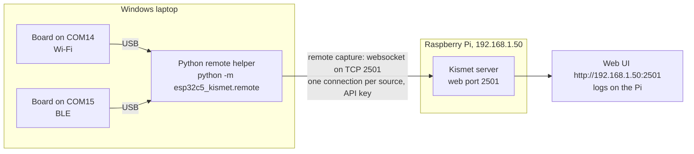

This guide connects ESP32-C5 boards plugged into a Windows laptop to a Kismet server on a Raspberry Pi on the same network, through the Python remote helper. It goes from setting up the server to a clean stop, and is for anyone who wants the boards next to them and Kismet somewhere else. The same steps work with any Linux server, and with the project's Docker image as the server.

> **Note:** Only capture on networks and devices you own or are authorised to test.

## How it fits together



Kismet does not run on Windows. The Python remote helper does: it opens each board on its COM port, sets the radio and the channel, and passes every frame to Kismet over Kismet's remote capture, a websocket on the web port 2501. Kismet on the Pi does the rest, and the logs are written there. [Remote Capture](Remote-Capture) explains the mechanism.

**What has been tested:** this guide was run end to end on 2026-10-02, from a Windows 11 Pro PC on Wi-Fi to Kismet on a Raspberry Pi 4 (Debian 13) across the LAN, with one board (firmware image 01a50bd6). Wi-Fi, 802.15.4 and Bluetooth LE sources each ran, started from PowerShell, cmd and Git Bash, with an API key, with a login, and with the environment variables. Two boards from one helper, as in part 4, and Kismet splitting the channels of two Wi-Fi boards from the laptop (part 5) were not run that way. <!-- VERIFY: part 4's two-board command from Windows, and the two-board channel split in part 5 -->

The examples use the Pi at `192.168.1.50`, boards on `COM14` and `COM15`, and the API key `3F9A6C1E07B24D58A1C9E2F4608B7D35`. Change all three to yours.

## Part 1: The Kismet server on the Pi

The Pi needs a Kismet that knows the `esp32c5` source type. A Kismet from a distribution package does not; it would log `Kismet could not find a datasource driver for incoming remote source 'esp32c5' ...` when the helper connects. Pick one:

- **Native build:** follow [Install on Raspberry Pi](Install-on-Raspberry-Pi), or steps 3 and 4 of [Guide: First Capture](Guide-First-Capture). About 78 minutes of unattended compiling on a Pi 4.
- **Docker:** follow [Install with Docker](Install-with-Docker). The image already has the source. Until the images are published, `docker compose up` builds the image on the Pi first: about 80 minutes on a Pi 4 (8 GB), almost all of it compiling Kismet. <!-- VERIFY: the published image exists and pulls on a Pi 4 -->

The Pi needs no boards of its own for this guide.

1. **Set Kismet's login before the first start.** Kismet's web UI listens on port 2501 on all network interfaces, and until a login exists, the first person to open it chooses the admin login. For the native build, as the user that will run Kismet:

   ```bash
   mkdir -p ~/.kismet
   printf 'httpd_username=%s\nhttpd_password=%s\n' admin 'choose-a-long-password' > ~/.kismet/kismet_httpd.conf
   chmod 600 ~/.kismet/kismet_httpd.conf
   ```

   For Docker, set `KISMET_USER` and `KISMET_PASSWORD` in the `.env` file ([Install with Docker](Install-with-Docker)).

2. **Start Kismet** without any sources. Native build:

   ```bash
   mkdir -p ~/kismet-logs
   cd ~/kismet-logs
   ~/kismet-install/bin/kismet --no-ncurses
   ```

   Kismet logs `No data sources defined; Kismet will not capture anything until a source is added.` That is expected: the sources come from the laptop. It also logs `HTTP server listening on 0.0.0.0:2501`, which means it accepts connections on every interface.

   Docker, from the project folder:

   ```bash
   sudo docker compose up -d
   ```

   Debian's `docker.io` package has no Compose; [Install with Docker](Install-with-Docker) says how to get it, and gives the equivalent `docker run` command. With no board on the Pi, the container waits up to 30 s for one, then starts Kismet without sources. A Kismet container that only receives remote sources needs no device rules; `compose.yaml` sets them anyway, for boards plugged into the Pi, and they do no harm. No capability is added: the container needs no `NET_ADMIN`.

   To check that this Kismet knows the `esp32c5` source type, which a Kismet from a distribution package does not, run the check in [Step 0 on Remote Capture](Remote-Capture#step-0-check-that-the-server-knows-the-esp32c5-type) on the Pi, with `localhost` as the address.

3. **Note the Pi's address:**

   ```bash
   hostname -I
   ```

4. **Open the port if the Pi runs a firewall.** The laptop connects to TCP 2501 on the Pi. If you run a firewall on the Pi, allow TCP 2501 from the laptop. Port 2501 also carries the web UI and the REST API, which is why the login in step 1 comes first.

   With the Docker server, do not count on the firewall to close the port: Docker's own rules let connections through to a published port, and a host firewall such as ufw may never see them. There, the login from step 1 is what protects port 2501. <!-- VERIFY: whether ufw on the Pi filters the kismet container's published port 2501 (general Docker behaviour, not tested here) -->

For the Pi to start Kismet at boot, see [Guide: Running as a Service](Guide-Running-as-a-Service).

## Part 2: An API key for the laptop

The helper needs a Kismet login or an API key. Use an API key with the `datasource` role:

- it can feed sources and nothing else: with it, a request such as the source list gets HTTP 401;
- the admin password never goes to the laptop;
- Kismet keeps it across restarts, and in the Kismet version this project builds keys do not expire.

A login works too, whatever its password holds: the helper sends it in an `Authorization` header. Only a login whose user name contains `:`, with an `&` in the user name or the password, cannot log in; the helper warns about it at start ([Install on Windows](Install-on-Windows#step-4-get-an-api-key-or-a-login)).

Create the key on the Pi, in the web UI or with curl.

**In the web UI:** open `http://192.168.1.50:2501`, log in, then **Settings → API Keys → Create API Key**. Give it a name, pick the role **datasource**, and copy the key. <!-- VERIFY: creating a datasource key from Kismet's web UI (read from Kismet's UI code, not tried) -->

**With curl,** in a terminal on the Pi:

```bash
curl -u admin:choose-a-long-password --data-urlencode 'json={"name": "windows-laptop", "role": "datasource", "duration": 0}' http://localhost:2501/auth/apikey/generate.cmd
```

It prints the key, 32 hex characters. The name must be unique on that Kismet. This call was tested against Kismet on the Pi and in Docker Desktop.

To withdraw the key later, delete it under **Settings → API Keys**, or call `/auth/apikey/revoke.cmd` with `json={"name": "windows-laptop"}`.

## Part 3: The helper on the laptop

1. **Install Python 3.10 or newer** from python.org, then check it in a new PowerShell window:

   ```powershell
   python --version
   ```

2. **Get the project and its three packages** (pyserial, msgpack and websocket-client). With Git for Windows installed:

   ```powershell
   git clone https://github.com/oshri-almog/esp32c5-kismet-wifi-interface
   cd esp32c5-kismet-wifi-interface
   python -m pip install -r requirements.txt
   ```

   Without Git, download the repository as a ZIP from its GitHub page, unpack it, `cd` into the unpacked folder, and run the `pip` line there.

   There is nothing to install beyond that: run the helper as `python -m esp32c5_kismet.remote` from this folder.

3. **Plug in the boards and list them:**

   ```powershell
   python -m esp32c5_kismet.remote --list
   ```

   ```text
   COM14  F0:F5:BD:01:02:03
       --source esp32c5-COM14
       --source esp32c5zigbee-COM14
       --source esp32c5btle-COM14
   COM15  F0:F5:BD:01:02:04
       --source esp32c5-COM15
       --source esp32c5zigbee-COM15
       --source esp32c5btle-COM15
   One source per board: it captures with one radio at a time. Every ESP32 on its native USB port has this USB ID, so a board listed here need not be an ESP32-C5 sniffer.
   ```

   Each board is listed with its MAC and its three source names, one per radio. Pick one per board. `--list` never opens a port, so it is safe to run at any time.

   The boards need this project's firmware. If they do not have it yet, flash them from this laptop with the [web flasher](https://oshri-almog.github.io/esp32c5-kismet-wifi-interface/) in Chrome or Edge ([Flashing the Firmware](Flashing-the-Firmware#flash-from-the-browser)).

[Install on Windows](Install-on-Windows) covers all of this in more detail, including a board that Windows has wedged.

## Part 4: Connect to the Pi

Keep the key off the command line, where it shows in the process list to administrators and to other programs running as you: put it in the environment variable `KISMET_CAP_APIKEY`, which the helper reads when no `--apikey`, `--user` or `--password` is given. In PowerShell:

```powershell
$env:KISMET_CAP_APIKEY = "3F9A6C1E07B24D58A1C9E2F4608B7D35"
python -m esp32c5_kismet.remote --connect 192.168.1.50:2501 --source esp32c5-COM14:name=win-wifi --source esp32c5btle-COM15:name=win-btle
```

In cmd:

```text
set KISMET_CAP_APIKEY=3F9A6C1E07B24D58A1C9E2F4608B7D35
python -m esp32c5_kismet.remote --connect 192.168.1.50:2501 --source esp32c5-COM14:name=win-wifi --source esp32c5btle-COM15:name=win-btle
```

- `--connect` takes the Pi's address and Kismet's **web port**, 2501.
- Each `--source` is one board on one radio, with its own connection. `name=` is what Kismet shows.
- The variable lasts as long as the window. For a login instead of a key, set `KISMET_CAP_USER` and `KISMET_CAP_PASSWORD`; the key wins if all three are set.

The helper logs one line per event:

```text
14:02:11 INFO: esp32c5-COM14:name=win-wifi: connected, offering it to Kismet as E5C50001-0000-0000-0000-F0F5BD010203
14:02:11 INFO: esp32c5-COM14:name=win-wifi: opening COM14 for wifi
14:02:11 INFO: win-wifi: COM14 opened
14:02:12 INFO: win-wifi capturing (wifi)
```

The BLE source logs the same four lines, ending `win-btle capturing (btle)`, mixed in with these.

If a board last used another radio, it reboots into the one asked for first. On Windows that took 1.2 to 1.5 s from opening the board to capturing, against about 0.8 s without a switch.

## Part 5: Check the sources

**On the Pi,** Kismet logs each new source:

```text
INFO: New remote source win-wifi (E5C50001-0000-0000-0000-F0F5BD010203) connected
```

In the web UI, **Data Sources** lists `win-wifi` and `win-btle` as remote sources, running, with climbing packet counts, and devices appear in the device list. The project's tests checked this through the REST API below, not in a browser. The ID Kismet shows is built from the board's MAC and the radio (`E5C50001` Wi-Fi, `E5C50002` 802.15.4, `E5C50003` BLE), so the same board on the same radio is always the same source, whatever COM port it is on.

**Over the REST API,** in a terminal on the Pi, with the admin login (the `datasource` key is not allowed to read the source list). The command uses bash quoting and `python3`, so it does not work in PowerShell on the laptop:

```bash
curl -s -u admin:choose-a-long-password http://localhost:2501/datasource/all_sources.json \
  | python3 -c 'import json,sys; [print(s["kismet.datasource.name"], "remote" if s["kismet.datasource.remote"] else "local", "running" if s["kismet.datasource.running"] else "stopped", s["kismet.datasource.num_packets"]) for s in json.load(sys.stdin)]'
```

It prints one line per source, such as `win-wifi remote running 186`.

**Channel control works as for local sources.** Kismet sends the helper its channel list and hop rate, and the helper retunes the board. The web UI's channel buttons and the REST calls on [Channel Control](Channel-Control) apply; through Docker Desktop, locking a remote Wi-Fi source on channel 48 put all its new packets on 5240 MHz. Two Wi-Fi boards on the laptop are split by Kismet like two on the Pi: Kismet logs `Splitting channels for interfaces using 'esp32c5' among 2 interfaces`, sends each source its starting point (21 and 0 of the 42 channels), and the helper hops from there.

What this guide's run measured, one source at a time: the Wi-Fi source found 41 Wi-Fi devices and delivered 18,488 packets in 90 s, hopping all 42 channels at 5 per second; the BLE source found 6 BLE devices in 60 s (791 packets); the 802.15.4 source ran and hopped, but with no Zigbee or Thread devices nearby it saw no packets. The first packets reached Kismet 1.3 to 2.0 s after the helper started. What you see depends on what is around you.

## Part 6: Keep it running

Run the helper in an ordinary console window (Windows Terminal, PowerShell or cmd) and leave it open. It keeps every source trying until you stop it:

| What happens | What the helper does |
|---|---|
| Kismet is not up yet, or restarts | Logs the failed connection (`[WinError 10061] No connection could be made because the target machine actively refused it` when nothing listens) and tries again 5 s later. Windows takes about 2 s to report a refused connection, so the line comes about every 7 s. When Kismet on the Pi restarted, the helper was capturing again 4.6 to 4.9 s after Kismet's port answered |
| Kismet comes back | Offers each source again under the same ID. A restarted Kismet logs `New remote source win-wifi (...) connected` again. A Kismet that kept running while the network or the helper was away logs `Remote source win-wifi (...) reconnected` and reuses the source it has |
| A board reboots to change radio | Reads through the reboot and asks again |
| A board is unplugged | Retries the port about once a second; after 15 s without capture it gives the source up, tells Kismet, and waits for the board: `COM14 is not there; is the board plugged in? (waiting for it)`. When the board is back it offers the same source |
| The laptop's network drops | Keeps trying, 5 s after each failed attempt, until the Pi is reachable again |

<!-- VERIFY: unplug and waiting behaviour of the current helper on Windows; the network-drop row is derived from the reconnect loop, not tested -->

While a board is missing or the Pi is unreachable, the helper logs the same ERROR line at every try, every 5 to 7 s. That is noisy but harmless.

To start the helper when you log on to the laptop, see [Guide: Running as a Service](Guide-Running-as-a-Service). Sleep and wake of the laptop have not been tested.

> **Note:** The websocket is plain `ws://`, not encrypted: Kismet has no TLS of its own. The API key travels in a request header (a cookie) and the packets travel in the clear across your network. Use this on a network you trust. Across one you do not, put a TLS reverse proxy in front of Kismet and give the helper `--ssl`, with `--ssl-certificate` for your own CA ([Remote Capture](Remote-Capture)).

## Part 7: Stop cleanly

1. **Stop the helper first.** Press **Ctrl+C**, or **Ctrl+Break**, in its window. It logs `INFO: stopping`, closes its connections, releases the COM ports and exits with status 0; pressing it again while it stops changes nothing. On the test PC this took 0.06 to 0.55 s with the helper as of commit `f8e6792`, and about 0.2 s at most with the current one, which was stopped while it fed Kismet in WSL2.
2. **Kismet on the Pi** then shows the sources as stopped, with the error `websocket connection closed`. That is expected, and the C helper gives the same. The sources stay listed; when the helper connects again, Kismet reuses them and keeps what it knew of them: the name, and any option the new definition leaves out. A source once locked with `channel_hop=false` stays locked when it is started again without it; write `channel_hop=true`, or restart Kismet. Kismet never reopens a remote source itself, and closing one from Kismet's side (its `close_source.cmd` call) lasts only until the helper connects again, about 5 s later: to stop a source, stop the helper.
3. **Stop Kismet** on the Pi, if you want to: Ctrl+C in its terminal, `sudo docker compose stop` for Docker, or `sudo systemctl stop kismet` for a service.

If you stop Kismet first instead, the helper keeps retrying, about every 7 s, until you stop it too.

If the helper will not stop, find its process ID in Task Manager (Details tab) and force it: `taskkill /F /PID 12345` with that number (without `/F`, Windows refuses). A forced stop still releases the COM ports at once, and Kismet shows the same `websocket connection closed`. A helper started as a background job from Git Bash (`python ... &`) stops with Ctrl+C in that window or with `kill -INT $!`: Windows gives such jobs an "ignore Ctrl+C" flag, and the helper clears it when it starts.

## If something goes wrong

| What you see | Where | What to do |
|---|---|---|
| `[WinError 10061] No connection could be made because the target machine actively refused it` | Helper | Kismet is not running on the Pi, or not on that address and port. Check `--connect` and that Kismet logged `HTTP server listening on 0.0.0.0:2501` |
| Connection attempts time out | Helper | The laptop cannot reach the Pi: a different network, or a firewall on the Pi blocking TCP 2501 |
| `Kismet refused the websocket: 401 Unauthorized (check the login -- --user/--password or KISMET_CAP_USER/KISMET_CAP_PASSWORD -- or the API key -- --apikey or KISMET_CAP_APIKEY; the key needs the datasource role)` | Helper | Wrong key, or a key without the `datasource` role. Create one as in part 2 |
| `a user and password, or an API key, are required for the websocket protocol ...` | Helper | `KISMET_CAP_APIKEY` is not set in this window. Set it again, or pass `--apikey` |
| `port 3501 is Kismet's legacy TCP port; did you mean --tcp, or port 2501?` | Helper | Use port 2501 |
| `COM14 is already in use by another capture (an esp32c5 source or another program holds it); a board captures with one radio at a time` | Helper | Another program has the COM port: a second helper, esptool, a serial terminal. Close it |
| `win-wifi: no capture from the board on COM14 for 15 seconds (last: ...); is it flashed with the esp32c5 sniffer firmware, and is nothing else holding the port?` | Helper, and in Kismet as the source's error | The board does not answer: not flashed with this firmware, wedged, or hung in a radio switch. Replug it; see [Flashing the Firmware](Flashing-the-Firmware) |
| `Kismet could not find a datasource driver for incoming remote source 'esp32c5' ...` | Kismet | The Pi's Kismet was built without the ESP32-C5 source. Use one built as in part 1 |

More on [Install on Windows](Install-on-Windows) and [Troubleshooting](Troubleshooting).

## See also

- [Install on Windows](Install-on-Windows): the Python remote helper on Windows in full
- [Remote Capture](Remote-Capture): the protocol, logins and API keys, and the legacy TCP port
- [Command-Line Reference](Command-Line-Reference): every option of the Python remote helper
- [Choosing a Setup](Choosing-a-Setup): other ways to combine Windows and Kismet
