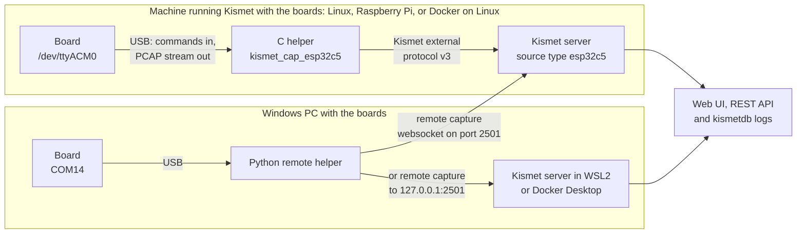

ESP32-C5 Kismet Interface turns ESP32-C5 boards into Kismet capture sources: dual-band Wi-Fi, Zigbee/Thread (IEEE 802.15.4) and Bluetooth LE advertising, from a small board that needs nothing but a USB port. This wiki is for anyone setting it up, from a first look without hardware to a survey with several boards.

## What it does

| | |
|---|---|
| **Three radios on one board** | Wi-Fi on 2.4 and 5 GHz, IEEE 802.15.4 for Zigbee and Thread, or Bluetooth LE advertising. A board listens with one radio at a time; the source definition picks which. |
| **Both Wi-Fi bands** | 42 channels: 1–14, 36–64, 100–144 and 149–177. Kismet hops them, and boards on the same radio hop the list from different starting points, so they are not on the same channel at once. |
| **An ordinary Kismet source** | Source type `esp32c5`. Boards appear under *Data Sources* in Kismet's web UI, once per radio, and their packets go into the normal device list, logs and REST API. <!-- VERIFY: the web UI's Data Sources panel in a browser. Kismet's REST interface list (list_interfaces) was checked on the Pi: three rows per board (esp32c5-, esp32c5zigbee-, esp32c5btle-<tty>), and all three gone while a source holds the board (hw2 n10) --> |
| **Boards anywhere** | Plug the boards into the machine that runs Kismet, or into another one and feed them over Kismet's remote capture: the C helper from Linux, the Python remote helper from Windows or anything else with Python. |
| **Stable identity** | A board is known by its MAC, which it reports as its USB serial number. Its source keeps the same UUID across port names, reboots and reconnects, so Kismet keeps one source per board and radio. |
| **Rides out reboots** | Switching radio reboots the board. The helpers wait for it, resynchronise the stream, and find a board that comes back under another port name. <!-- VERIFY: a board coming back under another port name, on hardware. Both helpers' tests cover it (tests/c/test_parser.c "now holds another board" / "is on", tests/test_board.py "board ... is on P2 now"); in the Pi runs no board changed its tty name --> |
| **Radio metadata** | Channel, frequency and signal strength with every packet: radiotap for Wi-Fi, a signal block for 802.15.4, the LE pseudo-header for BLE. |
| **Docker** | One image with Kismet and the C helper built in, for amd64 and arm64, and a demo image with a fake board. |
| **Try it without hardware** | The fake board speaks the firmware's protocol on a pseudo-terminal and makes up access points on both bands, two Zigbee nodes and a BLE advertiser. |
| **Flash from the browser** | The [web flasher](https://oshri-almog.github.io/esp32c5-kismet-wifi-interface/) installs the firmware from Chrome or Edge, with nothing to install. Its image can also be downloaded for esptool, from the flasher or from a release tagged since the flasher was added, and ESP-IDF 5.5 builds it from source. |

## How the pieces fit

The board runs this project's firmware and streams what its radio hears over its native USB port. A capture helper reads that stream and hands the packets to the Kismet server, which has been built with the `esp32c5` source type.

- **Local:** Kismet starts one C helper per source. It is the usual setup on a Raspberry Pi or a Linux PC.
- **Remote:** a helper connects to Kismet's web port and offers its boards there. The C helper does this from Linux (`--connect`), the Python remote helper from Windows or any OS with Python. On Windows, the Kismet server can be on another machine or on the same PC, in WSL2 or Docker Desktop; either way the boards reach it by remote capture.

[How It Works](How-It-Works) explains the protocol, the stream and why Kismet has to be patched.

## The three radios

| Radio | What it captures | Channels | Source name for the board on `/dev/ttyACM0` | Link type Kismet receives |
|---|---|---|---|---|
| Wi-Fi (`wifi`) | 802.11 management, control and data frames | 1–14, 36–64, 100–144, 149–177 | `esp32c5-ttyACM0` | radiotap (127) |
| Zigbee and Thread (`zigbee`) | IEEE 802.15.4 frames | 11–26 | `esp32c5zigbee-ttyACM0` | 802.15.4 without FCS (230) |
| Bluetooth LE (`btle`) | Advertising packets, all three advertising channels at once, all reported as channel 37 | 37 | `esp32c5btle-ttyACM0` | LE link layer with pseudo-header (256) |

On Windows the same names end in the COM port: `esp32c5-COM14`, `esp32c5zigbee-COM14`, `esp32c5btle-COM14`. The full syntax is on [Source Definitions](Source-Definitions).

Each radio has its own page: [Wi-Fi Capture](Wi-Fi-Capture), [Zigbee and Thread Capture](Zigbee-and-Thread-Capture) and [Bluetooth LE Capture](Bluetooth-LE-Capture). BLE capture covers advertising only, not connections, and the ESP32-C5 has no Bluetooth Classic.

## Supported setups

| Setup | Kismet runs on | Boards plug into | Helper | Tested | Page |
|---|---|---|---|---|---|
| Raspberry Pi | The Pi, built from source | The Pi | C helper | Yes: Raspberry Pi 4, 8 GB, Debian 13 arm64, four boards on a powered hub, four sources at once | [Install on Raspberry Pi](Install-on-Raspberry-Pi) |
| Linux PC | The PC, built from source | The PC | C helper | Built and run in WSL2 Ubuntu 24.04 with the fake board. Fedora and Arch not tested | [Install on Linux](Install-on-Linux) |
| Docker on Linux or a Pi | A container | The host | C helper, in the container | Yes: on the Raspberry Pi 4 (arm64), with the current image, four boards captured in a container, and the `helper` role fed a Kismet outside it. The image also passes its smoke test with the fake board on amd64 and arm64 | [Install with Docker](Install-with-Docker) |
| Windows with WSL2 | WSL2 | Windows COM ports | Python remote helper | Yes: Windows 11, boards on COM ports, Kismet in WSL2 | [Install on Windows](Install-on-Windows), [Install on WSL2](Install-on-WSL2) |
| Windows with Docker Desktop | A container | Windows COM ports | Python remote helper | Yes: Windows 11 feeding Kismet in Docker Desktop | [Install on Windows](Install-on-Windows), [Install with Docker](Install-with-Docker) |
| Boards on Windows, Kismet on a Pi | The Pi | Windows | Python remote helper | Yes: Windows 11, one board on a COM port feeding Kismet on the Raspberry Pi 4 across the LAN, each of the three radios | [Guide: Windows Boards to a Pi](Guide-Windows-Boards-to-a-Pi) |
| macOS, FreeBSD, OpenBSD, NetBSD | Untested | Untested | Either helper, naming the port | Not tested | [Install on macOS and BSD](Install-on-macOS-and-BSD) |

The runs with real boards did not all use the code as it is now:

- **Raspberry Pi:** the current helpers, with their latest changes to how they treat redirects and proxies, the websocket's `Host` header and some messages, ran with the Pi's boards on 2026-10-02, four sources at once among them. The four-board Wi-Fi survey and the 30 minutes of logging that day used the helpers as of commit `f8e6792`, just before those changes.
- **Windows:** on 2026-10-02 one board fed Kismet on the Pi and in WSL2, with the Python remote helper as of commit `f8e6792`. Later that day the current helper ran with the same board, feeding Kismet in WSL2; it has not yet fed the Pi across the LAN.
- **Docker on the Pi:** the current image ran with the four boards on 2026-10-02.
- **Docker Desktop on Windows:** an earlier version of the Python remote helper, and an image built from earlier Docker files.

> **Note:** Windows is covered only as the place the boards plug into. Kismet itself runs on Linux: natively, in WSL2 or in a container.

Docker Desktop on Windows cannot see USB boards by itself, so the tested way on Windows is the Python remote helper (attaching boards to WSL with usbipd has not been tried). [Choosing a Setup](Choosing-a-Setup) compares the options.

## Start here

1. [Choosing a Setup](Choosing-a-Setup): which setup fits your machines and boards.
2. [Try It Without Hardware](Try-It-Without-Hardware): the Docker demo with the fake board, to see what Kismet shows before you buy or flash anything.
3. [Guide: First Capture](Guide-First-Capture): flash a board, start Kismet with it, and watch devices appear. For boards on a Windows PC, see its section [Boards on a Windows PC](Guide-First-Capture#boards-on-a-windows-pc), or [Guide: Windows Boards to a Pi](Guide-Windows-Boards-to-a-Pi) for Kismet on a Raspberry Pi.

Before the first capture you need a board ([Hardware](Hardware)) with the firmware on it: the [web flasher](https://oshri-almog.github.io/esp32c5-kismet-wifi-interface/) installs it from Chrome or Edge, and [Flashing the Firmware](Flashing-the-Firmware) has the other ways. Questions that come up often are in the [FAQ](FAQ); problems are in [Troubleshooting](Troubleshooting).

## Status

- **Kismet.** No Kismet release includes the `esp32c5` source yet. You build Kismet from source at commit `cfe427074` (16 September 2026) with [`kismet/add-to-kismet.sh`](https://github.com/oshri-almog/esp32c5-kismet-wifi-interface/blob/main/kismet/add-to-kismet.sh) applied, as described in [Building Kismet with ESP32-C5 Support](Building-Kismet-with-ESP32-C5-Support), or use the Docker image, which does the same. The code in `kismet/` is written to become part of Kismet.
- **Docker images.** The project's CI publishes them at `ghcr.io/oshri-almog/esp32c5-kismet`, with the tags `latest`, `<version>` and `demo`, when a version is tagged. No version has been released yet, so for now `docker compose` builds the image locally instead.
- **Firmware.** The [web flasher](https://oshri-almog.github.io/esp32c5-kismet-wifi-interface/) installs this project's firmware from Chrome or Edge 89 or newer on a desktop computer. Its image is built by GitHub Actions with ESP-IDF 5.5.5 from `firmware/` on `main`, and can be downloaded from the flasher for esptool; a release tagged since the flasher was added carries the image built from its tag as well. To change the firmware, build it with ESP-IDF 5.5. [Flashing the Firmware](Flashing-the-Firmware) covers all three. A board flashed from the Wireshark project's browser flasher (its firmware 1.2.0) works on all three radios, because the helpers repair its BLE packets: a test board on 1.2.0 captured Wi-Fi, 802.15.4 and BLE under both helpers. Its older firmware does less, and a board that streams but never gets in sync with the helper needs this project's firmware. The [FAQ](FAQ) lists the differences.
- **Tested on:** a Raspberry Pi 4 (8 GB, Debian 13 trixie arm64) with four boards on a powered USB hub, all four running at once, natively and in Docker, without errors apart from one board that sometimes hung when it changed radio at the same moment as others (see [Troubleshooting](Troubleshooting#a-board-stops-answering-after-a-radio-switch)); the 802.15.4 one received nothing, as no Zigbee or Thread traffic was nearby. Windows 11 with boards on COM ports feeding Kismet in WSL2, in Docker Desktop and on the Pi across the LAN. WSL2 Ubuntu 24.04 with the fake board. The latest runs with boards were on 2026-10-02, with this project's firmware (image 01a50bd6). **Not tested:** macOS, the BSDs, Fedora and Arch, and Kismet's web UI in a browser (its REST API was checked).

## Licence

MIT, except the [`kismet/`](https://github.com/oshri-almog/esp32c5-kismet-wifi-interface/tree/main/kismet) directory, which is GPL-2.0-or-later because it becomes part of Kismet; see [`kismet/COPYING.md`](https://github.com/oshri-almog/esp32c5-kismet-wifi-interface/blob/main/kismet/COPYING.md). The Docker image contains Kismet and is therefore GPL-2.0-or-later as well. Prior art and credits are in [`CREDITS.md`](https://github.com/oshri-almog/esp32c5-kismet-wifi-interface/blob/main/CREDITS.md).

## Legal note

Only capture on networks and devices you own or are authorised to test. The boards only listen (the one exception is an 802.15.4 self-test that transmits when you ask for it), but recording other people's traffic can still be against the law where you are. <!-- VERIFY: whether ESP-IDF's 802.15.4 driver sends an automatic ACK for a frame that requests one while the firmware listens in promiscuous mode (firmware sets promiscuous on, coordinator off: esp32c5_sniffer.c sniffer_154_init); no test looked for ACKs on air -->
