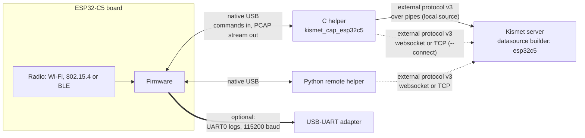
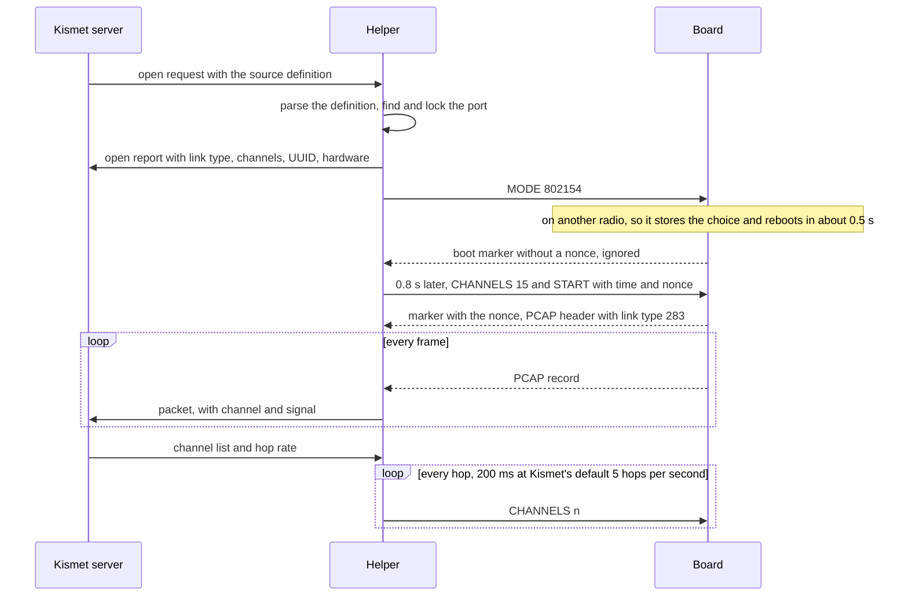

This page follows a packet from the air into Kismet: the firmware and its line protocol, the stream and how the helpers stay in step with it, the two helpers, the source type inside the Kismet server, and why Kismet has to be patched. It is for readers who want to understand the design, debug something unusual, or work on the code. You do not need it to install or use the boards.

## The pieces

| Piece | Runs on | What it does | Code |
|---|---|---|---|
| Firmware | The ESP32-C5 board | Listens with one radio and streams every frame as a PCAP record over the board's native USB port. Takes commands on the same port. | [`firmware/`](https://github.com/oshri-almog/esp32c5-kismet-wifi-interface/tree/main/firmware) |
| The C helper, `kismet_cap_esp32c5` | Linux, next to Kismet or on another machine | Opens a board, drives it, checks the stream and hands the packets to Kismet. Built on Kismet's capture framework like Kismet's own helpers. | [`kismet/capture_esp32c5/`](https://github.com/oshri-almog/esp32c5-kismet-wifi-interface/tree/main/kismet/capture_esp32c5) |
| The Python remote helper | Any OS with Python 3.10 or newer, mainly Windows (run on Windows and Linux) | The same job, over Kismet's remote capture only. | [`esp32c5_kismet/`](https://github.com/oshri-almog/esp32c5-kismet-wifi-interface/tree/main/esp32c5_kismet) |
| The datasource builder | Inside the Kismet server | Registers the source type `esp32c5`, so Kismet accepts these sources at all. | [`kismet/datasource_esp32c5.h`](https://github.com/oshri-almog/esp32c5-kismet-wifi-interface/blob/main/kismet/datasource_esp32c5.h) |
| `add-to-kismet.sh` | A Kismet source tree, before building and again after each update of `kismet/` | Adds the builder and the C helper to Kismet's build, and fixes bugs in Kismet's capture framework. | [`kismet/add-to-kismet.sh`](https://github.com/oshri-almog/esp32c5-kismet-wifi-interface/blob/main/kismet/add-to-kismet.sh) |
| The fake board | A POSIX pseudo-terminal | Behaves like a board, for the demo and the tests. | [`tools/fake_board.py`](https://github.com/oshri-almog/esp32c5-kismet-wifi-interface/blob/main/tools/fake_board.py) |



A board is used by one helper at a time. Between a helper and Kismet, the solid arrow is a local source and the dotted arrows are remote capture; the Python remote helper only does remote capture. The thick arrow to the USB-UART adapter is optional and carries only logs.

## The board and its firmware

The firmware is an ESP-IDF 5.5 project for the ESP32-C5 only. It came from the sibling project [esp32c5-wireshark-sniffer](https://github.com/oshri-almog/esp32c5-wireshark-sniffer), and the board speaks the same line protocol in both projects. A test board on the Wireshark project's published firmware, 1.2.0, captured all three radios under both of this project's helpers; the other direction, a board on this project's firmware in the Wireshark project's extcap, has not been tried. The [FAQ](FAQ) has the details per firmware version.

- **One radio per boot.** The board listens with Wi-Fi, IEEE 802.15.4 or Bluetooth LE, and only the driver for that radio is started. The choice is stored in flash (NVS), so the board boots back into it. A board that has never been told boots Wi-Fi.
- **Why not switch at runtime.** Handing the antenna from one radio to another at runtime "leaves the PHY in a state that no reset clears": two boards switched to 802.15.4 and back captured no Wi-Fi at all until they were unplugged. So asking for another radio stores the choice and reboots the board, after shutting the old radio down cleanly. The reboot takes about 0.53 s from the command to the new stream. On the Pi most switches left the board's USB port up, but some made the USB device drop off and come back within about 0.3 to 2.5 s, which both helpers ride out by reopening the port.
- **Known issues.** A reset that does not go through `MODE`, such as flashing, skips that clean shutdown: a board flashed while it was on 802.15.4 came back deaf to Wi-Fi until it was switched to BLE and back. And now and then a board drops off USB in a switch, comes back and answers nothing until it is reset, for a reason not yet known ([Troubleshooting](Troubleshooting#a-board-stops-answering-after-a-radio-switch)). [Troubleshooting](Troubleshooting) and [Flashing the Firmware](Flashing-the-Firmware) have the workarounds.
- **The host link** is the board's native USB port, the ESP32-C5's built-in USB-Serial-JTAG (USB ID `303a:1001`). It carries nothing but the capture stream in one direction and command lines in the other. The port's speed setting is ignored.
- **Logs** go to UART0 (115200 baud, TX on GPIO11), not to USB. That includes every answer to a command except `START`, and the drop counters. You see them only through a devkit's UART connector or a USB-UART adapter on those pins.
- **Receive only.** Wi-Fi runs in promiscuous mode with neither a station nor an access point: no beacons, no probes, no association. BLE runs a passive scan in the observer role: it never advertises, connects or pairs. The only transmitter is the `TXTEST` command in 802.15.4 mode, which neither helper ever sends. <!-- VERIFY: whether ESP-IDF's 802.15.4 driver sends an automatic ACK for a frame that requests one while the firmware listens in promiscuous mode (firmware sets promiscuous on, coordinator off: esp32c5_sniffer.c sniffer_154_init); no test looked for ACKs on air -->

## The line protocol

The host sends plain ASCII lines ending in `\n`. Command words are case-sensitive. The board answers nothing over USB except to `START`.

| Command | What the board does | How the helpers use it |
|---|---|---|
| `MODE WIFI\|802154\|BLE` | Asked for another radio: stores it and reboots. Asked for the radio it is on: nothing. | Sent before the first `START`, and again whenever the stream shows the board on another radio. |
| `CHANNELS <spec>` | Replaces the channel list. One channel locks the board there; several are hopped at the dwell time. | One channel at a time: `CHANNELS 6`, then `CHANNELS 11` at the next hop. |
| `DWELL <ms>` | Time on each channel of a list, 20 to 60000 ms. | The Python remote helper sends it; with one channel it has no effect. |
| `START [<unix time in µs>] [<nonce>]` | Throws away buffered frames, sets its clock, and restarts the stream (next section). | Sent with the current time and a new nonce. |
| `TXTEST [n]` | Transmits n 802.15.4 test frames, 802.15.4 mode only. | Never. |

The full syntax, the channel list grammar and every log message are in [Firmware Protocol](Firmware-Protocol).

## The stream

What the board sends after `START` is a PCAP file with a marker line in front of it:

```text
\n<<START>> 3f9a0c21\n      marker line; 3f9a0c21 is the nonce the host sent with START
PCAP global header           24 bytes: magic a1b2c3d4, version 2.4, snaplen 65535, the radio's link type
PCAP record header           16 bytes: seconds, microseconds, captured length, original length
frame                        radiotap + 802.11, TAP + 802.15.4, or pseudo-header + BLE packet
PCAP record header
frame
...
```

- Every record is sent whole or dropped whole, and the stream only restarts between records, so its framing is never lost. When the host or the USB link cannot keep up, the board drops whole frames and counts them on UART0.
- At boot the board sends a marker without a nonce and a header whose timestamps count from boot. A `START` with a time switches the timestamps to wall-clock time. For remote sources Kismet replaces packet times with its own arrival time unless the source definition says `timestamp=false`.
- The helpers send `START <time> <nonce>` with a nonce of 8 lowercase hex characters, new every time. The board answers within about 0.1 s.

### Staying in step with the stream

The helpers read the stream the same way:

1. Everything before `<<START>> <our nonce>` is ignored: boot text, the boot marker, or the tail of an older stream.
2. The global header must be a PCAP header with the link type of the radio asked for: 127, 283 or 256. Another link type means the board is still on another radio, so `MODE` is sent again.
3. Each record must be plausible: microseconds below 1,000,000, a length from 1 to 16384, and captured length no more than original length. Anything else is "lost sync", and the handshake starts again.
4. Nothing inside a record is read as protocol. A frame whose payload holds `<<START>>` and a PCAP header, which anyone could transmit, cannot fake a restart. The fake board's `--inject` option tests exactly this.

When the handshake does not work out, the helpers retry on a timer:

| What | Both helpers |
|---|---|
| From `MODE` to `CHANNELS` + `START` | 0.8 s, so the `START` is not lost while a rebooting board is deaf (about 0.5 s) |
| Handshake repeated while not in sync | every 2 s |
| Port says nothing at all before sync | reopened after 6 s. Once in sync, silence is a quiet channel, not an error |
| Not in sync for 15 s | The C helper reports an error and exits; Kismet reopens a local source 5 s later, and a remote C helper restarts itself 5 s later. The Python remote helper shuts the source down and reconnects 5 s later |

## Opening a source, step by step



Measured on the Raspberry Pi with the C helper as a local source, from Kismet's "launched successfully" to "capturing": **1 to 1.5 s** when the board was already on the requested radio, since the helpers always send `MODE` and wait the 0.8 s; about **1.5 s** when it had to switch; and about **2.5 to 3 s** when the board also dropped off USB during the switch and came back.

Kismet decides the channels: the list, the rate, the shuffle and each source's starting offset. The helper turns every hop into one `CHANNELS <n>` line; the board's own hopping is never used. Hops are at least 50 ms apart, and a shuffled list is walked with a skip of 4. While a source hops, Kismet's source record keeps showing its start channel (6, 15 or 37), with either helper, because Kismet does not update it on a hop, only when a channel is set; each packet's channel is the real one. See [Channel Control](Channel-Control).

## The C helper

`kismet_cap_esp32c5` is a Kismet capture helper like Kismet's own, built on Kismet's `capture_framework.c` and laid out like its serial sources `capture_freaklabs_zigbee_v2` and `capture_catsniffer_zigbee`.

- **Local sources.** Kismet starts one helper per source from its own binary directory, as `kismet_cap_esp32c5 --in-fd=<n> --out-fd=<m>`, and talks to it over those two pipes. The helper must therefore be installed next to the `kismet` binary.
- **Remote sources.** The same binary runs on another Linux machine with `--connect <host>:2501 --source <definition>` and feeds a Kismet server there. The capture framework connects again 5 s after a connection or a capture ends, unless `--disable-retry` is given. Before each connection the helper checks its own definition, and stops that attempt with `FATAL: Could not probe local source prior to connecting to the remote host: <reason>` when the definition names no port and there is no board or more than one, or when another process holds the board's port (it is not offered to Kismet then, since Kismet would close the running source with the same UUID to make room for it). The retry covers these cases too. A definition that names a port is offered whether the port is there or not; if it is missing, the open fails with `cannot open /dev/ttyACM9: No such file or directory`. At each attempt, 5 s apart, Kismet logs `Data source 'esp32c5-ttyACM9 / esp32c5-ttyACM9' ('esp32c5-ttyACM9') encountered an error: cannot open /dev/ttyACM9: No such file or directory` and `Error connecting new remote source esp32c5-ttyACM9 (<uuid>) - cannot open /dev/ttyACM9: No such file or directory`, and does not list the source. The `<uuid>` there comes from the path, since there is no board to read a MAC from. See [Remote Capture](Remote-Capture).
- **Probe.** For a definition without `type=`, Kismet asks every helper whether the definition is theirs, keeps their reasons to itself, and gives up for good if none says yes. For local sources the C helper therefore claims any definition named its way even while its board cannot be found: a name without a port (`esp32c5`, `esp32c5zigbee`, `esp32c5btle-kitchen` ...) with no board or several plugged in, and a named port (`esp32c5-ttyACM9`) whether it is there or not. Kismet then shows the helper's reason as the source error, such as `no Espressif USB-Serial-JTAG device (USB ID 303a:1001) found; plug the board in, or give device= in the source definition`, and retries every 5 s, so a board plugged in later is picked up. A definition that is wrong in itself, with a bad `mode=` or `channel=`, is not claimed, and Kismet says only `Unable to find driver`; add `type=esp32c5` to see the reason.
- **Names.** After `esp32c5-`, only names that look like a serial port are taken as one: `tty*`, `cu.*`, `cua*`, `dty*` and `pts/<n>`, never a name containing `..`. Anything else, such as `esp32c5-kitchen`, is a free-form name, and the board is found by itself.
- **List.** For the *Data Sources* panel Kismet asks what each helper can see. The C helper lists every board three times, once per radio (`esp32c5-ttyACM0`, `esp32c5zigbee-ttyACM0`, `esp32c5btle-ttyACM0`), because Kismet keeps nothing but the name of a listed interface. A board whose port is in use is left out, all three names together; the helper learns that from `/proc/locks` without opening the port, since opening it would move the reset lines. On the test Pi, Kismet's list of interfaces showed three rows per board and dropped all three while a source held the board; that was read through Kismet's REST API, and the panel itself has not been looked at in a browser. Finding boards by itself needs Linux sysfs; on macOS and the BSDs you name the port.
- **The port.** It opens the tty raw and takes an exclusive `flock` on it before anything else touches it, then puts the tty in exclusive mode (`TIOCEXCL`; not on a pseudo-terminal). It clears RTS before DTR, because on USB-Serial-JTAG those lines drive reset and boot mode, and releasing DTR while RTS is up resets the chip.
- **Privileges.** First thing, before it reads its options, it drops every capability and sets `no_new_privs`: it only opens serial ports and talks to Kismet, which need none. So neither Kismet nor Docker has to give it `NET_ADMIN`. This needs a build with libcap (`libcap-dev`), as the install pages and the Docker image have; built without it, the helper drops nothing and keeps whatever it was given. Installed setuid root it keeps no capability either, and retries a refused open with the user's own file permissions; setuid installs have been checked only in the test harness, not on a real system.
- **Recovery.** Errors, a closed port or silence make it reopen the port and ask again. A reopened port is checked, by the board's MAC, to still hold the same board, since two boards that reboot together can come back with their tty names swapped, and a board that moved is found again by its MAC. Only 15 s without capturing is reported to Kismet, as an error in its log: `<name>: no capture from the board on <device> for 15 seconds; is it flashed with the esp32c5 sniffer firmware, and is nothing else holding the port?`. Kismet ignores the error frame the helper sends with it, so for a local source it records only `IPC connection closed` as the source's error.

## The Python remote helper

`python -m esp32c5_kismet.remote` is a pure-Python helper for remote capture. It exists mainly for Windows, where Kismet does not run and Docker Desktop cannot see USB boards by itself, but it runs anywhere with Python 3.10 or newer and the packages in [`requirements.txt`](https://github.com/oshri-almog/esp32c5-kismet-wifi-interface/blob/main/requirements.txt).

- It implements Kismet's external protocol v3 itself, from Kismet's `kis_external_packet.h` and `capture_framework.c`: the same fields, in the same order and with the same msgpack types as a C helper sends. Its tests check the exact bytes.
- It connects to Kismet's websocket on the web port (default) or to the legacy TCP port with `--tcp`. Each `--source` is one board on one radio with its own connection; one process can run several.
- Channel hopping works as for any helper: Kismet sends a channel list, a rate, a shuffle flag and an offset, and the helper retunes the board on its own timer. The C helper gets that timer from Kismet's capture framework; the Python remote helper has its own, with the same 50 ms floor and skip of 4.
- It follows the C helper's rules on purpose: the same source names, UUIDs, hardware label, `channel=` rules, port lock (`flock` and `TIOCEXCL`), stream checks, BTLE fix-up, login headers and handling of a refused channel. The two helpers take the same lock, so they exclude each other on one machine. On the Pi, both gave each board the same UUID per radio and the same hardware label.
- Where they differ: a board that is not capturing for 15 s makes the Python remote helper drop the connection and reconnect by itself 5 s later, while the C helper exits and is restarted. The Python remote helper reports the port itself (`COM14`, `/dev/ttyACM0`) as the capture interface, the C helper `esp32c5-ttyACM0`. With an HTTP proxy set in the environment, the C helper's libwebsockets sends every websocket through `http_proxy` and ignores `no_proxy`, while the Python remote helper leaves out the hosts `no_proxy` covers and never sends a loopback address, such as 127.0.0.1, through a proxy. The Python remote helper's `--list` uses pyserial rather than sysfs, so it should work on Windows, Linux and macOS (it has run on Windows and Linux only).
- It is tested offline and end to end against a real Kismet with the fake board ([`tests/remote_e2e.sh`](https://github.com/oshri-almog/esp32c5-kismet-wifi-interface/blob/main/tests/remote_e2e.sh): websocket and `--tcp`, all three radios, a radio switch, a channel lock, a refused channel, a second source refused, a Kismet restart). It ran with real boards on 2026-10-02, on the Pi and on Windows as of commit `f8e6792`, and later that day on the Pi as it is now, with its changes since then (proxies and `no_proxy`, one-line messages). Its stop-signal handling was changed because the old one could hang it on Windows; the new one has run on Windows only in the offline tests.
- It is not in the Docker image. The image's `helper` role runs the C helper.

## Inside the Kismet server

Kismet only accepts a source whose type has a builder compiled into the server. [`datasource_esp32c5.h`](https://github.com/oshri-almog/esp32c5-kismet-wifi-interface/blob/main/kismet/datasource_esp32c5.h) is that builder: it registers the type `esp32c5`, described as "ESP32-C5 sniffer board: Wi-Fi (2.4/5 GHz), 802.15.4, or BTLE advertising", and names the helper binary `kismet_cap_esp32c5`.

| Capability | Set | Meaning |
|---|---|---|
| probe | yes | Kismet may ask the helper whether a definition without `type=` is an `esp32c5` source. |
| list | yes | Boards appear in the *Data Sources* panel. |
| local | yes | Kismet can start the helper itself. |
| remote | yes | Remote helpers may offer `esp32c5` sources. |
| tune, hop | yes | Kismet sets channels and hops them. |
| passive | no | An `esp32c5` source always has a helper behind it. |

The builder has no packet code. The helpers hand over every packet in a link type Kismet already decodes, with a signal block where needed. Because the link type follows the radio, it is not fixed per source type; each source sets it in its open report.

## Kismet's external protocol v3

Helpers and the server exchange frames: a 20-byte header in network byte order (signature `0xDECAFBAD`, the v3 sentinel `0xA9A9`, version 3, length, packet type, code, sequence number) followed by a msgpack map. The numbers come from Kismet's `kis_external_packet.h`.

| Message | Direction | Used for |
|---|---|---|
| probe request / report | Kismet to helper and back | "Is this definition yours?" |
| list request / report | Kismet to helper and back | Boards for the *Data Sources* panel |
| new source | remote helper to Kismet | A remote helper announcing its source, within 5 s of connecting |
| open request / report | Kismet to helper and back | Open a source; the report carries link type, channels, UUID, hardware and capture interface |
| configure request / report | Kismet to helper and back | Lock a channel, or hop a list at a rate |
| packet | helper to Kismet | One frame, with its link type, timestamp and signal block |
| message | helper to Kismet | Status text, such as `c5-zigbee capturing (zigbee)` |
| ping / pong | both | Kismet pings every 5 s; no answer for 15 s is an error |

| Transport | Where | Login |
|---|---|---|
| Pipes | Local sources: Kismet starts the helper | None needed |
| Websocket | `ws://<host>:2501/datasource/remote/remotesource.ws`, on Kismet's web port | Required: a user and password, sent in an HTTP Basic `Authorization` header, or an API key with the `datasource` role, sent as Kismet's `KISMET` cookie. Only a user name that contains `:` goes in the URL instead |
| Legacy TCP | Port 3501, on 127.0.0.1 only by default | None. Keep it on loopback or a network you trust |

Kismet never reopens a remote source itself. When the connection drops it waits for the helper to connect again and recognises the source by its UUID. It then keeps every option of that UUID's earlier definition that the new one leaves out, for as long as that Kismet runs (options the new definition gives replace the old ones): a source once locked with `channel_hop=false` stays locked after its definition drops that option, until Kismet restarts or the definition says `channel_hop=true`. Closing a remote source in Kismet ends its connection, and lasts only until the helper connects again, 5 s later; to stop a remote source, stop its helper.

## Link types, per radio

| Radio | The board sends | The helper sends Kismet | Kismet's phy |
|---|---|---|---|
| Wi-Fi | 127, radiotap + 802.11 | 127, unchanged | `IEEE802.11` |
| 802.15.4 | 283, IEEE 802.15.4 TAP | 230, 802.15.4 without FCS, plus a signal block | `802.15.4` |
| Bluetooth LE | 256, LE link layer with pseudo-header | 256, unchanged (repaired for older firmware) | `BTLE` |

### Wi-Fi: radiotap

Each frame has a 16-byte radiotap header with the flags, the channel (frequency and band flags), the signal in dBm and the noise floor in dBm. The FCS is stripped, and frames that failed their FCS check never reach the stream. There are no rate, MCS, bandwidth or HT/VHT/HE fields. The helpers pass Wi-Fi to Kismet unchanged.

### 802.15.4: TAP, rewrapped

The radio never hands over a frame's FCS: the hardware checks it and then overwrites those two bytes with RSSI and LQI. So the firmware wraps each frame in an IEEE 802.15.4 TAP header, 48 bytes with five TLVs: FCS type (none), signal (RSS, dBm), channel, LQI and a start-of-frame timestamp.

Kismet reads a TAP header as if it were always 28 bytes with three TLVs, and would misread this one. So the helpers take the channel and signal out of it and send Kismet the bare MAC frame as link type 230 (802.15.4 without FCS), with a signal block holding the channel, the frequency (2405 + 5 × (channel − 11) MHz) and the signal rounded to whole dBm. A frame with a malformed TAP header is dropped and counted.

On the Pi, 200 test frames sent by a second board on channel 20 arrived in Kismet as 200 packets of link type 230, with the C helper as a local and as a remote source and with the Python remote helper, each on a source locked to channel 20. Kismet's device records show the frequency (2450000 kHz for channel 20), but its kismetdb log stores a frequency of 0 for every 802.15.4 and BLE packet, whatever the helper sends: Kismet's 802.15.4 and BLE code never copies it into the packet.

### Bluetooth LE: LE link layer with pseudo-header

Each record is a 10-byte pseudo-header (the same one Nordic's nRF Sniffer produces), the access address `0x8E89BED6`, the advertising PDU and a 3-byte CRC:

- **Channel.** The ESP32-C5 controller scans advertising channels 37, 38 and 39 together and does not report which one a packet came on, so every record says channel 37 (RF channel 0).
- **PDU.** The controller hands the host an advertising report, not the raw packet, so the firmware rebuilds the PDU from it. The report does not carry the ChSel header bit, which is always recorded clear. For BLE 5 devices that set it in `ADV_IND` or `ADV_DIRECT_IND`, the recorded header byte and CRC therefore differ from what was on the air.
- **CRC and flags.** The firmware computes the 24-bit advertising CRC over the recorded PDU and sets the flags "CRC checked" and "CRC valid" (flags `0x0C13`). The controller only reports packets whose CRC passed, so the flags are truthful. They matter: Kismet trusts a BLE packet's CRC only when the pseudo-header says it was checked, and otherwise checks it itself and drops the packet when that fails.
- **Older firmware.** The Wireshark project's published firmware (1.2.0) leaves both flags clear and the CRC zeroed, so Kismet would drop every packet. Both helpers notice, fill in the CRC and the flags, and say so once each time the source opens (for a remote helper, once per connection): `<name>: the board's firmware does not mark BTLE packets as CRC checked, so Kismet would drop them; the helper fills in the CRC and the flags (the board only reports packets whose CRC passed). Flashing current firmware makes this unnecessary`. On a test board with 1.2.0, every packet reached Kismet with a valid CRC and the flags set, through either helper.

Kismet treats repeats of an identical advertisement as duplicate packets, so BLE device packet counts and last-seen times stop moving after the first few packets. And an advertiser whose advertising data ends in zero padding never becomes a device at all, because Kismet cannot parse that data; its packets are still in the logs. That, and what else to expect from BLE in Kismet, is on [Bluetooth LE Capture](Bluetooth-LE-Capture).

## Board identity

- **USB ID.** Every Espressif chip with a native USB-Serial-JTAG port (ESP32-C3, C5, C6, H2, S3, P4 and others) has the USB ID `303a:1001`. The helpers cannot tell an ESP32-C5 sniffer from any other ESP32 on native USB, so with other ESP32 boards plugged in you name the port.
- **MAC.** The board reports its MAC as its USB serial number. On Linux, udev turns it into a stable name: `/dev/serial/by-id/usb-Espressif_USB_JTAG_serial_debug_unit_F0:F5:BD:01:02:03-if00`.
- **UUID.** Each source's Kismet UUID is `E5C5000M-0000-0000-0000-<MAC>`, where M is 1 for Wi-Fi, 2 for 802.15.4 and 3 for BLE. The board with MAC `F0:F5:BD:01:02:03` is `E5C50001-0000-0000-0000-F0F5BD010203` on Wi-Fi. One board has three UUIDs, one per radio, and they do not change when the port name does. When the helper cannot read a MAC (the C helper on macOS and the BSDs, or the fake board), a 48-bit hash of the device path stands in. `uuid=` in the definition overrides both.
- **Hardware label.** `Espressif USB-Serial-JTAG (F0:F5:BD:01:02:03)`, or `ESP32-C5` without a MAC. It names the USB device on purpose, not the chip. Logs from earlier versions show `ESP32-C5 (<MAC>)`.

This matters because Kismet matches a remote source by its UUID only, and never removes an old source. A UUID that changed between connections would leave a second, dead copy of the source in Kismet.

## One board, one source

A board listens with one radio at a time, and every change of radio reboots it. Two sources on one board would reboot it back and forth and capture little. So each helper takes the board's port exclusively while it runs: on Linux and other POSIX systems an `flock` and the tty's exclusive mode (`TIOCEXCL`), the same in both helpers, and on Windows the exclusive open that Windows gives every COM port anyway. A second source on a busy board fails with:

```text
/dev/ttyACM0 is already in use by another capture (an esp32c5 source or another program holds it); a board captures with one radio at a time
```

The Python remote helper also refuses, at startup, two `--source` definitions for one port, however the port is spelled (`COM14`, `com14` and `\\.\COM14` are one port, and so are a `/dev/serial/by-id/` link and its tty).

The `flock` lives on the device node, and a container makes its own device nodes, so the `flock` alone would not stop the host, or a second container, from opening a board a container is using. The exclusive mode does: the kernel keeps it with the tty, whichever node it was opened through, so every other open fails with "Device or resource busy" (EBUSY), which the helpers report as `... is already in use by another capture ...`. On the Pi, the host could not open a board while a container captured from it. The exception is a process with the `CAP_SYS_ADMIN` capability, such as esptool run with `sudo`, which the exclusive mode lets in.

On Linux both remote helpers also look, before each connection, whether another process holds the board's `flock`, and do not offer the source to Kismet while it does: the same board and radio always give the same UUID, and Kismet closes a running source when a new connection arrives with its UUID. The Python remote helper cannot look on Windows, so there a second copy of a running source would take its place (worked out from the code, not tried).

## Why Kismet has to be patched

A capture helper alone cannot add a source type to Kismet. The server needs a builder for the type compiled in and registered in `kismet_server.cc`. A stock Kismet refuses these sources. Its code has a message for each case: a definition with `type=esp32c5` gets `Unable to find datasource for 'esp32c5'`, and a remote helper's source is refused with `Kismet could not find a datasource driver for incoming remote source 'esp32c5' defined as '<definition>'` in Kismet's log. This applies to remote capture too: even when every board is on another machine, the Kismet server must be the patched one.

No Kismet release includes the source yet, so Kismet is built from source at commit `cfe427074`, the commit the source was developed against. [`kismet/add-to-kismet.sh`](https://github.com/oshri-almog/esp32c5-kismet-wifi-interface/blob/main/kismet/add-to-kismet.sh) prepares the tree:

1. Copies `datasource_esp32c5.h` and the `capture_esp32c5/` directory into the tree.
2. Includes and registers the builder in `kismet_server.cc`.
3. Adds the helper to `Makefile.in` (build, install, clean) and to `configure.ac`. The helper needs only a serial port, so no new dependency or platform test is added, and the configure summary gains the line `ESP32-C5: yes`.
4. Fixes seven upstream bugs in `capture_framework.c` that every capture helper has: a memory leak of about 32 bytes per packet in `cf_commit_packet`; websocket remote capture that sent in bursts every 5 s; a closed websocket that could leave the helper holding its port without reconnecting; the login in the websocket's URL, which now goes in HTTP headers, with redirects refused so that the login never goes along to wherever one points (libwebsockets 4.0 and later do not even connect there); a libwebsockets warning, `rejecting message on queue depth 40`, on machines with many network routes; an empty `INFO: ` line after each channel set; and a websocket `Host` header without the port, which a reverse proxy that routes by host and port can take for another site. Each goes to Kismet as a change of its own, and the script skips each once Kismet has it.
5. Regenerates `configure` with `aclocal` and `autoconf`, when `configure.ac` has changed.

Running it again on the same tree repeats none of the edits, and copies only the files of the builder and helper that changed, so that `make` does not recompile `kismet_server.cc` and relink `kismet` for nothing. That is how an updated helper gets into the tree: after updating this repository, run the script again and build again ([Guide: Updating](Guide-Updating)). The steps and the build are on [Building Kismet with ESP32-C5 Support](Building-Kismet-with-ESP32-C5-Support). Once the source is part of Kismet, this step goes away.

## Where Docker fits

The Docker image is Kismet built exactly this way, with the C helper installed next to it. Its `kismet` role runs Kismet with local sources for the boards plugged into the host; its `helper` role runs only the C helper with `--connect`, to feed a Kismet elsewhere. The `demo` image adds the fake board. See [Install with Docker](Install-with-Docker) and [Docker Reference](Docker-Reference).

## The fake board

[`tools/fake_board.py`](https://github.com/oshri-almog/esp32c5-kismet-wifi-interface/blob/main/tools/fake_board.py) makes a pseudo-terminal that behaves like a board: it speaks the line protocol, remembers its radio, reboots in about 0.53 s on `MODE`, and sends made-up traffic that depends on the channel it is tuned to, about 100 records a second on a channel with traffic. On Wi-Fi it has three access points, `ESP32C5-FAKE-24` on channel 6, `ESP32C5-FAKE-5LOW` on 36 and `ESP32C5-FAKE-5HIGH` on 149; on 802.15.4 two nodes on channels 15 and 25; on BLE an advertiser called `ESP32C5-FAKE`. It runs on Linux and other POSIX systems only. The Docker demo and the end-to-end tests use it; see [Try It Without Hardware](Try-It-Without-Hardware) and [Development and Testing](Development-and-Testing).
