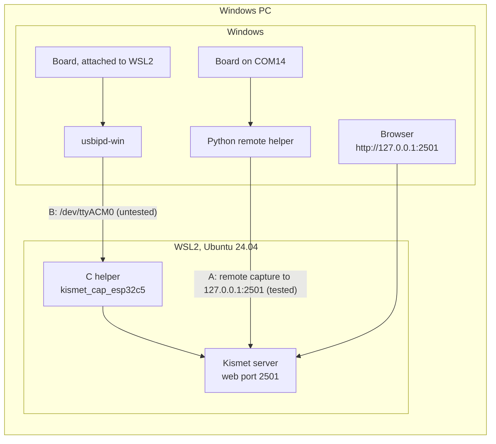

This page runs Kismet with ESP32-C5 support inside WSL2 on a Windows PC, so the Kismet server and the boards are on the same computer without Docker or a second machine. It is for Windows users who are at home in a Linux shell. It covers building Kismet in WSL2, the two ways to get the boards to it, and the points where WSL2 differs from an ordinary Linux machine.

## Two ways to connect the boards

Kismet's own documentation says that WSL2 has no direct access to USB hardware, and that capture from it works through Kismet's remote capture ([Kismet on Windows](https://www.kismetwireless.net/docs/readme/installing/windows/)). That leaves two ways:

| | A: boards on Windows, Python remote helper | B: boards attached to WSL2 with usbipd-win |
|---|---|---|
| Where the boards appear | Windows, as COM ports (`COM14`) | Inside WSL2, as `/dev/ttyACM0` |
| What feeds Kismet | The Python remote helper on Windows, over remote capture | The C helper (`kismet_cap_esp32c5`), started by Kismet inside WSL2 |
| Extra software on Windows | Python 3.10 or newer | usbipd-win |
| The board can also be used from Windows | Yes, once the helper is stopped | No, not while it is attached to WSL2 |
| Tested | **Yes**: Windows 11, a real board | **No** |

Use way A. Way B is described so that someone can try it; nobody has run it with these boards yet.



[How It Works](How-It-Works) explains the helpers, and [Choosing a Setup](Choosing-a-Setup) compares this setup with Docker Desktop, a Raspberry Pi and a Linux machine.

## What was tested

| What | Result |
|---|---|
| Building Kismet in WSL2 | WSL2 Ubuntu 24.04 (x86_64) on Windows 11 Pro. Kismet at commit `cfe427074` with the ESP32-C5 source, built and installed as root into `/root/kismet-install`. It reports `Kismet 2026.09.0-cfe427074`. |
| Way A with a real board | One board on COM32, the Python remote helper on Windows (Python 3.13.2), Kismet in WSL2 with WSL's default networking (no `.wslconfig`). On 2026-10-02 (firmware image 01a50bd6), with an API key, a Wi-Fi source found 82 Wi-Fi devices in about 40 s and came back by itself after Kismet restarts, through `127.0.0.1` and through `localhost`. Earlier, with an older version of the helper, Wi-Fi on both bands, Bluetooth LE and 802.15.4 sources all ran, with a login; a second board, on COM30, was wedged with Windows error 31 for most of that run ([Install on Windows](Install-on-Windows) explains the error). <!-- VERIFY: Bluetooth LE and 802.15.4 sources, and a login, against Kismet in WSL2 with the current helper (on 2026-10-02 they ran against Kismet on a Pi) --> |
| The fake board | The project's end-to-end tests with the fake board and a real Kismet, for the C helper and for the Python remote helper ([Development and Testing](Development-and-Testing)), ran in WSL2. |
| Not tested | Way B (usbipd-win); any board inside WSL2; Kismet in WSL2 as a normal user; reaching Kismet in WSL2 from another machine; Windows 10. |

## Before you start

- **WSL2 with Ubuntu 24.04**, the tested distribution. It must run under WSL 2, not WSL 1: in PowerShell, `wsl --list --verbose` shows the version of each distribution. Other distributions should work the same way but have not been tried. If WSL or Ubuntu 24.04 is not installed yet, run this in an administrator PowerShell, restart if Windows asks, then open Ubuntu from the Start menu and create your Linux user:

  ```powershell
  wsl --install -d Ubuntu-24.04
  ```

  <!-- VERIFY: not part of the test record; Microsoft's documented WSL install command on Windows 11, and the distribution name Ubuntu-24.04 -->
- **Memory.** WSL2 takes its memory from the same pool as Windows, and as Docker Desktop if that is running. Kismet's C++ needs about 1.5 GB for each compiler that runs in parallel. This is why the build below uses `-j4` and no more.
- **Disk.** On the Raspberry Pi build, the installed `kismet` program alone is about 490 MB, because Kismet is built with debug information. It was not measured in WSL2, and neither was the whole build tree.
- **Boards** flashed with this project's firmware ([Flashing the Firmware](Flashing-the-Firmware)). Flash from Windows; the firmware tools do not need WSL2.
- **One Kismet on port 2501.** A Kismet in Docker Desktop on the same PC publishes port 2501 on Windows too: the demo on `127.0.0.1`, the `kismet` service on all interfaces. Stop one, or give Docker's another port ([Install with Docker](Install-with-Docker)).

## Step 1: Build Kismet in WSL2

The build is the same as on any Ubuntu machine, and [Building Kismet with ESP32-C5 Support](Building-Kismet-with-ESP32-C5-Support) explains each part. The commands here follow the build that ran in WSL2, with the two WSL2 problems they avoid: running out of memory during `make`, and `make install` failing for want of a `kismet` group. The package list is the one the Raspberry Pi build used, plus `python3` and `curl`.

Open Ubuntu and start a root shell. The tested build ran as root, so every command below runs in that shell and `~` is `/root`:

```bash
sudo -i
```

<!-- VERIFY: the home-directory install as a normal user in WSL2 (make install INSTUSR=$(id -un) INSTGRP=$(id -gn) SUIDGROUP=$(id -gn), as on Install-on-Linux); only the root install ran in WSL2 -->

### Install the build packages

```bash
apt-get update
apt-get install -y build-essential git pkg-config autoconf automake python3 curl \
    libwebsockets-dev zlib1g-dev libnl-3-dev libnl-genl-3-dev libcap-dev libpcap-dev \
    libnm-dev libdw-dev libsqlite3-dev libsensors-dev libusb-1.0-0-dev libmosquitto-dev \
    libpcre2-dev libssl-dev
```

`autoconf`, `automake` and `python3` are for `add-to-kismet.sh`, and `curl` is for creating an API key in step 4. <!-- VERIFY: this package list on a freshly installed Ubuntu 24.04 in WSL2 -->

### Get this project and Kismet, and add the ESP32-C5 source

```bash
git clone https://github.com/oshri-almog/esp32c5-kismet-wifi-interface.git ~/esp32c5-kismet-wifi-interface
git clone https://github.com/kismetwireless/kismet.git ~/src/kismet
git -C ~/src/kismet checkout cfe427074
sh ~/esp32c5-kismet-wifi-interface/kismet/add-to-kismet.sh ~/src/kismet
```

`cfe427074` is the Kismet commit the ESP32-C5 source was developed and tested against; Git reports a "detached HEAD", which is expected. No Kismet release contains the source yet, so Kismet has to be built this way. `add-to-kismet.sh` prints an `edited <file>` line for each change and ends by suggesting `./configure && make`; use the `configure` command below instead.

### Configure

```bash
cd ~/src/kismet
./configure --prefix=$HOME/kismet-install --disable-python-tools --disable-librtlsdr --disable-ubertooth --disable-bladerf --disable-btgeiger
```

This is the line the WSL2 test tree's `config.log` records. The `--disable-...` options leave out support for other hardware (RTL-SDR dongles, Ubertooth, bladeRF, a Bluetooth LE Geiger counter) that these boards do not need, as [Building Kismet with ESP32-C5 Support](Building-Kismet-with-ESP32-C5-Support#configure) explains; without `--disable-librtlsdr`, `configure` stops unless librtlsdr's development files are installed, and the package list above does not have them.

At the end, check that the summary has `ESP32-C5: yes` and `Websocket datasources: yes`. The first means the ESP32-C5 source is in the build; the second, that the C helper can do remote capture.

### Compile, with four jobs at most

```bash
nice make -j4
```

> **Warning:** Do not give `make` one job per core in WSL2. On the test PC (20 cores), `make -j20` used up the memory that WSL2 shares with Windows: Windows was down to 1.2 GB free and the WSL distribution had to be terminated. With Docker Desktop running, there is even less to spare. `make -j4` finished normally.

If WSL2 stops responding during the build, stop the distribution from PowerShell, using the name `wsl --list --verbose` shows, then open Ubuntu again and rerun `nice make -j4`:

```powershell
wsl --terminate Ubuntu-24.04
```

The time of the WSL2 build was not recorded. On the same PC, a Docker Desktop build, which leaves out more optional parts of Kismet, spent about 17.5 minutes on configure, compile and install at `-j4`.

### Install

```bash
make install INSTGRP=root SUIDGROUP=root MANGRP=root
```

A plain `make install` fails in WSL2 with `/usr/bin/install: invalid group 'kismet'`. Kismet installs some of its own capture helpers (for example `kismet_cap_rz_killerbee`, built whenever libusb is found) with a `kismet` group, and Ubuntu in WSL2 has no such group. The variables use `root` instead. `MANGRP=root` has no effect at this Kismet commit but does no harm. The alternative is to create the group first, with `groupadd kismet`, and run `make install` without the variables.

The install ends with `Kismet has NOT been installed suid-root. This means you will need to start it as root...`. That advice is for Kismet's Wi-Fi and Bluetooth helpers; the ESP32-C5 source needs only a serial port.

### Check the build

```bash
~/kismet-install/bin/kismet --version
```

It prints `Kismet 2026.09.0-cfe427074` or similar (`2026.09` is the year and month of your build, the last number is always 0, and `cfe427074` is the Kismet commit) and exits with status 1, which is normal for Kismet.

## Step 2: Set the login

Kismet keeps its web login, API keys and server ID in a `.kismet` folder in the home directory of the user it runs as. It takes that home directory from the system's user database, **not from `$HOME`**. Running as root, that is `/root/.kismet`, whatever `$HOME` says. In the WSL2 tests, a Kismet started with `HOME` pointing elsewhere still read `/root/.kismet/kismet_httpd.conf`, found no login there, and asked for one.

Set the login before the first start. Change `admin` and the password:

```bash
mkdir -p ~/.kismet
printf 'httpd_username=%s\nhttpd_password=%s\n' admin 'choose-a-long-password' > ~/.kismet/kismet_httpd.conf
chmod 600 ~/.kismet/kismet_httpd.conf
```

Without the file, Kismet logs `This is the first time Kismet has been run as this user.` and the first browser to open the web UI chooses the login. In the tested setup only this PC can reach the web UI (see [Ports between WSL2 and Windows](#ports-between-wsl2-and-windows)), but set it anyway.

### A separate home for tests: --homedir

To run a second Kismet for tests without touching `/root/.kismet`, give it its own home with `--homedir`. That Kismet reads its login from `.kismet/kismet_httpd.conf` inside that folder and keeps its API keys there, so write the login first. Stop the other Kismet before you start this one: both want port 2501. Change `admin` and the password:

```bash
mkdir -p /tmp/kismet-test/.kismet
printf 'httpd_username=%s\nhttpd_password=%s\n' admin 'choose-a-long-password' > /tmp/kismet-test/.kismet/kismet_httpd.conf
chmod 600 /tmp/kismet-test/.kismet/kismet_httpd.conf
~/kismet-install/bin/kismet --homedir /tmp/kismet-test --no-ncurses --no-logging
```

Without the login file, the first browser to open the web UI chooses the login. The project's end-to-end tests start Kismet this way.

## Step 3: Start Kismet

Kismet writes its log into the folder it starts in, so start it in one:

```bash
mkdir -p ~/kismet-logs
cd ~/kismet-logs
~/kismet-install/bin/kismet --no-ncurses
```

Leave this window open: Kismet runs until you press Ctrl+C in it. Lines worth knowing:

| Line | Meaning |
|---|---|
| `HTTP server listening on 0.0.0.0:2501` | The web UI and remote capture are up. |
| `No data sources defined; Kismet will not capture anything until a source is added.` | Expected for way A: the sources arrive over remote capture. |
| `ERROR: Tried to re-register duplicate alert FLIPPERZERO` | Printed at every start of this Kismet version; harmless. |
| `ALERT: ROOTUSER ...` | Kismet is running as root. It works; Kismet's advice is to run as a normal user. |

Open **http://127.0.0.1:2501** in a browser on Windows and log in. [Kismet Configuration](Kismet-Configuration) covers `kismet_site.conf`, which lives in `~/kismet-install/etc/` here.

## Ports between WSL2 and Windows

Inside WSL2, Kismet listens on port 2501 on all interfaces. WSL2 forwards that port to Windows through its port forwarder (`wslrelay.exe`), which listens on **127.0.0.1:2501 only**. This is WSL's default networking mode, NAT. With `networkingMode=mirrored` in `.wslconfig` the forwarding works differently, and that has not been tried. <!-- VERIFY: how the Python remote helper reaches Kismet in WSL2 with networkingMode=mirrored (addresses, IPv6, reachability from other machines) -->

In the default mode:

- **From Windows** (the browser, the Python remote helper): use `127.0.0.1:2501`. The forwarder listens on IPv4 only, and Windows tries `localhost` as the IPv6 `::1` first. With an earlier version of the helper, `localhost` cost about 2 s per connection (measured: 2.07 s through `localhost`, 0.001 s through `127.0.0.1`). The helper now tries `127.0.0.1` first for `localhost`, and while Kismet is up it connects as fast either way. While Kismet is down, each refused attempt still goes on to `::1`, so the retries come about 9 s apart instead of about 7 s. `127.0.0.1` stays the safe choice.
- **From another machine** on the network: the forwarder does not listen there, so a helper elsewhere cannot reach Kismet in WSL2 this way. No other way has been tried. If boards on other machines should feed this Kismet, run Kismet on a Raspberry Pi, a Linux machine or in Docker Desktop instead ([Choosing a Setup](Choosing-a-Setup)). A Windows helper feeding Kismet on a Pi across the network works ([Guide: Windows Boards to a Pi](Guide-Windows-Boards-to-a-Pi)); one feeding Docker Desktop on another PC has not been tested. <!-- VERIFY: a Python remote helper on another machine feeding Kismet in Docker Desktop across the network -->
- **Legacy TCP remote capture, port 3501**: Kismet listens on it on `127.0.0.1` inside WSL2, and it has no login. Windows reaches it on `127.0.0.1:3501`: the Python remote helper with `--connect 127.0.0.1:3501 --tcp` captured through it. With no login, any program on this PC can feed Kismet that way, so the websocket on 2501 is the better choice ([Remote Capture](Remote-Capture)).
- **Docker Desktop** publishes its ports on Windows too (the demo on `127.0.0.1:2501`, the `kismet` service on port 2501 of all interfaces), so a Kismet container and Kismet in WSL2 get in each other's way. Run one at a time, or publish the container on another port.

## Step 4, way A: boards on Windows (tested)

1. Install the Python remote helper on Windows and find the boards: steps 1 to 3 of [Install on Windows](Install-on-Windows).
2. Open a second Ubuntu window (Kismet is running in the first) and create an API key with the `datasource` role, with the login from step 2:

   ```bash
   curl -u admin:choose-a-long-password --data-urlencode 'json={"name": "windows-helper", "role": "datasource", "duration": 0}' http://127.0.0.1:2501/auth/apikey/generate.cmd
   ```

   It prints the key, 32 hex characters. The name must be unique on this Kismet. You can also create the key in the web UI, under **Settings**, **API Keys**. <!-- VERIFY: creating a datasource key from Kismet's web UI (read from Kismet's UI code, not tried) --> A key is safer than the login: it can feed sources and nothing else, and it keeps the admin password off the helper's command line.
3. In PowerShell on Windows, in the project folder, put the key in `KISMET_CAP_APIKEY` and start the helper. Change the key and `COM14` to yours:

   ```powershell
   $env:KISMET_CAP_APIKEY = "3F9A6C1E07B24D58A1C9E2F4608B7D35"
   python -m esp32c5_kismet.remote --connect 127.0.0.1:2501 --source esp32c5-COM14
   ```

4. Kismet in WSL2 logs `New remote source esp32c5-COM14 (E5C50001-...) connected`, and the source appears in the web UI under **Data Sources**. <!-- VERIFY: that the source shows in the web UI's Data Sources window in a browser (only the REST API was checked) --> For Zigbee and Thread use `--source esp32c5zigbee-COM14`, for Bluetooth LE `--source esp32c5btle-COM14`, and repeat `--source` for more boards.

> **Note:** Only capture on networks and devices you own or are authorised to test.

What the Windows-to-WSL2 test showed, with the earlier helper:

| Radio | About 3 minutes of capture |
|---|---|
| Wi-Fi | 128 Wi-Fi devices, 60 of them on 2.4 GHz channels; access points on 5 GHz too, 21 frequencies within a minute |
| Bluetooth LE | 16 devices, each showing channel 37 ([Bluetooth LE Capture](Bluetooth-LE-Capture) explains why) |
| 802.15.4 | The source ran and hopped channels 11 to 26; with no Zigbee or Thread devices nearby it saw no packets |

- **Kismet restarts.** On 2026-10-02, when Kismet in WSL2 was stopped for 10 s and started again, the helper reconnected on its own and was capturing 2.4 to 2.7 s after Kismet's port answered (3.8 to 4.5 s with `localhost`). How soon depends on where the helper is in its wait: it tries again 5 s after each failed attempt, and Windows takes about 2 s to report a refused one (about 4 s with `localhost`), so it can take up to about 7 s (9 s with `localhost`). The source comes back under the same ID (`E5C50001-0000-0000-0000-<MAC>` for Wi-Fi), because the ID is made from the board's MAC and the radio.
- **Stopping.** Ctrl+C in the helper's window stops it. Kismet then shows the source as stopped with the error `websocket connection closed`, which is expected.

[Install on Windows](Install-on-Windows) covers the helper in full: logins, keeping it running, COM port problems and the firewall.

## Step 4, way B: boards attached to WSL2 with usbipd-win (untested)

> **Warning:** Nobody has tried this with these boards. The usbipd-win steps come from its own documentation ([usbipd-win](https://github.com/dorssel/usbipd-win), [WSL support](https://github.com/dorssel/usbipd-win/wiki/WSL-support)); what happens after them is what the C helper does on any Linux machine. <!-- VERIFY: attach a board with usbipd-win, capture from it with Kismet in WSL2, and update this section and the tested table -->

usbipd-win shares a USB device from Windows over USB/IP, and WSL2 attaches it as if it were plugged in. While a board is attached, Windows cannot use it: its COM port is gone until you detach it.

1. Update WSL's kernel. usbipd-win's documentation asks for a recent one, which supports most USB devices:

   ```powershell
   wsl --update
   ```

2. Install usbipd-win, with winget or with the `.msi` from its [releases page](https://github.com/dorssel/usbipd-win/releases/latest):

   ```powershell
   winget install usbipd
   ```

3. Stop everything on Windows that has the board open: the Python remote helper, a serial terminal, esptool.
4. Open an Ubuntu window, start a root shell in it as in step 1, and leave it open. The WSL2 virtual machine has to be running when you attach, and steps 8 and 9 run in this shell: Kismet was installed as root, into `/root/kismet-install`, which a normal user's `~` does not point to.

   ```bash
   sudo -i
   ```
5. In an **administrator** PowerShell, list the USB devices:

   ```powershell
   usbipd list
   ```

   Find the board: its VID:PID is `303a:1001`. Every Espressif chip on its native USB port has that ID, so with other ESP32 boards plugged in, match the COM port number in the description. Note its BUSID, for example `2-3`. <!-- VERIFY: how an ESP32-C5 board appears in usbipd list (VID:PID column and description) -->
6. Share the board, still as administrator. This is needed once per board and survives reboots. Change `2-3` to your BUSID:

   ```powershell
   usbipd bind --busid 2-3
   ```

7. Attach it to WSL2. A normal PowerShell is enough:

   ```powershell
   usbipd attach --wsl --busid 2-3
   ```

8. In the root shell from step 4, check that the board is there and that the C helper sees it:

   ```bash
   ls -l /dev/ttyACM*
   ~/kismet-install/bin/kismet_cap_esp32c5 --list 2>&1
   ```

   `--list` should show the board three times, once per radio, as on any Linux machine; it writes to stderr and exits with status 2, which is normal. <!-- VERIFY: that an attached board appears as /dev/ttyACM0 in WSL2 (the cdc_acm driver in the WSL2 kernel) and that --list finds it through sysfs -->
9. Stop the Kismet from step 3 with Ctrl+C in its window. Only one Kismet can have port 2501: a second one exits with `Could not initialize HTTP server on 0.0.0.0:2501, could not bind socket`. Then, in the root shell from step 4, start Kismet again with the board as a local source. Change `ttyACM0` to the board's port:

   ```bash
   cd ~/kismet-logs
   ~/kismet-install/bin/kismet --no-ncurses -c 'esp32c5-ttyACM0:name=c5-wifi'
   ```

   Look for `INFO: c5-wifi capturing (wifi)`. `esp32c5zigbee-ttyACM0` and `esp32c5btle-ttyACM0` select the other radios; [Source Definitions](Source-Definitions) has every form. Kismet runs as root here, so it can open the port. As a normal user you would need the port's group, as on [Install on Linux](Install-on-Linux).

   Instead of restarting, you can leave the Kismet from step 3 running and enable the board in the web UI's **Data Sources** panel, where the C helper offers it once per radio (`esp32c5-ttyACM0`, `esp32c5zigbee-ttyACM0`, `esp32c5btle-ttyACM0`), as on [Install on Linux](Install-on-Linux). <!-- VERIFY: that a board attached through usbipd-win after Kismet started appears in the Data Sources panel and can be enabled there -->
10. To give the board back to Windows, stop Kismet and detach it:

    ```powershell
    usbipd detach --busid 2-3
    ```

Points to check if you try this:

- **Attaching does not last.** usbipd-win's documentation says to attach again after a reboot, when WSL restarts, and when the device resets or is unplugged and plugged in again. Its `--auto-attach` option keeps a window running that attaches the device again whenever it comes back: `usbipd attach --wsl --busid 2-3 --auto-attach`.
- **A radio switch reboots the board.** On a Raspberry Pi most switches left the board's USB device in place. Some made it go away and come back, with its tty back within about 0.3 to 2.5 s, and the helpers usually carried on. Now and then such a board answers nothing afterwards until it is reset or replugged ([Troubleshooting](Troubleshooting#a-board-stops-answering-after-a-radio-switch)). Through usbipd-win a device that comes back like this may also need attaching again, which `--auto-attach` would do. None of this has been tried through usbipd. <!-- VERIFY: whether a board stays attached to WSL2 through a MODE reboot (a radio switch), and whether usbipd attach --auto-attach brings it back when its USB device re-enumerates during the switch -->
- **Flashing** ends with a hard reset of the board. Detach the board and flash it from Windows ([Flashing the Firmware](Flashing-the-Firmware)).
- **Several boards**: bind and attach each one. Their `ttyACM` numbers can change from one attach to the next, and whether WSL2 makes the stable `/dev/serial/by-id/` names that Linux has is unknown. `--list` shows each board's MAC, which tells them apart. <!-- VERIFY: whether /dev/serial/by-id links exist in WSL2 for attached boards -->
- **Docker Desktop**: usbipd-win's [WSL support](https://github.com/dorssel/usbipd-win/wiki/WSL-support) page says that once a device is attached to WSL, it can be used in any WSL 2 distribution, so the `kismet` service in Docker Desktop might see the boards too. Also untested; see [Install with Docker](Install-with-Docker).

## Running the tests in WSL2

WSL2 is where the project's C helper tests (`tests/c/run.sh`) and both Kismet end-to-end tests with the fake board, `tests/kismet_e2e.sh` for the C helper and `tests/remote_e2e.sh` for the Python remote helper, were run. The end-to-end tests start their own Kismet with `--homedir`, so they leave `/root/.kismet` alone. `tests/kismet_e2e.sh` starts its Kismet on port 2501, so stop the Kismet from step 3 first; `tests/remote_e2e.sh` uses ports 2511 and 3511 and does not clash with it. [Development and Testing](Development-and-Testing) has the commands, and [Try It Without Hardware](Try-It-Without-Hardware) shows the fake board on its own.

## Troubleshooting

| What you see | Cause | Fix |
|---|---|---|
| WSL2, or all of Windows, stops responding during `make` | Too many compilers for the memory WSL2 shares with Windows | `wsl --terminate` the distribution from PowerShell, then `nice make -j4` |
| `/usr/bin/install: invalid group 'kismet'` | WSL2's Ubuntu has no `kismet` group | `make install INSTGRP=root SUIDGROUP=root MANGRP=root`, or `groupadd kismet` first |
| `ESP32-C5` missing from the `configure` summary | `add-to-kismet.sh` did not run on this tree | Run it again and read its output, then `./configure` again |
| `Error reading config file '/root/.kismet/kismet_httpd.conf': No such file or directory`, and REST calls fail | Kismet reads `.kismet` from the user database's home, not `$HOME` | Create the login in `/root/.kismet` (step 2), or pass `--homedir` |
| `Unable to open KismetDB log at ...` and Kismet exits | Kismet was started in a folder it cannot write to | `cd ~/kismet-logs` first, or set `log_prefix` in `kismet_site.conf` |
| The helper on Windows logs `[WinError 10061] No connection could be made because the target machine actively refused it` | Kismet in WSL2 is not running | Start it (step 3). The helper keeps retrying, about every 7 s |
| The helper connects about 2 s late, or retries about every 9 s while Kismet is down | `--connect localhost`, which tries `::1` as well (an earlier helper tried it first) | Use `--connect 127.0.0.1:2501` |
| Way B: no `/dev/ttyACM0` in WSL2 | The board is not attached, or the WSL2 kernel is old | `usbipd list` should say Attached; run `wsl --update` |

[Troubleshooting](Troubleshooting) covers Kismet and the helpers in general.

## Next steps

- [Guide: First Capture](Guide-First-Capture): see devices appear in Kismet.
- [Install on Windows](Install-on-Windows): everything about the Python remote helper.
- [Remote Capture](Remote-Capture) and [Kismet Configuration](Kismet-Configuration).
- [Guide: Running as a Service](Guide-Running-as-a-Service) sets Kismet up to start by itself on Linux. In WSL2 that has not been tried.
