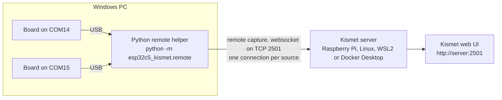

This page is for people whose ESP32-C5 boards are plugged into a Windows PC. Kismet itself does not run on Windows, so the Python remote helper runs there instead: it opens the boards on their COM ports and feeds them to a Kismet server elsewhere, on a Raspberry Pi, a Linux machine, WSL2 on the same PC, or Docker Desktop.

## How it fits together



The Python remote helper opens each board on its COM port, tells it which radio and channel to use, and passes every frame to the Kismet server over Kismet's remote capture, a websocket on Kismet's web port 2501. Each `--source` is one board on one radio, with its own connection. The Kismet server does everything else: decoding, the device list, logging and the web UI. [How It Works](How-It-Works) and [Remote Capture](Remote-Capture) explain the mechanism.

## Why Kismet does not run on Windows

Kismet's own documentation says that Kismet "has deep dependencies on the Posix (ie, Unix-based) libraries and environment, and as such, does not run _directly_ on Windows platforms" ([Kismet on Windows](https://www.kismetwireless.net/docs/readme/installing/windows/)). The project's C helper, `kismet_cap_esp32c5`, is part of Kismet's build and has the same limit: it uses POSIX serial and file-locking calls, and Linux sysfs to find boards.

Kismet does run in WSL, but its Windows page also says that WSL has no direct access to USB hardware, and points to remote capture instead. That is what the Python remote helper does. It needs only Python and three pip packages (pyserial, msgpack and websocket-client), all of which run on Windows.

Docker Desktop has the same limit: its containers do not see Windows COM ports. A board reaches a container only if it is first attached to WSL with usbipd-win, which has not been tested ([Install on WSL2](Install-on-WSL2) has the details).

## What you need

| | |
|---|---|
| Windows | Windows 11. Tested on Windows 11 Pro. Windows 10 has not been tried. |
| Python | 3.10 or newer. Tested with 3.13.2. |
| Boards | ESP32-C5 boards flashed with this project's firmware ([Flashing the Firmware](Flashing-the-Firmware)), on data cables. For several boards, a powered USB hub ([Hardware](Hardware)). |
| A Kismet server | One built with the `esp32c5` source type (see below). |
| Git | Optional, for `git clone`. A ZIP download works too. |

No driver is needed: Windows' built-in USB serial driver handles the boards' native USB port, and each board appears as a COM port. <!-- VERIFY: on a clean Windows 11 (and Windows 10) PC, that a freshly plugged board gets a COM port with no driver install -->

**The Kismet server must know the `esp32c5` source type.** No Kismet release includes it yet. A Kismet installed from a distribution package, Homebrew or Kismet's own packages cannot accept these sources; the server logs `Kismet could not find a datasource driver for incoming remote source 'esp32c5' ...` instead. Use one of these:

- [Install on Raspberry Pi](Install-on-Raspberry-Pi) or [Install on Linux](Install-on-Linux), which build Kismet as described in [Building Kismet with ESP32-C5 Support](Building-Kismet-with-ESP32-C5-Support).
- [Install on WSL2](Install-on-WSL2), for Kismet on the same Windows PC.
- [Install with Docker](Install-with-Docker): the project's image already has the source, and runs in Docker Desktop.

[Choosing a Setup](Choosing-a-Setup) compares these. To check that a running server knows the type, use [Step 0 on Remote Capture](Remote-Capture#step-0-check-that-the-server-knows-the-esp32c5-type).

## Step 1: Install Python

1. Install Python 3.10 or newer from [python.org](https://www.python.org/downloads/windows/). In the installer, tick **Add python.exe to PATH**.
2. Open a new PowerShell window and check the version:

   ```powershell
   python --version
   ```

   If the command is not found, or opens the Microsoft Store, Python is not installed yet or is not on the PATH.

Why 3.10: the helper's requirements ask for websocket-client 1.9.1 or newer, the first version that survives a connection Kismet has reset, and that version needs Python 3.10.

## Step 2: Get the project and its packages

1. Clone the repository and install the packages it needs:

   ```powershell
   git clone https://github.com/oshri-almog/esp32c5-kismet-wifi-interface
   cd esp32c5-kismet-wifi-interface
   python -m pip install -r requirements.txt
   ```

   Without Git, download the repository as a ZIP from its GitHub page, unpack it, and `cd` into the folder.

2. Check that the helper starts:

   ```powershell
   python -m esp32c5_kismet.remote --help
   ```

`requirements.txt` installs three packages:

| Package | Why | Version on the test PC |
|---|---|---|
| `pyserial>=3.5` | Opens the COM ports and finds the boards | 3.5 |
| `msgpack>=1.0` | Kismet's remote capture protocol | 1.2.2 |
| `websocket-client>=1.9.1` | The websocket on Kismet's web port | 1.9.2 |

> **Note:** There is no package to install and no `esp32c5_kismet` command. Run the helper as `python -m esp32c5_kismet.remote` from the repository folder. From any other folder Python answers `Error while finding module specification for 'esp32c5_kismet.remote' (ModuleNotFoundError: No module named 'esp32c5_kismet')`.

Without pyserial or msgpack, even `--help` fails with `ModuleNotFoundError`. Without websocket-client the helper stops with `the websocket protocol needs websocket-client (pip install websocket-client), or use --tcp`.

## Step 3: Find the boards

List the boards plugged in:

```powershell
python -m esp32c5_kismet.remote --list
```

With one board on COM14 the output looks like this:

```text
COM14  F0:F5:BD:01:02:03
    --source esp32c5-COM14
    --source esp32c5zigbee-COM14
    --source esp32c5btle-COM14
One source per board: it captures with one radio at a time. Every ESP32 on its native USB port has this USB ID, so a board listed here need not be an ESP32-C5 sniffer.
```

- Each board appears once, with its MAC address, and then with three source definitions: Wi-Fi, 802.15.4 (Zigbee and Thread) and Bluetooth LE. They are alternatives. A board listens with one radio at a time, so use one of the three.
- The MAC stays with the board whatever COM number Windows gives it. Use it to tell boards apart.
- The helper finds boards by their USB ID, `303a:1001`. Every Espressif chip on its native USB port has that ID (ESP32-C3, C6, S3 and others), so another ESP32 plugged in shows up too.
- `--list` never opens a port, so it is safe to run while the boards are capturing. On Windows it lists a board that is in use too, since it cannot tell without opening the port.
- With no board plugged in it prints `No Espressif USB-Serial-JTAG device (USB ID 303a:1001) found.` and exits with status 1.

## Step 4: Get an API key or a login

The websocket needs either a Kismet login or a Kismet API key with the `datasource` role. Use an API key:

- It can feed sources and nothing else. With a `datasource` key, other requests, such as the source list, are refused with HTTP 401.
- Kismet keeps it across restarts. Keys do not expire in the Kismet version this project builds.
- The admin password stays off this PC.

A login works too, whatever characters its password holds (`&`, spaces and `%41` included). The helper sends a login in an `Authorization` header and an API key in a cookie, so neither appears in the connection's address, which proxies and logs keep. The one exception is a user name that contains `:`, which has to go in the address instead. If such a login also contains an `&`, in the user name or the password, it cannot log in at all, and the helper warns at start:

```text
14:02:11 WARNING: the Kismet user name holds ':' and the login '&': Kismet reads a user name in an Authorization header only up to its first ':', and cuts a login in the websocket's address at every '&' (after decoding it), so this one cannot log in either way; use an API key (--apikey or KISMET_CAP_APIKEY) instead of the login
```

To create a key:

- **In Kismet's web UI:** open **Settings**, then **API Keys**, choose **Create API Key**, give it a name and pick the role **datasource**. <!-- VERIFY: creating a datasource key from the web UI (read from Kismet's UI code, not tried) -->
- **With curl**, from Git Bash, WSL or the Kismet host. Replace `admin:PASSWORD` with the Kismet login and `192.168.1.50` with the server's address:

  ```bash
  curl -u admin:PASSWORD --data-urlencode 'json={"name": "windows-helper", "role": "datasource", "duration": 0}' http://192.168.1.50:2501/auth/apikey/generate.cmd
  ```

  It prints the key, 32 hex characters. The name must be unique on that server. This call was tested from Git Bash against Kismet in Docker Desktop.

> **Note:** In Windows PowerShell 5.1, `curl` is a different command (`Invoke-WebRequest`), and the command above will not work there. Run it in Git Bash, or use the web UI.

Or, in PowerShell, call `curl.exe` with a backslash before each inner quote, as [Kismet Configuration](Kismet-Configuration#creating-a-key-with-curl) shows, together with the form for cmd:

```powershell
curl.exe -u admin:PASSWORD --data-urlencode 'json={\"name\": \"windows-helper\", \"role\": \"datasource\", \"duration\": 0}' http://192.168.1.50:2501/auth/apikey/generate.cmd
```

Both forms were tested with Windows' own `curl.exe` against Kismet on a Raspberry Pi: each printed a `datasource` key. Without the backslashes, PowerShell 5.1 drops the inner quotes and Kismet answers with an HTTP 500 error instead of a key.

## Step 5: Connect to Kismet

The examples below use a Kismet server at `192.168.1.50`, a board on `COM14`, and the key `3F9A6C1E07B24D58A1C9E2F4608B7D35`. Replace all three with your own. For Kismet in WSL2 or Docker Desktop on the same PC, see [Where Kismet runs](#where-kismet-runs-the---connect-value) for the address to use.

### With an API key on the command line

```powershell
python -m esp32c5_kismet.remote --connect 192.168.1.50:2501 --apikey 3F9A6C1E07B24D58A1C9E2F4608B7D35 --source esp32c5-COM14
```

### With environment variables

A key given with `--apikey` is part of the helper's command line, which Task Manager can show (Details tab, once you add the **Command line** column) and administrators of the PC can read. To keep it off the helper's command line, put it in `KISMET_CAP_APIKEY` and leave `--apikey` out.

Whichever way you give it, the line you type may also be saved in PowerShell's history file. Windows PowerShell 5.1 as it ships with Windows comes with PSReadLine 2.0.0 (the version on the test PC), which saves every line, so the key ends up there too. PSReadLine 2.2 and later, as in PowerShell 7 or an updated module, by default leave lines that contain words such as `apikey` or `password` out of the history file. Git Bash keeps its lines in `~/.bash_history`, `export KISMET_CAP_APIKEY=...` included. cmd keeps no history file: its history lasts only as long as the window. <!-- VERIFY: on Windows 11, that another standard user cannot read the helper's command line while the same user and administrators can; that PSReadLine 2.0.0 in Windows PowerShell 5.1 writes both the $env:KISMET_CAP_APIKEY line and an --apikey line to ConsoleHost_history.txt; that PSReadLine 2.2 or later (PowerShell 7) leaves both out; that cmd writes neither to disk -->

In PowerShell:

```powershell
$env:KISMET_CAP_APIKEY = "3F9A6C1E07B24D58A1C9E2F4608B7D35"
python -m esp32c5_kismet.remote --connect 192.168.1.50:2501 --source esp32c5-COM14
```

In cmd:

```text
set KISMET_CAP_APIKEY=3F9A6C1E07B24D58A1C9E2F4608B7D35
python -m esp32c5_kismet.remote --connect 192.168.1.50:2501 --source esp32c5-COM14
```

The variable lasts as long as that window. The helper reads the environment only for what the command line leaves out, by these rules:

| On the command line | The helper reads | And uses |
|---|---|---|
| none of `--user`, `--password` and `--apikey` | `KISMET_CAP_APIKEY` | the API key |
| none of them, and `KISMET_CAP_APIKEY` is not set | `KISMET_CAP_USER` and `KISMET_CAP_PASSWORD` | the login; both must be set |
| `--user` alone | `KISMET_CAP_PASSWORD` | the login, completed from the environment |
| `--password` alone | `KISMET_CAP_USER` | the login, completed from the environment |
| `--apikey`, or both `--user` and `--password`, or `--tcp` | nothing | the command line (`--tcp` has no login at all) |

- With all three variables set and nothing on the command line, the API key wins.
- A variable that is set but empty counts as unset.
- `--user admin` with the password in `KISMET_CAP_PASSWORD` is a login that keeps the password off the command line.
- Half a login is completed only by the other half, never by `KISMET_CAP_APIKEY`. If the missing half is in neither place, the helper stops with exit status 2 and `give both --user and --password (the one left out may also be in KISMET_CAP_USER or KISMET_CAP_PASSWORD)`.

The C helper reads the same three names by the same rules.

### With a login

```powershell
python -m esp32c5_kismet.remote --connect 192.168.1.50:2501 --user admin --password choose-a-long-password --source esp32c5-COM14
```

`--user` and `--password` go together, but a half left off the command line may come from the environment: `KISMET_CAP_PASSWORD` for `--user` alone, `KISMET_CAP_USER` for `--password` alone (see the rules above). If the missing half is in neither place, the helper stops with `give both --user and --password (the one left out may also be in KISMET_CAP_USER or KISMET_CAP_PASSWORD)`. If both a login and `--apikey` are given, the login is used and the helper warns `ignoring --apikey and using the login`.

### What you should see

The helper logs to the console, one line per event:

```text
14:02:11 INFO: esp32c5-COM14: connected, offering it to Kismet as E5C50001-0000-0000-0000-F0F5BD010203
14:02:11 INFO: esp32c5-COM14: opening COM14 for wifi
14:02:11 INFO: esp32c5-COM14: COM14 opened
14:02:12 INFO: esp32c5-COM14 capturing (wifi)
```

The board's statuses start with the source's name: its `name=` if the definition has one, otherwise the definition up to its first `:` (here `esp32c5-COM14`). `capturing` comes only once the board streams in the radio that was asked for.

> **Note:** Only capture on networks and devices you own or are authorised to test.

The Kismet server logs `New remote source esp32c5-COM14 (E5C50001-...) connected`, then `esp32c5-COM14 - esp32c5-COM14: COM14 opened`, then `esp32c5-COM14 - esp32c5-COM14 capturing (wifi)`, and the source appears in the web UI under **Data Sources**. <!-- VERIFY: that the source shows in the web UI's Data Sources window in a browser (only the REST API was checked) --> The ID Kismet shows, `E5C50001-0000-0000-0000-<MAC>`, is built from the board's MAC and the radio, so the same board on the same radio is always the same source in Kismet, whichever COM port it is on. Add `--debug` to see every protocol message except packets.

### Choosing the radio, and several boards

The radio is part of the source definition:

| Definition | Meaning |
|---|---|
| `esp32c5-COM14` | Wi-Fi, 2.4 and 5 GHz, on COM14 |
| `esp32c5zigbee-COM14` | IEEE 802.15.4 (Zigbee and Thread) on COM14 |
| `esp32c5btle-COM14` | Bluetooth LE advertising on COM14 |
| `esp32c5:device=COM14,mode=btle` | Bluetooth LE on COM14, with the port and radio given as options: the same as `esp32c5btle-COM14` |
| `esp32c5-COM14:name=desk-wifi` | Wi-Fi, shown in Kismet as `desk-wifi` |
| `esp32c5zigbee-COM14:channel=20,channel_hop=false` | 802.15.4, staying on channel 20 |
| `esp32c5` | Wi-Fi on the only board plugged in |

On Windows only a `COM<n>` after the first `-` names a port, in any case: `esp32c5-COM14` and `esp32c5-com14` are the same source. In `device=`, `COM14`, `com14` and `\\.\COM14` are the same port. [Source Definitions](Source-Definitions) has the full rules, and [Channel Control](Channel-Control) the channel options.

For several boards, repeat `--source`. Each one gets its own connection:

```powershell
python -m esp32c5_kismet.remote --connect 192.168.1.50:2501 --apikey 3F9A6C1E07B24D58A1C9E2F4608B7D35 --source esp32c5-COM14 --source esp32c5zigbee-COM15 --source esp32c5btle-COM16
```

- **One source per board.** Two definitions for the same board are refused at start, for example `esp32c5-COM14 and esp32c5:device=com14,mode=zigbee both want COM14`, and the helper exits with status 2.
- **A radio switch reboots the board.** A board remembers its last radio. When a source asks for another one, the board reboots into it. On Windows the helper went from opening the board to capturing in 1.2 to 1.5 s after a switch, against about 0.8 s for a board already on that radio. Now and then a board hangs in a switch. On a Raspberry Pi with four boards and both helpers, 1 of 160 switches between Wi-Fi and Bluetooth LE hung a board. One board did worse at a fresh start, when Kismet or one helper started it on Bluetooth LE while two other boards also changed radio: it dropped off USB 25 times in 25, and 3 of those times it then stayed silent. Whether the firmware or the power on that board's hub port is to blame is not known. A hung board never starts capturing; the helper gives up after 15 s and tries again, which does not help. Unplug the board and plug it back in, or reset it with esptool. [Multiple Boards](Multiple-Boards) has more.

### Quoting definitions in PowerShell, cmd and Git Bash

A definition without double quotes needs no quoting in any of the three shells: `--source esp32c5-COM14:mode=wifi,name=desk-wifi` arrives intact.

A value that holds a comma must be in double quotes inside the definition, for example `channels="1,6,11"`. Without them Kismet reads `channels=1` and turns the rest into a junk option, losing `name=` as well. The shells treat those inner quotes differently. Tested with Python 3.13.2 on Windows 11:

| Shell | Type this | Notes |
|---|---|---|
| Windows PowerShell 5.1 | `--source 'esp32c5-COM14:channels=\"1,6,11\",name=desk'` | Writing `'...channels="1,6,11"...'` loses the quotes. A quoted value with a space, such as `name=\"lab, bench 2\"`, is split into several arguments: use values without spaces. |
| cmd | `--source "esp32c5-COM14:channels=\"1,6,11\",name=desk"` | Spaces inside the quoted value work. |
| Git Bash | `--source 'esp32c5-COM14:channels="1,6,11",name=desk'` | Spaces inside the quoted value work. |

PowerShell 7 passes arguments to programs differently and has not been tried. <!-- VERIFY: quoting of channels="1,6,11" and name="lab, bench 2" in PowerShell 7 -->

If the quotes are lost on the way, the helper warns at start and carries on. For the PowerShell 5.1 mistake above it logs:

```text
14:02:11 WARNING: esp32c5-COM14:channels=1,6,11,name=desk: the comma list in channels= is not in double quotes, so Kismet reads only its first item and takes the rest for another option; write channels="1,6,11"
```

## Where Kismet runs: the --connect value

`--connect` takes the Kismet server's address and its **web port**, 2501 by default.

| Kismet server | `--connect` | Tested from Windows |
|---|---|---|
| Raspberry Pi or Linux PC at 192.168.1.50 | `192.168.1.50:2501` | Yes, a Raspberry Pi 4 across the LAN ([Guide: Windows Boards to a Pi](Guide-Windows-Boards-to-a-Pi)) |
| WSL2 on this PC ([Install on WSL2](Install-on-WSL2)) | `127.0.0.1:2501` | Yes, as `127.0.0.1:2501` and as `localhost:2501` (see below) |
| Docker Desktop on this PC ([Install with Docker](Install-with-Docker)) | `127.0.0.1:2501`, or the host port you published | Yes, with the port published as `127.0.0.1:2612` and the helper run as `--connect localhost:2612` |

<!-- VERIFY: run the helper with --connect 127.0.0.1:2612 against Docker Desktop; only a raw socket connect to 127.0.0.1 was measured there -->

No Kismet container of this project needs the `NET_ADMIN` capability, and one that only receives remote sources needs no device rules either. A Kismet in WSL2 and one in Docker Desktop both want port 2501 on this PC, so run one at a time or publish Docker's on another port. [Guide: Windows Boards to a Pi](Guide-Windows-Boards-to-a-Pi) walks through the Pi setup end to end.

What was measured from Windows 11 Pro with one board on COM32:

- Kismet on a Raspberry Pi 4 (Debian 13) across the LAN, 2026-10-02: Wi-Fi, 41 Wi-Fi devices and 18,488 packets in 90 s, hopping all 42 channels at 5 per second with no error packets. BLE: 6 devices and 791 packets in 60 s. 802.15.4: the source ran and hopped; with no Zigbee or Thread devices nearby it saw no packets. The first packets reached Kismet 1.3 to 2.0 s after the helper started.
- Kismet in WSL2, 2026-10-02: Wi-Fi, 82 Wi-Fi devices in about 40 s. Earlier, with an older version of the helper: 128 Wi-Fi devices in about 3 minutes, including 5 GHz access points; BLE, 16 devices; 802.15.4, the source ran and hopped channels 11 to 26 but saw no packets. `channel=` did not lock the channel then; the helper has been fixed since.
- Kismet in Docker Desktop, with an earlier version of the helper, Wi-Fi: with a login, 128 Wi-Fi devices, 11 of them on 5 GHz, and 6249 packets in about 2.5 minutes; then with an API key. The source hopped all 42 Wi-Fi channels at 5 per second, with no error packets.

<!-- VERIFY: re-run the Docker Desktop setup with the current Python remote helper -->

### 127.0.0.1 or localhost

Use `127.0.0.1` when Kismet runs in WSL2 or Docker Desktop on the same PC.

Windows resolves `localhost` to the IPv6 address `::1` first, but WSL2's port forwarding listens on IPv4 only. Windows then spends about 2 seconds on `::1` before it tries `127.0.0.1`. With an earlier version of the helper that made every connection 2 s slower (measured against WSL2: 2.07 s through `localhost` against 0.001 s through `127.0.0.1`). Docker Desktop was not measured separately.
<!-- VERIFY: Docker Desktop and localhost. A port it publishes without an address (compose's kismet service, "2501:2501") answered on ::1 in 0.03 s in a quick check with another container, so it may not have the delay; one published on 127.0.0.1 (the demo service) may refuse ::1 as WSL2 does -->

The helper now tries `127.0.0.1` first when it is given `localhost`. Measured against WSL2: while Kismet is up, `localhost` connects as fast as `127.0.0.1` (0.36 s after the helper started). While Kismet is down or restarting, each refused attempt still goes on to try `::1` and takes about 4 s instead of about 2 s, so the attempts come about 9 s apart instead of about 7 s. After a restart of Kismet the helper was capturing again 3.8 to 4.5 s after Kismet's port answered, against 2.4 to 2.7 s with `127.0.0.1`. <!-- VERIFY: re-measure --connect localhost against Docker Desktop with the current helper, with Kismet up and while it restarts --> `127.0.0.1` stays the safe choice.

## Keeping it running

### Run it in a console window

Start the helper in an ordinary console window: Windows Terminal, PowerShell or cmd. Leave the window open; the helper runs until you stop it.

To stop it, press **Ctrl+C** or **Ctrl+Break** in that window. It logs `stopping`, closes its connections, releases the COM ports and exits with status 0. In 25 stops on Windows 11, from PowerShell, cmd and Git Bash, with the helper as of commit `f8e6792`, this took 0.06 to 0.55 s every time. A stop that comes while a refused connection is still failing waits for it, about 2 s.

Kismet then shows the source as stopped with the error `websocket connection closed`. That is expected: the C helper gives the same result. Closing the source from Kismet's side instead (its `close_source.cmd` call) lasts only until the helper connects again, about 5 s later; to stop capturing, stop the helper.

> **Note:** A helper started as a background job from Git Bash (`python ... &`) stops with Ctrl+C in that window, or with `kill -INT` and its process ID, such as `kill -INT $!` right after starting it. Windows passes such jobs an "ignore Ctrl+C" flag; the helper clears it when it starts.

If a helper will not stop, force it. Find its process ID in Task Manager (Details tab) and put it in place of `12345`. In PowerShell or cmd:

```powershell
taskkill /F /PID 12345
```

Without `/F`, Windows refuses: `Reason: This process can only be terminated forcefully (with /F option).`

In Git Bash, double the slashes. Git Bash turns an argument that starts with `/`, such as `/F`, into a Windows path before `taskkill` sees it:

```bash
taskkill //F //PID 12345
```

A forced stop still releases the COM port at once.

### What it recovers from on its own

The helper keeps each source trying until you stop it. Nothing that goes wrong in one connection ends a source.

| What happens | What the helper does |
|---|---|
| Kismet is not running yet, or restarts | Logs the refused connection and tries again 5 s later. Windows takes about 2 s to report a refused connection, so the attempts come about every 7 s. After Kismet on a Pi restarted, the helper was capturing again 4.6 to 4.9 s after Kismet's port answered (2.4 to 2.7 s against WSL2); how soon depends on where the helper is in its wait. |
| Kismet is stopped for good | Keeps trying in the same way. |
| The board reboots to change radio | Reads through the reboot, then asks again. |
| The board is unplugged | Retries the port about once a second. After 15 s without capture it gives the source up, tells Kismet, and then waits for the board: `COM14 is not there; is the board plugged in? (waiting for it)`. When the board is back it offers the same source, under the same ID. |
| Another board appears on the named COM port | Uses it, and warns that Kismet will see it as another source. |
| A board is wedged with error 31 | Reports the error to Kismet and retries every 5 s; the board needs a replug (below). |

<!-- VERIFY: unplug and waiting behaviour with the current helper on Windows with a real board (on Linux with the fake board an unplug gave the 15 s give-up and then the "is not there" line every 5 s; a board back after an unplug and another board on the named port were not run) -->

Exit codes: 0 when stopped with Ctrl+C or Ctrl+Break; 1 when `--list` finds no board, or on an internal error (a source never stops by itself); 2 for a mistake on the command line or in a definition. [Command-Line Reference](Command-Line-Reference) lists them all.

### Starting it automatically

[Guide: Running as a Service](Guide-Running-as-a-Service#the-python-remote-helper-at-logon-on-windows) starts the helper at logon from a batch file that restarts it after an error. The batch file was tested by hand; the logon task, a Windows service and how the helper behaves when the PC sleeps and wakes have not been tested. For a machine that must capture unattended, a Raspberry Pi or Linux box with Kismet and the boards on it is the tested route, which the same guide covers.

## COM port notes

- **One program per COM port.** Windows lets only one program open a COM port at a time. While the helper has a board, esptool, `idf.py monitor`, a serial terminal or the Arduino IDE cannot open it, and while any of those has it, the helper reports `COM14 is already in use by another capture (an esp32c5 source or another program holds it); a board captures with one radio at a time` and keeps trying. Stop the helper before flashing ([Flashing the Firmware](Flashing-the-Firmware)).
- **One helper per board.** Do not start a second helper for a board another one is capturing from. On Linux the helper sees that the port is held and does not offer the source to Kismet. On Windows it cannot tell without opening the port, so the same board and radio are offered again under the same ID, and Kismet closes the running source to make room for the new one. The first helper keeps the port until it gives up on Kismet 15 s later, so the new one first reports the port `already in use` and gets the board on a later try. Each helper offers its source again 5 s after its connection ends, so from then on the two keep taking the source from each other and capture keeps being interrupted until one of them is stopped. Tried on Windows, the source changed hands about every 15 to 20 s.
- **Serial terminals can reset the board.** On these boards the DTR and RTS lines drive reset and boot mode. A program that opens the port with its default line settings can reboot the chip or leave it in download mode. After one such open, both boards on the test PC briefly disappeared from Windows. The helper opens the port with both lines low.
- **COM numbers.** Windows gives each board its own COM number and should keep giving it the same one: a test board that spent days on the Pi between two Windows runs came back as the same COM number. <!-- VERIFY: that Windows keeps a board's COM number when it is plugged into another USB port (a code comment; which USB port the one replugged test board used each time is not recorded) --> `--list` shows which MAC is on which port.
- **A board that does not appear at all.** Try another cable (some carry power only), another USB port, or a powered hub. See [Hardware](Hardware).

### A board wedged with error 31

Now and then Windows puts a board into a state where its COM port is still listed but cannot be used. On the test PC it happened to one of two boards, several times in an afternoon. The earlier helper, used in that test, logged lines like these about once a second:

```text
COM30 opened
COM30: Write timeout
COM30: Cannot configure port, something went wrong. Original message: PermissionError(13, 'A device attached to the system is not functioning.', None, 31)
```

The current helper tries the port before it answers Kismet. When the open fails, the source fails with the Windows error, the connection ends, and the helper tries again 5 s later. The same error text goes to Kismet at most once every 10 s, with a count of the repeats; the helper's log shows what was sent at INFO and the repeats only with `--debug`. When Windows fails the port's settings rather than its opening (the `Cannot configure port ... PermissionError(13, ...)` line above), the helper takes the PermissionError for a port that another program holds, and reports `COM30 is already in use by another capture ...` instead; if nothing else has the port open, that is this wedge too. <!-- VERIFY: helper log for a board wedged with error 31 with the current helper (throttled status, open failure, 5 s retry, and whether the "Cannot configure port" case shows as "already in use", as the code reads it) -->

Kismet shows the source's error as `could not open port 'COM30': OSError(22, 'A device attached to the system is not functioning.', None, 31)`, and esptool says `Could not open COM30, the port is busy or doesn't exist.` <!-- VERIFY: that the current helper reports the error 31 open failure to Kismet as the source's error --> `--list` still shows the board, with its MAC.

**Fix:** unplug the board and plug it back in, or power-cycle the hub. The same board had passed every test on a Raspberry Pi an hour earlier, so neither the firmware nor the board is at fault. The trigger was probably an earlier open that raised DTR and RTS; that is not confirmed. Other boards in the same helper keep capturing.

## Firewall

- **On the Windows PC:** the helper only makes outgoing connections, to TCP 2501 on the Kismet server (3501 with `--tcp`). It never listens for connections, so Windows needs no inbound rule. Windows Defender Firewall allows outgoing connections unless it has been set to block them. Tested with the firewall on in its default settings, on a network set as Private: the helper reached Kismet on a Pi with no rule added.
- **On the Kismet server:** Kismet listens on port 2501 on all its network interfaces by default. If the server runs a firewall, allow TCP 2501 from the Windows PC. Port 2501 also carries Kismet's web UI and REST API, so set Kismet's login before you open it to a network: until a login exists, the first visitor chooses it ([Kismet Configuration](Kismet-Configuration)).
- **WSL2 or Docker Desktop on the same PC:** no rule is needed. The helper reaches them on `127.0.0.1`.
- **Legacy TCP (`--tcp`, port 3501):** this older protocol has no login at all, and Kismet listens on it on `127.0.0.1` only by default. Leave it that way. With the Python remote helper it has no speed advantage either: on a Raspberry Pi, the Python remote helper over the websocket was capturing 0.35 s after connecting. [Remote Capture](Remote-Capture) covers both protocols.

## Troubleshooting

| Message | Cause | Fix |
|---|---|---|
| `ModuleNotFoundError: No module named 'serial'` (or `'msgpack'`) | The packages are not installed for this Python | `python -m pip install -r requirements.txt` |
| `Error while finding module specification for 'esp32c5_kismet.remote'` | Not in the repository folder | `cd` into the folder first |
| `a user and password, or an API key, are required for the websocket protocol ...` | No login anywhere | Add `--apikey`, or set `KISMET_CAP_APIKEY` |
| `[WinError 10061] No connection could be made because the target machine actively refused it` | Kismet is not running, or not on that address and port | Start Kismet; check `--connect`. The helper keeps retrying, about every 7 s. |
| `Kismet refused the websocket: 401 Unauthorized (check the login -- --user/--password or KISMET_CAP_USER/KISMET_CAP_PASSWORD -- or the API key -- --apikey or KISMET_CAP_APIKEY; the key needs the datasource role)` | Wrong login or key, or a key without the `datasource` role (an `admin` key is accepted too) | Create a `datasource` key (step 4) |
| `port 3501 is Kismet's legacy TCP port; did you mean --tcp, or port 2501?` | `--connect` points at the legacy port | Use port 2501 |
| `COM14 is not there; is the board plugged in? (waiting for it)` | No board on that COM port right now | Check `--list`; the helper waits for it |
| `COM14 is already in use by another capture ...` | Another program or source has the port; with nothing else holding it, a board wedged with error 31 | Close the other program; otherwise replug the board (above) |
| `... 'A device attached to the system is not functioning.', None, 31)` | The board is wedged | Replug it (above) |
| `esp32c5-COM14: no capture from the board on COM14 for 15 seconds (last: ...); is it flashed with the esp32c5 sniffer firmware, and is nothing else holding the port?` | The board does not answer: not flashed with this firmware, on very old firmware, wedged, or hung in a radio switch | [Flashing the Firmware](Flashing-the-Firmware); replug |
| `esp32c5-COM14 capturing (wifi)`, but no packets ever come, right after flashing | A known firmware problem: a board flashed while it was in 802.15.4 mode can come up with its Wi-Fi deaf, and a reset does not cure it | Switch its radio away and back: run it once as `esp32c5btle-COM14` until it is capturing, then as `esp32c5-COM14` again. See [Flashing the Firmware](Flashing-the-Firmware) |
| On the Kismet server: `Kismet could not find a datasource driver for incoming remote source 'esp32c5' ...` | The server's Kismet lacks the `esp32c5` source | Use a Kismet built with it (see [What you need](#what-you-need)) |

[Troubleshooting](Troubleshooting) covers the rest, including Kismet's side.

## Next steps

- [Guide: First Capture](Guide-First-Capture): see devices appear in Kismet.
- [Guide: Windows Boards to a Pi](Guide-Windows-Boards-to-a-Pi): the whole Windows-to-Pi setup.
- [Remote Capture](Remote-Capture) and [Command-Line Reference](Command-Line-Reference): every option of the Python remote helper.
