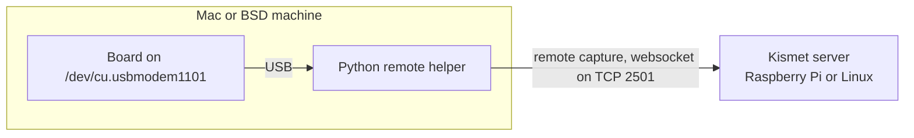

This page is for using the boards with a Mac, or with a FreeBSD, OpenBSD or NetBSD machine. Nothing on it has been tested: nobody has run either helper, or built Kismet with the ESP32-C5 source, on these systems. What follows is what the code is written to do, and each point is marked for checking. If you try it, please report what happened ([Contributing](Contributing)).

> **Warning:** macOS and the BSDs are untested. The tested setups are a Raspberry Pi or Linux machine with the boards plugged in, and Windows feeding Kismet in WSL2 or Docker Desktop ([Choosing a Setup](Choosing-a-Setup)).

## What to expect

| | macOS | FreeBSD, OpenBSD | NetBSD |
|---|---|---|---|
| The board's port | `/dev/cu.usbmodem1101` (the number depends on the USB port it is in) | `/dev/cuaU0` | `/dev/dtyU0` |
| Python remote helper | Should work, and should find the boards and read their MACs by itself | Should work when you name the port; cannot find boards by itself | As FreeBSD |
| C helper (`kismet_cap_esp32c5`) | Written with macOS in mind, never compiled there; you always name the port | As macOS | As macOS |
| Kismet server | Kismet supports macOS, but has to be built from source with the ESP32-C5 source added | Kismet has no install page for the BSDs; not tried | As FreeBSD |

<!-- VERIFY: every cell of this table; neither helper has been built or run on macOS or a BSD -->

The route with the fewest unknowns is the **Python remote helper** on the Mac or BSD machine, feeding a Kismet server that runs somewhere tested: a Raspberry Pi or a Linux machine (Docker Desktop was tested on Windows, not on macOS). It needs only Python and three pip packages (pyserial, msgpack and websocket-client), and no Kismet build on the untested system.



## The Python remote helper

### 1. Python and the packages

The helper needs Python 3.10 or newer, because its websocket package (websocket-client 1.9.1 or newer) does. Check the version:

```bash
python3 --version
```

If it prints 3.9 or older, `pip install` below fails. The `python3` that comes with Xcode's command line tools is 3.9. Install a newer Python with Homebrew, or from [python.org](https://www.python.org/downloads/macos/):

```bash
brew install python
```

Then create the virtual environment below with that Python, by its version number: for example `python3.12 -m venv .venv` in place of `python3 -m venv .venv`. Inside the virtual environment, `python` is then that version.

On the BSDs there is no `python3` until you install a Python package. Install Python 3.10 or newer from the system's packages or ports, and use its command (for example `python3.11`) the same way. <!-- VERIFY: the Python version of the python3 in Xcode's command line tools (3.9.x); the command name Homebrew's python formula installs; the Python package and command names on FreeBSD, OpenBSD and NetBSD, and that venv and pip work with them -->

Get the project and install its three packages in a virtual environment, which keeps them apart from the system's Python:

```bash
git clone https://github.com/oshri-almog/esp32c5-kismet-wifi-interface.git
cd esp32c5-kismet-wifi-interface
python3 -m venv .venv
. .venv/bin/activate
python -m pip install -r requirements.txt
```

In every new terminal, `cd` into the project folder and run `. .venv/bin/activate` again before using the helper. There is no package to install: the helper runs as `python -m esp32c5_kismet.remote` from the project folder. [Install on Windows](Install-on-Windows) explains the packages and the helper's messages in more detail; apart from the port names and the points under [What differs from Linux and Windows](#what-differs-from-linux-and-windows), the helper behaves the same everywhere.

### 2. Find the board's port

**macOS.** Let the helper list the boards:

```bash
python -m esp32c5_kismet.remote --list
```

With one board plugged in, the output should look like this, with your port and MAC:

```text
/dev/cu.usbmodem1101  F0:F5:BD:01:02:03
    --source esp32c5-cu.usbmodem1101
    --source esp32c5zigbee-cu.usbmodem1101
    --source esp32c5btle-cu.usbmodem1101
One source per board: it captures with one radio at a time. Every ESP32 on its native USB port has this USB ID, so a board listed here need not be an ESP32-C5 sniffer.
```

The helper finds boards through pyserial, which on macOS reads each port's USB ID and serial number from the system; the board's USB serial number is its MAC. pyserial names the port by its call-out device, `/dev/cu.…`. macOS also has a `/dev/tty.…` name for the same port; use the `cu.` one. Without the helper, `ls /dev/cu.usbmodem*` shows the ports. <!-- VERIFY: --list on macOS with a real board: that it finds it, prints a /dev/cu.* name and reads the MAC -->

**FreeBSD, OpenBSD, NetBSD.** On these systems pyserial lists port names only, without USB IDs or serial numbers, so the helper cannot tell which port is a board. `--list` prints `No Espressif USB-Serial-JTAG device (USB ID 303a:1001) found.` even with a board plugged in, and a definition that names no port cannot find one. Find the port yourself: plug the board in and look for the new device.

```bash
ls /dev/cuaU*
```

On NetBSD, look for `/dev/dtyU*` instead. <!-- VERIFY: that a board appears as /dev/cuaU0 on FreeBSD and OpenBSD and /dev/dtyU0 on NetBSD, and that --list finds nothing there (read from pyserial 3.5's code) -->

### 3. Connect to Kismet

You need a Kismet server with the `esp32c5` source and an API key from it with the `datasource` role; [Remote Capture](Remote-Capture) shows how to make the key. The examples use a server at `192.168.1.50`: change it to yours. Change the key too. (For Kismet in Docker Desktop on the same Mac it would be `127.0.0.1:2501`, but that has not been tried; see [Docker Desktop on macOS](#docker-desktop-on-macos).)

On macOS:

```bash
export KISMET_CAP_APIKEY=3F9A6C1E07B24D58A1C9E2F4608B7D35
python -m esp32c5_kismet.remote --connect 192.168.1.50:2501 --source esp32c5-cu.usbmodem1101
```

On the BSDs, name the port the same way. Change `cuaU0` to your port (`dtyU0` on NetBSD):

```bash
export KISMET_CAP_APIKEY=3F9A6C1E07B24D58A1C9E2F4608B7D35
python -m esp32c5_kismet.remote --connect 192.168.1.50:2501 --source esp32c5-cuaU0
```

`--source 'esp32c5:device=/dev/cuaU0,mode=wifi'` means the same.

Why the port has to be in the definition there: both helpers take the part of a source name after the first `-` as the port `/dev/<name>` when it starts with `tty`, `cu.`, `cua`, `dty` or `pts/`, whether or not that port exists at the moment. So `esp32c5-cuaU0` is `/dev/cuaU0` and `esp32c5-dtyU0` is `/dev/dtyU0`, plugged in or not. If the board is not there, the Python remote helper logs `/dev/cuaU0 is not there; is the board plugged in? (waiting for it)` and tries again every 5 s. Any other name, such as a bare `esp32c5` or `esp32c5-kitchen`, names no port, and the helper then has to find the board by itself, which it cannot do on a BSD. <!-- VERIFY: on a BSD, that esp32c5-cuaU0 (esp32c5-dtyU0 on NetBSD) and device=/dev/cuaU0 open the board, and that with the board unplugged the Python remote helper logs the "is not there ... (waiting for it)" line and picks the board up when it is plugged in -->

For the other radios, use the names `esp32c5zigbee-cu.usbmodem1101` and `esp32c5btle-cu.usbmodem1101` on macOS, `esp32c5zigbee-cuaU0` and `esp32c5btle-cuaU0` on the BSDs, or `mode=zigbee` and `mode=btle` with `device=`. Repeat `--source` for more boards; each is one board on one radio. [Source Definitions](Source-Definitions) has every form.

The key in `KISMET_CAP_APIKEY` stays off the helper's command line, which other users of the machine may be able to read in the process list. To stop the helper, press Ctrl+C, or send it SIGTERM (`kill` with its process ID). It closes its connections, releases the ports and exits with status 0. <!-- VERIFY: connecting, capturing and stopping with the Python remote helper on macOS and on a BSD -->

> **Note:** Only capture on networks and devices you own or are authorised to test.

### What differs from Linux and Windows

- **The source's ID in Kismet.** On macOS the helper should read the board's MAC, so its Kismet ID is the usual `E5C50001-0000-0000-0000-<MAC>` (1 for Wi-Fi, 2 for 802.15.4, 3 for Bluetooth LE). On the BSDs it has no MAC: the ID is made from a hash of the device path, and Kismet shows the hardware as plain `ESP32-C5`. The same board on another port then becomes another source in Kismet. To keep one ID, give it yourself with `uuid=`, for example `esp32c5:device=/dev/cuaU0,mode=wifi,uuid=E5C50001-0000-0000-0000-000000000001`. <!-- VERIFY: on macOS, the MAC-based ID; on a BSD, the ID from a hash of the device path, the hardware label ESP32-C5, and that uuid= keeps the ID -->
- **A board that comes back on another port.** On Linux and Windows the helper checks, by MAC, which board is on a port it reopens, and follows a board that moved. On macOS and the BSDs it cannot check, and trusts the port name. <!-- VERIFY: that on macOS and the BSDs the helper reopens the named port without checking which board is on it -->
- **One program per port.** The helper takes an exclusive `flock` on the port, the same lock as the C helper and esptool, so they keep out of each other's way. A second capture on the same board gets `... is already in use by another capture (an esp32c5 source or another program holds it); a board captures with one radio at a time`. Close serial terminals before starting the helper: on these boards the DTR and RTS lines drive reset and boot mode, and a terminal that raises them can reboot the board. The helper itself clears them in a safe order. <!-- VERIFY: on macOS and a BSD, that the helper's flock keeps out a second helper, the C helper and esptool, the exact message, and that opening the port does not reset the board -->
- **Permissions.** Your user needs read and write access to the port. `ls -l /dev/cuaU0` (or the macOS port) shows its owner and group. On the BSDs the dial-out ports usually belong to the group `dialer`: add your user to it (on FreeBSD `pw groupmod dialer -m <user>`, on OpenBSD and NetBSD `usermod -G dialer <user>`), then log out and back in. On macOS the `cu.` ports are usually open to every user. <!-- VERIFY: the owner, group and permissions of the board's port on macOS, FreeBSD, OpenBSD and NetBSD; the group commands, and that usermod -G on OpenBSD and NetBSD adds the group without removing the user's other groups -->
- **Quoting.** In zsh, bash and sh, put a definition with double quotes inside single quotes: `--source 'esp32c5-cu.usbmodem1101:channels="1,6,11",name=desk'`. <!-- VERIFY: that this quoting reaches the helper intact in zsh on macOS and in sh on a BSD -->

## Kismet on macOS

Kismet runs on macOS and documents a Homebrew install and a source build ([Kismet on macOS](https://www.kismetwireless.net/docs/readme/installing/macos/)). No Kismet release contains the ESP32-C5 source yet, so a Homebrew Kismet cannot use these boards, not even from the Python remote helper: the server has to know the `esp32c5` source type. For a Kismet server on the Mac itself, build it from source with the source added. None of this has been tried.

1. Install Xcode and Homebrew, and the packages Kismet's macOS page lists. Add the two tools `add-to-kismet.sh` needs (it also needs `python3`):

   ```bash
   brew install autoconf automake
   ```

2. Get Kismet at the tested commit and add the ESP32-C5 source, as on Linux:

   ```bash
   git clone https://github.com/kismetwireless/kismet.git ~/src/kismet
   git -C ~/src/kismet checkout cfe427074
   sh ~/esp32c5-kismet-wifi-interface/kismet/add-to-kismet.sh ~/src/kismet
   ```

   Change `~/esp32c5-kismet-wifi-interface` to where you cloned this project.
3. Configure with the options from Kismet's macOS page, plus a folder in your home to install into:

   ```bash
   cd ~/src/kismet
   LDFLAGS=-L$(brew --prefix)/lib CPPFLAGS="-I$(brew --prefix)/include -I$(brew --prefix openssl)/include" ./configure --with-openssl=$(brew --prefix openssl) --prefix=$HOME/kismet-install --disable-python-tools
   ```

   Check that the summary says `ESP32-C5: yes`.
4. Compile and install:

   ```bash
   make -j4
   make install INSTUSR=$(id -un) INSTGRP=$(id -gn) SUIDGROUP=$(id -gn)
   ```

   The three variables make every installed file yours, so the install needs no root, as on [Install on Linux](Install-on-Linux). On macOS Kismet's default group for its privileged helpers is `staff`.

<!-- VERIFY: the whole macOS build: dependencies, add-to-kismet.sh, configure with the Homebrew flags, make, and make install with the three variables -->

[Building Kismet with ESP32-C5 Support](Building-Kismet-with-ESP32-C5-Support) explains what `add-to-kismet.sh` changes. [Kismet Configuration](Kismet-Configuration) covers the login and `kismet_site.conf`, which is the same on every system.

### The C helper without Linux

The C helper runs inside Kismet for boards plugged into the Kismet machine. Its code leaves out its Linux-only parts on other systems and knows the port names of macOS and the BSDs, but whether it compiles and runs there has not been checked. What it cannot do anywhere but Linux is find boards: that reads Linux's sysfs. So:

- **Always name the port.** A definition that names none, such as a bare `esp32c5` or `esp32c5-kitchen`, fails with:

  ```text
  finding a board by itself needs Linux sysfs (/sys/class/tty), which this system does not have; name the port with device=/dev/... or a source name like esp32c5-cu.usbmodem1101 or esp32c5-cuaU0
  ```

  Kismet shows this as the source's error and retries every 5 seconds, which cannot succeed until the port is named.
- **Name it like this**, with your port and radio:

  ```bash
  ~/kismet-install/bin/kismet --no-ncurses -c 'esp32c5-cu.usbmodem1101:name=mac-wifi'
  ~/kismet-install/bin/kismet --no-ncurses -c 'esp32c5zigbee-cuaU0:name=bsd-zigbee'
  ```

  The C helper takes a name starting with `cu.`, `cua`, `dty` or `tty` as a port even when it is not there yet; Kismet then reports `cannot open /dev/...: No such file or directory` and retries every 5 seconds until the board is plugged in. `device=/dev/...` works too.
- **`kismet_cap_esp32c5 --list`** prints `esp32c5 - No supported data sources found...`, and Kismet's **Data Sources** panel does not offer the boards. Add sources with `-c` or `source=` lines instead.
- **The source's ID** comes from a hash of the device path, because the MAC is read from sysfs too, and the hardware shows as `ESP32-C5`. So the C helper and the Python remote helper give the same board different IDs on macOS, and a board on another port is another source. Use `uuid=` for an ID that stays.
- **A board that comes back on another port** is not followed; the helper waits on the port it was given.

<!-- VERIFY: the C helper on macOS and the BSDs: that it compiles, the sysfs message, --list output, and capture from a named port -->

## Kismet on the BSDs

Kismet's documentation has install pages for Linux, macOS and Windows, and none for the BSDs, and this project has not tried to build Kismet there. `add-to-kismet.sh` adds the ESP32-C5 source to Kismet's build on every platform, and the C helper knows the BSD port names, so a Kismet that builds on a BSD should take `-c 'esp32c5-cuaU0'` (or `esp32c5-dtyU0` on NetBSD), with the same limits as on macOS above. Until someone tries, run the Python remote helper on the BSD machine and Kismet on Linux. <!-- VERIFY: that Kismet's documentation has no install page for the BSDs; whether Kismet at cfe427074 with add-to-kismet.sh builds on FreeBSD, OpenBSD and NetBSD; and that it then takes -c esp32c5-cuaU0 (esp32c5-dtyU0 on NetBSD) -->

## Docker Desktop on macOS

Not tested. Docker Desktop on macOS presumably cannot pass USB boards into containers, as on Windows. The project's images are built for 64-bit Intel and ARM (linux/amd64 and linux/arm64), so the demo with the fake board should run on both kinds of Mac, and a Kismet container should accept the Python remote helper from the Mac at `--connect 127.0.0.1:2501`. See [Install with Docker](Install-with-Docker) and [Try It Without Hardware](Try-It-Without-Hardware). <!-- VERIFY: the demo image and a Kismet container fed by the Python remote helper on Docker Desktop for macOS (Intel and Apple silicon) -->

## Flashing from macOS or a BSD

[Flashing the Firmware](Flashing-the-Firmware) covers macOS: ESP-IDF 5.5 and esptool, with the board's `/dev/cu.usbmodem…` port. Stop the helper or Kismet first, because they hold the port. Flashing from a BSD has not been considered. <!-- VERIFY: building and flashing the firmware from macOS with ESP-IDF 5.5 and esptool on /dev/cu.usbmodem*, and that esptool is refused while a helper holds the port -->

## If you try it

Please report what you found, working or not: the system and its version, the Python version, what `--list` printed, the port name, whether a source captured, and the helper's and Kismet's messages. [Contributing](Contributing) says where.

## Troubleshooting

| What you see | Cause | Fix |
|---|---|---|
| `finding a board by itself needs Linux sysfs ...` | The C helper, with a definition that names no port | Name the port: `esp32c5-cu.usbmodem1101`, `esp32c5-cuaU0` or `device=/dev/...` |
| `No Espressif USB-Serial-JTAG device (USB ID 303a:1001) found.` from `--list` on a BSD | pyserial on the BSDs has no USB information | Find the port with `ls /dev/cuaU*` and name it: `esp32c5-cuaU0` |
| `no Espressif USB-Serial-JTAG device (USB ID 303a:1001) found; plug the board in, or give device= in the source definition` from the Python remote helper on a BSD | The definition names no port | Name the port: `esp32c5-cuaU0` or `device=/dev/cuaU0` |
| `/dev/cuaU0 is not there; is the board plugged in? (waiting for it)` | No board on that port right now | Plug the board in; `ls /dev/cuaU*` shows which port it got. The helper keeps waiting |
| `... is already in use by another capture ...` | Another program or source has the port | Close it, or stop the other source |
| `Permission denied` for the port | Your user cannot open the device | Check `ls -l` on the port and join its group |
| On the Kismet server: `Kismet could not find a datasource driver for incoming remote source 'esp32c5' ...` | That Kismet lacks the ESP32-C5 source, for example one from Homebrew | Use a Kismet built with it |

[Troubleshooting](Troubleshooting) covers the helpers and Kismet in general.
