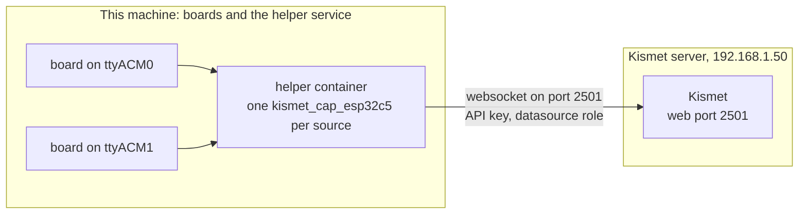

This page runs Kismet with the ESP32-C5 source from the project's Docker image, instead of building Kismet by hand. It is for Linux and Raspberry Pi users with boards plugged in, for Windows and macOS users with Docker Desktop, and for anyone who wants to feed boards on one machine to a Kismet server on another. Every variable, path, tag and build option is listed in [Docker Reference](Docker-Reference).

## Pick your setup

| You have | You run | Section |
|---|---|---|
| Boards plugged into a Linux PC or a Raspberry Pi, and want Kismet on the same machine | the `kismet` service | [Kismet with boards on Linux or a Raspberry Pi](#kismet-with-boards-on-linux-or-a-raspberry-pi) |
| No boards yet | the `demo` service, with a fake board | [Try It Without Hardware](Try-It-Without-Hardware) |
| Windows or macOS with Docker Desktop, boards on the same computer | Kismet in Docker Desktop, fed by the Python remote helper | [Docker Desktop on Windows and macOS](#docker-desktop-on-windows-and-macos) |
| Boards on this machine, Kismet on another | the `helper` service | [Boards here, Kismet elsewhere: the helper service](#boards-here-kismet-elsewhere-the-helper-service) |

If you are still deciding between Docker and a native build, [Choosing a Setup](Choosing-a-Setup) compares them. [How It Works](How-It-Works) explains the pieces.

## What has been tested

- **Windows 11, Docker Desktop 4.92 (Docker Engine 29.8, amd64):** the image build, the smoke test (the fake board in all three radios, and the helper role feeding a second container), the Compose demo, and Kismet in a container fed by the Python remote helper from a real board on a COM port. These runs used an image built from an earlier version of the Docker files. The current files change how the container finds boards.
- **Raspberry Pi 4 (8 GB, Debian 13 trixie, arm64), Docker 26.1.5:** the image build with `sudo docker build`, both targets, in about 80 minutes.
- **Not tested yet:** real boards inside a container on any platform (everything in [How the boards reach the container](#how-the-boards-reach-the-container)), the published images (nothing is published yet), boards passed into Docker Desktop through usbipd, macOS, Fedora, Arch, rootless Docker and Podman.
<!-- VERIFY: after the real-board test of the image on the Pi, update this list: boards found, all three radios captured, arm64 image size -->

## Before you start

- **Flashed boards.** Each board needs this project's firmware ([Flashing the Firmware](Flashing-the-Firmware)), and connects by its native USB port (USB ID `303a:1001`). The image holds no firmware and no flashing tools, so flash from the host before you start the container.
- **A powered USB hub** for more than one or two boards. An unpowered hub browns out under several boards, and the failures look like firmware bugs. See [Hardware](Hardware).
- **A 64-bit system on a Raspberry Pi.** The images are built for `linux/amd64` and `linux/arm64` only, so a Pi 4 or 5 needs a 64-bit OS. This prints `arm64` on a suitable Pi:

  ```bash
  dpkg --print-architecture
  ```

- **Internet access**, to pull the image or to build it.

## Install Docker

### Debian and Raspberry Pi

These are the Docker packages installed on the test Pi (Debian 13), plus `git`, which step 1 uses to get the project files and which a minimal install may not have:

```bash
sudo apt-get update
sudo apt-get install -y docker.io docker-buildx git
```

That gives Docker 26.1.5 with BuildKit (`docker-buildx` 0.13.1), but **not Docker Compose**. You then have two choices:

- Use plain `docker` commands, which need nothing more. This page gives them for the steps that need them: [Without Compose](#without-compose) for the `kismet` service, with a table of the other commands, and step 4 of [the helper service](#boards-here-kismet-elsewhere-the-helper-service). [Docker Reference](Docker-Reference#docker-run-equivalents) has the `docker run` form of all three services.
- Install Docker's own packages, which include the Compose plugin, by following Docker's instructions for Debian: https://docs.docker.com/engine/install/debian/. Those instructions start by removing Debian's Docker packages. On the test Pi these were `docker.io`, `docker-cli`, `docker-buildx`, `containerd` and `runc`, so remove them first:

  ```bash
  sudo apt-get remove docker.io docker-cli docker-buildx containerd runc
  ```

  This route was not tried on the test Pi.

<!-- VERIFY: pick one supported way to get `docker compose` on Debian 13 (Docker's apt repository with docker-compose-plugin, or Debian's docker-compose package if it provides the plugin) and test it on the Pi -->
<!-- VERIFY: the package list to remove before Docker's own packages (the Pi's dpkg -l showed containerd, docker-buildx, docker-cli, docker.io, runc); check against Docker's current Debian instructions -->

### Other Linux distributions

Install Docker Engine and the Compose plugin as Docker describes for your distribution: https://docs.docker.com/engine/install/. Fedora and Arch have not been tried with this project.

### Windows and macOS

Install Docker Desktop: https://docs.docker.com/desktop/. It includes Compose. Docker Desktop 4.92 (Docker Engine 29.8) on Windows 11 was tested; macOS was not. Read [Docker Desktop on Windows and macOS](#docker-desktop-on-windows-and-macos) first: containers there cannot see USB boards.

### sudo or the docker group

On Debian, Docker's socket (`/var/run/docker.sock`) belongs to root and the `docker` group. A user in neither runs every Docker command with `sudo`, and this page writes the Linux commands that way.

The alternative is to add yourself to the `docker` group. Membership is equivalent to root: any member can start a container that mounts the host's whole file system. The test Pi keeps using `sudo` for that reason. If you accept the trade-off:

```bash
sudo usermod -aG docker "$USER"    # then log out and back in
```

<!-- VERIFY: the usermod command was not run in this project; Docker documents it at https://docs.docker.com/engine/install/linux-postinstall/ -->

> **Note:** `sudo` does not pass your shell's environment variables on to Docker. Put Compose settings in the `.env` file described below, not in `KISMET_PORT=... sudo docker compose ...`.

## Kismet with boards on Linux or a Raspberry Pi

This runs the `kismet` service: Kismet in a container, with one source per board plugged into this machine.

### 1. Get the project files

```bash
git clone https://github.com/oshri-almog/esp32c5-kismet-wifi-interface
cd esp32c5-kismet-wifi-interface
```

Compose reads `compose.yaml` and `.env` from this directory, so run every `docker compose` command below from here.

### 2. Check that the host sees the boards

```bash
ls -l /dev/serial/by-id/
```

Each board shows up as a link named after its MAC, such as `usb-Espressif_USB_JTAG_serial_debug_unit_F0:F5:BD:01:02:03-if00 -> ../../ttyACM0`. The name stays with the board; the `ttyACM` number can change from one plug-in to the next. Every ESP32 on its native USB port gets a name of this shape, so other Espressif boards appear here too.

If nothing is listed, the board is not on the USB bus: check the cable and the hub, and see [Troubleshooting](Troubleshooting).

### 3. Choose the login and the sources

Create a file named `.env` next to `compose.yaml`. Replace the password with your own:

```ini
KISMET_USER=admin
KISMET_PASSWORD=choose-a-long-password
```

Set both or neither. Without them the container makes up a login and prints it once (step 5).

By default every board found becomes a Wi-Fi source. To put one board on each radio, list the sources yourself. Change the `ttyACM` numbers to the ones step 2 showed:

```ini
KISMET_SOURCES="esp32c5-ttyACM0:mode=wifi esp32c5-ttyACM1:mode=zigbee esp32c5-ttyACM2:mode=btle"
```

Or put every board found on one radio with `ESP32C5_MODE=zigbee` (or `btle`).

A source can also name a board by its `/dev/serial/by-id` link, which stays right when the `ttyACM` numbers change. The container makes the same links as the host:

```ini
KISMET_SOURCES="esp32c5:device=/dev/serial/by-id/usb-Espressif_USB_JTAG_serial_debug_unit_F0:F5:BD:01:02:03-if00,mode=zigbee"
```

<!-- VERIFY: /dev/serial/by-id links inside the container are made by the current entrypoint (sync_by_id); not run yet with a real board -->

Separate definitions with spaces; a definition itself cannot contain a space. The full syntax is in [Source Definitions](Source-Definitions). The file holds a password, so keep it private:

```bash
chmod 600 .env
```

The project's `.gitignore` does not list `.env`, so never add it to a commit: a `git add .` or `git add -A` in this directory would take the password with it.

<!-- VERIFY: .gitignore still has no .env entry; if one is added, drop the sentence above -->

### 4. Start Kismet

```bash
sudo docker compose up -d
```

The first time, Compose tries to pull `ghcr.io/oshri-almog/esp32c5-kismet:latest`. Until the first release is published that pull fails with `error from registry: denied`, and Compose builds the image locally instead. That takes about 18.5 minutes on a fast PC and about 80 minutes on a Raspberry Pi 4; on a Pi, read [Building the image yourself](#building-the-image-yourself) first.

<!-- VERIFY: once the first version tag is pushed, confirm that `docker compose up -d` pulls the multi-arch image on amd64 and on the Pi -->

Follow the start-up in the container's log:

```bash
sudo docker compose logs -f kismet
```

With two boards found you should see lines like these, then Kismet's own log. Compose puts `kismet-1  |` in front of every line of the service's log; `docker logs` shows the same lines without it. Ctrl+C stops following the log; Kismet keeps running.

```text
kismet-1  | [esp32c5-kismet] source: esp32c5-ttyACM0:mode=wifi
kismet-1  | [esp32c5-kismet] source: esp32c5-ttyACM1:mode=wifi
kismet-1  | [esp32c5-kismet] Kismet starts with 2 source(s)
```

Once a board is streaming, Kismet logs a line such as `INFO: esp32c5-ttyACM0 capturing (wifi)`.

<!-- VERIFY: the "source:", "Kismet starts with" and "capturing" lines with real boards in the container, and the `kismet-1  |` prefix as Compose prints it -->

If no board is found at start, the container waits up to 30 s for one (`waiting up to 30 s for an ESP32-C5 board`). Once a board turns up, it looks again every 2 s until two looks in a row find the same boards, so that the boards of a hub that come up one after another are all taken. That ends 2 to 4 s after the last board appears, and never more than 40 s from the start of the wait (`ESP32C5_WAIT` plus 10 s). If none turns up, Kismet starts without sources and the log says:

```text
[esp32c5-kismet] no ESP32-C5 board found. Plug one in and restart the container, or add sources from
[esp32c5-kismet] the web UI (Data Sources); boards plugged in now appear in the container on their own.
```

<!-- VERIFY: waiting until the board list stops changing (at most ESP32C5_WAIT + 10 s from the start of the wait) is new in the entrypoint; not run -->

### 5. Find the login

If you set `KISMET_USER` and `KISMET_PASSWORD`, that is the login. Otherwise the container made one up and printed it:

```bash
sudo docker compose logs kismet | grep "web login"
```

The line looks like this, with your own password and Compose's `kismet-1  |` in front:

```text
kismet-1  | [esp32c5-kismet] no web login was set, so Kismet's is now: user admin, password 5c1e0b7a92d4f3e8a6b1c0d2
```

Without Compose, use `sudo docker logs esp32c5-kismet 2>&1 | grep "web login"`; that line has no prefix.

Only the container that made the login printed it. After the container has been recreated (by an update, for example), read the login from the file Kismet keeps it in:

```bash
sudo docker compose exec kismet cat /root/.kismet/kismet_httpd.conf    # with Compose
sudo docker exec esp32c5-kismet cat /root/.kismet/kismet_httpd.conf    # with docker run
```

<!-- VERIFY: the grep, exec and docker exec commands above against the current entrypoint; the `kismet-1  |` prefix is Compose's usual one (web-1  | for a service named web), not seen for this service -->

Why the container always sets a login: Kismet without one serves a page that lets the first visitor choose the admin login, and with port 2501 published on the network that is whoever gets there first. The container picks the login in this order:

| Situation | Login used |
|---|---|
| `KISMET_USER` and `KISMET_PASSWORD` both set | Those two, written at **every** start. They replace a login kept from before, including one changed in the web UI. |
| Neither set, a login kept in the `/root/.kismet` volume | The kept one, unchanged. |
| Neither set, nothing kept | User `admin` and a random password of 24 hex characters, printed once. |

If only one of the two variables is set, the log says `KISMET_USER and KISMET_PASSWORD go together; ignoring the one that is set`.

<!-- VERIFY: the one-variable warning is logged at every start, whichever login is then used; new in the entrypoint, not run -->

To change the login later, set both variables in `.env` and run `sudo docker compose up -d` again, which recreates the container with the new values.

To start over with a new random login, take `KISMET_USER` and `KISMET_PASSWORD` out of `.env`, then remove the container, delete the `kismet-home` volume and start again:

```bash
sudo docker compose down
sudo docker volume rm esp32c5-kismet_kismet-home
sudo docker compose up -d
```

The new login is printed as above. This keeps the logs, which are in `esp32c5-kismet_kismet-data`, but deletes the API keys, so remote helpers need a new key. `down` comes first because Docker does not delete a volume that a container still uses, even a stopped one. Do not use `docker compose down -v` for this: it deletes the logs too.

With `docker run`, the volume is called `kismet-home`: run `sudo docker rm -f esp32c5-kismet`, then `sudo docker volume rm kismet-home`, then the `docker run` command again.

<!-- VERIFY: the login reset (down, volume rm, up -d) was not run -->

### 6. Open Kismet

In a browser, open `http://192.168.1.50:2501`, with your machine's address in place of 192.168.1.50 (or `http://localhost:2501` on the machine itself), and log in.

Under **Data Sources**, each board should be listed and running. On the Pi (native build), the first packets arrived 1.7 to 2.7 s after Kismet started. A board last used on another radio reboots into the requested one first, which took about 1.5 s. Continue with [Guide: First Capture](Guide-First-Capture).

> **Note:** Only capture on networks and devices you own or are authorised to test.

### Without Compose

The same service with `docker run`. Change the password, and add `-e KISMET_SOURCES="..."` to choose the sources:

```bash
sudo docker run -d --name esp32c5-kismet --restart unless-stopped --init \
    --cap-add NET_ADMIN \
    --device-cgroup-rule 'c 166:* rmw' --device-cgroup-rule 'c 188:* rmw' \
    -p 2501:2501 \
    -v kismet-data:/data -v kismet-home:/root/.kismet \
    -e KISMET_USER=admin -e KISMET_PASSWORD=choose-a-long-password \
    ghcr.io/oshri-almog/esp32c5-kismet:latest
```

<!-- VERIFY: this docker run command is derived from compose.yaml and has not been run -->
<!-- VERIFY: NET_ADMIN removed? -->

`--cap-add NET_ADMIN` and the two `--device-cgroup-rule` options are what `compose.yaml` sets for the service; [How the boards reach the container](#how-the-boards-reach-the-container) and [Why the container needs NET_ADMIN](#why-the-container-needs-net_admin) explain them.

Until the image is published, build it first ([Building the image yourself](#building-the-image-yourself)) and write `esp32c5-kismet` in place of `ghcr.io/oshri-almog/esp32c5-kismet:latest`.

The container's messages go to its standard error, so include it when you search the log:

```bash
sudo docker logs esp32c5-kismet 2>&1 | grep "web login"
```

The other Compose commands on this page become these, for the container named `esp32c5-kismet`:

| With Compose | With `docker run` |
|---|---|
| `sudo docker compose logs -f kismet` | `sudo docker logs -f esp32c5-kismet` |
| `sudo docker compose exec kismet ls -l /data` | `sudo docker exec esp32c5-kismet ls -l /data` |
| `sudo docker compose cp kismet:/data/Kismet-20260928-11-13-48-1.kismet .` | `sudo docker cp esp32c5-kismet:/data/Kismet-20260928-11-13-48-1.kismet .` |
| `sudo docker compose restart kismet` | `sudo docker restart esp32c5-kismet` |
| `sudo docker compose stop kismet` | `sudo docker stop esp32c5-kismet` |
| `sudo docker compose up -d` after changing `.env` | `sudo docker rm -f esp32c5-kismet`, then `docker run` again with the new `-e` values |

To pass options to Kismet, put `kismet` and then the options after the image name, for example `... ghcr.io/oshri-almog/esp32c5-kismet:latest kismet --no-logging`. The first word after the image picks the container's role, so the options alone would be run as a command.

## How the boards reach the container

The container does not get the host's `/dev`. Two things give it the boards and nothing else:

1. **Device rules.** `compose.yaml` gives the `kismet` and `helper` services `device_cgroup_rules` that allow two classes of device: major 166 (`ttyACM`, the boards' native USB) and major 188 (`ttyUSB`). The `docker run` equivalent is `--device-cgroup-rule 'c 166:* rmw' --device-cgroup-rule 'c 188:* rmw'`.
2. **Nodes made by the container.** A container sees the host's `/sys`. The entrypoint reads the `ttyACM` and `ttyUSB` devices there and makes their `/dev` nodes itself, then checks again every second: a board plugged in, rebooted or back under another `ttyACM` number gets its node within about a second, and the node of a board that has gone is removed. It also makes the `/dev/serial/by-id` links the host's udev would make.

A board counts as found when its USB ID is `303a:1001`. Its port is not opened to check, because opening the port moves DTR and RTS, which are the board's reset lines. At start the entrypoint also tries once, per device class, whether the device rules let it open such a device, on a spare device number, never on a board. A board whose class is not allowed is reported and left out:

```text
[esp32c5-kismet] found ttyACM0 in sysfs but the container may not use it: allow it with
[esp32c5-kismet] compose.yaml's device_cgroup_rules, or docker run --device-cgroup-rule 'c 166:* rmw'
```

<!-- VERIFY: the device-class probe and this message are new in the entrypoint; not run with a board -->

**Why not share the host's `/dev`.** A `/dev:/dev` bind would hand the container every device node on the host: its terminals, `/dev/shm` and its disks. An earlier version of `compose.yaml` did that; the device rules replaced it for this reason.

**Why not `--device /dev/ttyACM0`.** A fixed device entry is one node. A board that is plugged in again, or re-enumerates, can come back as another `ttyACM` number, and the container would lose it. Nodes given with `--device` are still used if you prefer them.

What this means in practice:

- **Boards plugged in after start** get their node, but they are not added as sources, because the source list is worked out once at start. Add them from Kismet's **Data Sources** panel, or restart the container with `sudo docker compose restart kismet` (`sudo docker restart esp32c5-kismet` without Compose).
- **Boards named in `KISMET_SOURCES` can come later.** A board you name there that is not plugged in at start stays in Kismet's **Data Sources** list with the reason, and Kismet retries it every 5 s, so it is picked up within about 5 s of being plugged in. You can list all the boards of a hub up front this way. Name them by their by-id links, since a board's `ttyACM` number is only known once it is plugged in.
  <!-- VERIFY: in the container, a KISMET_SOURCES entry (a by-id link) whose board is plugged in after start is picked up: the entrypoint makes the node and link within about 1 s, and Kismet retries the source every 5 s. Checked for the C helper outside Docker only -->
- **Other Espressif boards** (ESP32-C3, C6, H2, S3, P4) share the USB ID `303a:1001`. With any of them plugged in, list your sources in `KISMET_SOURCES` so that only the sniffer boards are used.
- **One board, one source.** A board captures with one radio at a time. Do not also give it to Kismet with `-c` in the container's command: auto-discovery would add it a second time. Use `KISMET_SOURCES` instead.
- **Stop the container before you use its boards elsewhere.** The helpers lock a board's port so that a second capture cannot take it, but that lock does not reach across the container boundary: a program on the host, or in a second container, can still open the same board. Run `sudo docker compose stop kismet` (or `sudo docker stop esp32c5-kismet`) before you flash a board, open it in a serial monitor, or give it to the `helper` service or a native Kismet.
  <!-- VERIFY: the helpers are to set TIOCEXCL on the tty so that the lock also holds between a container and the host, and between containers; if that has landed, restate this caution -->
- **Permissions.** Everything in the container runs as root, so the host's `dialout` group does not matter here.

## Why the container needs NET_ADMIN

Kismet's capture helpers, when they run as root, keep the capabilities NET_ADMIN and NET_RAW and drop all others. Docker's default set includes NET_RAW but not NET_ADMIN, so that step fails, and the helper crashes (signal 11) before it opens the board. Kismet then shows only `cancelling source probe due to timeout` or `Unable to find driver`, and its log has `capture process exited 0 signal 11`. Kismet's stock `kismet_cap_catsniffer_zigbee` crashes the same way.

So `compose.yaml` adds NET_ADMIN (`cap_add: [NET_ADMIN]`) to all three services, and a `docker run` with boards needs `--cap-add NET_ADMIN`. The capability lets the container change network settings of its own network namespace only, not the host's.

<!-- VERIFY: NET_ADMIN removed? -->

It is needed only for boards plugged into this machine. A container that only receives sources from remote helpers works without it; that was tested twice. The entrypoint warns when it is missing:

```text
[esp32c5-kismet] the container has no NET_ADMIN capability, and without it Kismet's capture helpers
[esp32c5-kismet] crash on start. Add --cap-add NET_ADMIN to docker run (compose.yaml has it).
```

With no local sources, the warning instead says that remote helpers work and local boards would not:

```text
[esp32c5-kismet] no NET_ADMIN capability: sources from remote helpers work, boards plugged into this
[esp32c5-kismet] machine would not (add --cap-add NET_ADMIN for those)
```

## Settings

Set these in `.env` next to `compose.yaml`, or with `-e` on `docker run`. The full list is in [Docker Reference](Docker-Reference).

| Variable | Default | Meaning |
|---|---|---|
| `KISMET_SOURCES` | empty | Source definitions separated by spaces. Empty: every board found, each on the radio in `ESP32C5_MODE`. |
| `ESP32C5_MODE` | `wifi` | `wifi`, `zigbee` or `btle`: the radio for boards found by the container. Not used when `KISMET_SOURCES` is set. |
| `ESP32C5_WAIT` | `30` | Seconds to wait at start for a first board, when none is there. Once one is found, the container looks again every 2 s until the list stops changing, for at most `ESP32C5_WAIT` + 10 s in all. `0` turns the wait off. |
| `KISMET_USER`, `KISMET_PASSWORD` | empty | The web login (step 5). |
| `KISMET_PORT` | `2501` | Compose only: the host port for Kismet's web UI. Change it when another Kismet already uses 2501. |

`compose.yaml` does not pass `ESP32C5_WAIT` on, so a value in `.env` has no effect. To set it under Compose, create `compose.override.yaml` next to `compose.yaml`; Compose reads that file as well:

```yaml
services:
  kismet:
    environment:
      ESP32C5_WAIT: "0"
```

<!-- VERIFY: the override file was not tried -->

With `docker run`, pass `-e ESP32C5_WAIT=0`.

## Where your data is

The image keeps two directories as volumes, and Compose gives them names so that they survive updates:

| Volume (Compose name) | In the container | Holds |
|---|---|---|
| `esp32c5-kismet_kismet-data` | `/data` | Kismet's logs: one `.kismet` database per run, such as `Kismet-20260928-11-13-48-1.kismet` (time in UTC). |
| `esp32c5-kismet_kismet-home` | `/root/.kismet` | The web login (`kismet_httpd.conf`), the API keys and sessions (`session.db`), and Kismet's other per-user state. |

To list the logs, and copy one out to the current directory (change the file name to one from the list):

```bash
sudo docker compose exec kismet ls -l /data
sudo docker compose cp kismet:/data/Kismet-20260928-11-13-48-1.kismet .
```

With `docker run`, the same with the container's name:

```bash
sudo docker exec esp32c5-kismet ls -l /data
sudo docker cp esp32c5-kismet:/data/Kismet-20260928-11-13-48-1.kismet .
```

<!-- VERIFY: `docker compose cp` and `docker cp` were not run in this project -->

The image also holds Kismet's log tools, such as `kismetdb_to_pcap`; [Guide: Exporting to Wireshark](Guide-Exporting-to-Wireshark) shows how to turn a log into a pcapng file. Kismet writes only its own `.kismet` database by default; [Kismet Configuration](Kismet-Configuration) shows how to add pcapng logs.

`docker run` without `-v` gives each container two unnamed volumes, which `docker rm -v` removes with the container.

## Docker Desktop on Windows and macOS

Docker Desktop runs containers in a Linux virtual machine that cannot see the computer's USB serial devices. On Windows the boards stay on their COM ports; Docker Desktop on macOS presumably has the same limit, but it was not tested. That leaves three ways to use it, after you get the project files.

### Get the project files

Compose reads `compose.yaml` from the project, and until the image is published, `docker build` needs the project's files as well. In PowerShell, with Git for Windows installed (on macOS, in Terminal):

```powershell
git clone https://github.com/oshri-almog/esp32c5-kismet-wifi-interface
cd esp32c5-kismet-wifi-interface
```

Run every `docker compose` and `docker build` command below from this directory, and create `.env` here.

### The demo

The demo image runs Kismet with a fake board, and works on Docker Desktop:

```powershell
docker compose --profile demo up demo
```

Then open `http://localhost:2501` and log in as `demo` / `demo`. If your `.env` sets `KISMET_USER` and `KISMET_PASSWORD` (as the next section and step 3 on Linux do), the demo uses that login instead. [Try It Without Hardware](Try-It-Without-Hardware) has the details.

The demo publishes the same host port as the `kismet` service, 2501 (on this computer's loopback only), so it cannot start while the `kismet` service is running. Stop the `kismet` service first, and start it again when you are done with the demo:

```powershell
docker compose stop kismet
docker compose --profile demo up demo    # Ctrl+C ends the demo
docker compose start kismet
```

Or give the demo another port with `KISMET_PORT` in `.env` (for example `KISMET_PORT=2502`, then open `http://localhost:2502`). That moves the `kismet` service's port as well, the next time its container is created.

### Kismet in Docker Desktop, boards through the Python remote helper

This is the tested way to use real boards with Docker on Windows: Kismet runs in Docker Desktop, and the Python remote helper runs on Windows, opens the boards on their COM ports and sends them to Kismet over remote capture.

1. Create `.env` next to `compose.yaml` with your login (change the password):

   ```ini
   KISMET_USER=admin
   KISMET_PASSWORD=choose-a-long-password
   ```

2. Start Kismet:

   ```powershell
   docker compose up -d
   ```

   The container finds no board, waits 30 s, then starts Kismet without sources and logs the no-board message. That is expected here: the sources arrive from the remote helper. Until the image is published, Compose builds it first, which took about 18.5 minutes on the test PC.

   Or, without Compose, publishing Kismet on this computer only and skipping the wait:

   ```powershell
   docker run -d --name esp32c5-kismet -p 127.0.0.1:2501:2501 -e KISMET_USER=admin -e KISMET_PASSWORD=choose-a-long-password -e ESP32C5_WAIT=0 -v kismet-data:/data -v kismet-home:/root/.kismet ghcr.io/oshri-almog/esp32c5-kismet:latest
   ```

   <!-- VERIFY: adapted from the tested command (docker run -d --name esp32c5-wintest -p 127.0.0.1:2612:2501 -e KISMET_USER=wintest -e KISMET_PASSWORD=... -e ESP32C5_DEMO= esp32c5-kismet:latest kismet --no-logging); run it as written -->

   Until the image is published, build it first, from the project directory, and write `esp32c5-kismet` in place of `ghcr.io/oshri-almog/esp32c5-kismet:latest` in the command above:

   ```powershell
   docker build -f docker/Dockerfile -t esp32c5-kismet .
   ```

   This container needs neither NET_ADMIN nor device rules, since it opens no board itself. Its log says so, which is expected here: `no NET_ADMIN capability: sources from remote helpers work, boards plugged into this machine would not (add --cap-add NET_ADMIN for those)`, over two lines (see [Why the container needs NET_ADMIN](#why-the-container-needs-net_admin)).

   <!-- VERIFY: NET_ADMIN removed? (if so, this warning is gone from the entrypoint too) -->

3. Create an API key with the `datasource` role, which lets the helper feed sources and nothing else. From Git Bash (tested), with your login:

   ```bash
   curl -u admin:choose-a-long-password --data-urlencode 'json={"name": "windows-helper", "role": "datasource", "duration": 0}' http://127.0.0.1:2501/auth/apikey/generate.cmd
   ```

   It prints the key, 32 hex characters. `duration` 0 means it never expires. The key is kept in the `kismet-home` volume, so it survives restarts and updates. Kismet's web UI can also create keys, under **Settings → API Keys**.

   <!-- VERIFY: creating a key from Kismet's web UI was not checked -->

   > **Note:** In Windows PowerShell 5.1, `curl` is another command (Invoke-WebRequest), and PowerShell strips the double quotes inside the JSON before `curl.exe` sees them. Use Git Bash or the web UI for this step, or `curl.exe` with a backslash before each inner quote, as on [Kismet Configuration](Kismet-Configuration#creating-a-key-with-curl):

   ```powershell
   curl.exe -u admin:choose-a-long-password --data-urlencode 'json={\"name\": \"windows-helper\", \"role\": \"datasource\", \"duration\": 0}' http://127.0.0.1:2501/auth/apikey/generate.cmd
   ```

   <!-- VERIFY: the PowerShell and cmd curl.exe forms against a real Kismet (checked only against a local echo server) -->

4. On Windows, install the Python remote helper as [Install on Windows](Install-on-Windows) describes, and list the boards:

   ```powershell
   python -m esp32c5_kismet.remote --list
   ```

5. Start the helper with the key and a board. Change `COM14` to a port from the list and the key to yours:

   ```powershell
   python -m esp32c5_kismet.remote --connect 127.0.0.1:2501 --apikey 3F9A6C1E07B24D58A1C9E2F4608B7D35 --source esp32c5-COM14:mode=wifi
   ```

   <!-- VERIFY: run this command with the final Python remote helper (its review was still running) against Kismet in Docker Desktop -->

   The examples use `127.0.0.1`. On Windows, `localhost` resolves to the IPv6 address `::1` first, and in the tests against Kismet in WSL2 each attempt on `::1` cost about 2 s; Docker Desktop was not measured separately. The current Python remote helper tries `127.0.0.1` first when you write `localhost`, so either works with it while Kismet is up.

   <!-- VERIFY: Docker Desktop and localhost. A port it publishes without an address (compose's kismet service, "2501:2501") answered on ::1 in 0.03 s in a quick check with another container, so it may not have the delay; one published on 127.0.0.1 (the demo service) may refuse ::1 as WSL2 does -->

   The key can also come from the environment instead of the command line, where it shows in the process list. In PowerShell:

   ```powershell
   $env:KISMET_CAP_APIKEY = "3F9A6C1E07B24D58A1C9E2F4608B7D35"
   python -m esp32c5_kismet.remote --connect 127.0.0.1:2501 --source esp32c5-COM14:mode=wifi
   ```

   <!-- VERIFY: the environment form (KISMET_CAP_APIKEY) with the final Python remote helper on Windows -->

6. In Kismet's web UI, **Data Sources** now lists the board as a remote source. Stop the helper with Ctrl+C.

What the test showed, with an earlier image and helper: a board on COM32 feeding Kismet in Docker Desktop with a login, hopping all 42 Wi-Fi channels at 5 per second, gave 6249 packets in about 2.5 minutes with no error packets, and 128 Wi-Fi devices, 11 of them on 5 GHz. Run on with an API key for about 90 s more, the source reached 15,032 packets and 179 devices. After `docker restart`, the helper reconnected by itself in about 7 s and the API key was still valid. [Remote Capture](Remote-Capture) covers the helper's options, and [Guide: Windows Boards to a Pi](Guide-Windows-Boards-to-a-Pi) does the same with the Kismet server on a Pi.

### Boards passed into Docker Desktop through usbipd (untested)

On Windows, usbipd-win (https://github.com/dorssel/usbipd-win) can attach a USB device to WSL 2. Docker Desktop's engine runs in the same WSL 2 virtual machine, so an attached board should be visible to the `kismet` service as on Linux. Nobody has tried this with these boards. Attaching a board to WSL takes it away from Windows, so the Python remote helper cannot use it at the same time. [Install on WSL2](Install-on-WSL2) describes attaching boards to WSL.

<!-- VERIFY: attach a board with usbipd and check that the kismet service in Docker Desktop finds and captures from it -->

### Windows notes

- **Port clash.** A Kismet in WSL and one in Docker Desktop both want `localhost:2501`. Give the container another host port with `KISMET_PORT=2502` in `.env` (or `-p 127.0.0.1:2502:2501` on `docker run`), and connect helpers to that port.
- **Git Bash rewrites container paths.** Git Bash turns arguments that look like POSIX paths into Windows paths, so `/root/.kismet/...` in a `docker` command reaches the container as a `C:/...` path. Run such commands in PowerShell, or prefix them in Git Bash:

  ```bash
  MSYS_NO_PATHCONV=1 MSYS2_ARG_CONV_EXCL='*' docker compose exec kismet cat /root/.kismet/kismet_httpd.conf
  ```

- **macOS.** The Python remote helper has not been run on macOS; see [Install on macOS and BSD](Install-on-macOS-and-BSD).

## Boards here, Kismet elsewhere: the helper service

The `helper` service runs no Kismet. It sends the boards plugged into this machine to a Kismet server on another machine over remote capture, one `kismet_cap_esp32c5` (the C helper) per source.



The Kismet server must know the `esp32c5` source type: this project's image (the `kismet` service on another machine), or a Kismet built with [Building Kismet with ESP32-C5 Support](Building-Kismet-with-ESP32-C5-Support). A stock Kismet cannot take these sources.

1. **Make port 2501 of the server reachable** from this machine. The `kismet` service publishes it on all interfaces.
2. **Create an API key** on the server with the `datasource` role. Change the address and the login to the server's:

   ```bash
   curl -u admin:choose-a-long-password --data-urlencode 'json={"name": "pi-helper", "role": "datasource", "duration": 0}' http://192.168.1.50:2501/auth/apikey/generate.cmd
   ```

   It prints the key, 32 hex characters.

3. **On the machine with the boards**, get the project files (step 1 above) and create `.env` with the server's address, the key and the sources. Change all three to yours:

   ```ini
   KISMET_SERVER=192.168.1.50:2501
   KISMET_APIKEY=3F9A6C1E07B24D58A1C9E2F4608B7D35
   KISMET_SOURCES="esp32c5-ttyACM0:mode=wifi esp32c5-ttyACM1:mode=btle"
   ```

   Without `KISMET_SOURCES`, every board found is sent in `ESP32C5_MODE`, as in the `kismet` service.

4. **Start the helper.** Name the service: `--profile helper up` on its own would also start the `kismet` service, and the two would compete for the same boards.

   ```bash
   sudo docker compose --profile helper up -d helper
   ```

   Without Compose, give the same settings with `-e` instead of `.env`. Change the address, the key and the sources to yours:

   ```bash
   sudo docker run -d --name esp32c5-helper --restart unless-stopped --init \
       --cap-add NET_ADMIN \
       --device-cgroup-rule 'c 166:* rmw' --device-cgroup-rule 'c 188:* rmw' \
       -e KISMET_SERVER=192.168.1.50:2501 \
       -e KISMET_APIKEY=3F9A6C1E07B24D58A1C9E2F4608B7D35 \
       -e KISMET_SOURCES="esp32c5-ttyACM0:mode=wifi esp32c5-ttyACM1:mode=btle" \
       ghcr.io/oshri-almog/esp32c5-kismet:latest helper
   ```

   <!-- VERIFY: this docker run command is derived from compose.yaml (as in Docker-Reference's docker run equivalents) and has not been run -->
   <!-- VERIFY: NET_ADMIN removed? -->

   Until the image is published, build it first ([Building the image yourself](#building-the-image-yourself)) and write `esp32c5-kismet` in place of `ghcr.io/oshri-almog/esp32c5-kismet:latest`. The word `helper` after the image name picks the container's role.

5. **Check it.** The log shows one line per source each time its helper starts:

   ```bash
   sudo docker compose --profile helper logs -f helper    # with Compose
   sudo docker logs -f esp32c5-helper                     # with docker run
   ```

   With Compose, each line starts with `helper-1  |`; `docker logs` shows it without:

   ```text
   helper-1  | [esp32c5-kismet] helper: esp32c5-ttyACM0:mode=wifi -> 192.168.1.50:2501
   helper-1  | [esp32c5-kismet] helper: esp32c5-ttyACM1:mode=btle -> 192.168.1.50:2501
   ```

   On the server, **Data Sources** lists the boards as remote sources. With an older build on the Pi, the C helper took about 3 to 5.4 s from connecting to capturing, and packets then came in bursts.

<!-- VERIFY: the helper role has only run with the fake board (smoke test, older image: running=1, 200 packets); run it with real boards -->

How the helper service behaves:

- **Each source restarts by itself.** When a `kismet_cap_esp32c5` exits (its board has been away for 15 s, or the server cannot be reached), it is started again 5 s later. Kismet never re-opens a remote source on its own; it waits for the helper to come back and recognises the source by its UUID. A helper started before its server logged `FATAL: Datasource could not connect websocket` and retried until the server came up.
- **No waiting for a first board.** Boards it finds by itself are checked again every 2 s until the list stops changing, at most 10 s, since boards on a hub come up one after another (`ESP32C5_WAIT=0` turns that off). <!-- VERIFY: the helper role's settle wait (entrypoint changed after the last Docker test) --> With no board and no `KISMET_SOURCES`, the container exits with `helper: no ESP32-C5 board found and KISMET_SOURCES is empty`, and Docker restarts it (`restart: unless-stopped`) until a board is there. A source in `KISMET_SOURCES` that names no port (a bare `esp32c5`) stops before it connects when there is no board or more than one, with `Could not probe local source prior to connecting to the remote host` and the reason, and the container starts it again 5 s later, until the board is there. One that names a port (`esp32c5-ttyACM0`, `device=`, a by-id link) connects anyway, and Kismet shows the open error as the source's error until the board is there. <!-- VERIFY: that a remote C helper whose named port is missing connects and reports the open error (read from capture_esp32c5.c probe_callback and resolve_device) -->
- **Boards plugged in later** are not added; run `sudo docker compose --profile helper restart helper` (or `sudo docker restart esp32c5-helper`). A board named in `KISMET_SOURCES` is the exception: as the previous point says, its helper is started again every 5 s until the board is there.
- **A login instead of a key.** `KISMET_USER` and `KISMET_PASSWORD` also work, but for remote capture they cannot contain `&`, a space or `%` followed by two hex digits: Kismet decodes the whole query string of the remote capture URL before splitting it, so these characters cannot get through. The container refuses such a login and exits. An API key has no such limit, and can only feed sources.
- **The credentials stay out of the process list.** The container hands them to `kismet_cap_esp32c5` in its environment (`KISMET_CAP_APIKEY`, or `KISMET_CAP_USER` and `KISMET_CAP_PASSWORD`), not on its command line. With `docker run`, the key is on the `docker run` command line itself, so it is in your shell's history; Compose reads it from `.env`.
- **It uses the C helper.** The Python remote helper is not in the image. On Windows, use the Python remote helper directly, as in [Docker Desktop on Windows and macOS](#docker-desktop-on-windows-and-macos).
- **NET_ADMIN and the device rules** are needed as for the `kismet` service; `compose.yaml` sets both.
  <!-- VERIFY: NET_ADMIN removed? -->
- **Stopping.** `sudo docker compose --profile helper stop helper` (or `sudo docker stop esp32c5-helper`) ends every helper; the container exited in about 1 s in the test. Kismet then shows the sources in error with the reason `websocket connection closed`, which is expected.

[Remote Capture](Remote-Capture) explains remote capture in general, including the legacy TCP port 3501, which the image keeps on the container's loopback, out of reach.

## Building the image yourself

Build the image when no published image is available yet, to try another Kismet commit, or to test changes to the helper.

### With Compose

```bash
sudo docker compose build
sudo docker compose up -d
```

The first command builds the `kismet` service's image (and the `helper`'s, which is the same image) and tags it `ghcr.io/oshri-almog/esp32c5-kismet:latest` on this machine. `sudo docker compose up -d --build` does both in one step. The demo image builds with `sudo docker compose --profile demo build demo`.

On a machine that runs only the `helper` service, build and start that service by name instead, so that the `kismet` service is not started as well:

```bash
sudo docker compose --profile helper up -d --build helper
```

<!-- VERIFY: `docker compose build`, `up --build` and the demo build were not run in this project -->

### With docker build

```bash
sudo docker build -f docker/Dockerfile -t esp32c5-kismet .
sudo docker build -f docker/Dockerfile --target demo -t esp32c5-kismet:demo .
```

The first makes the Kismet image (target `kismet`, the default); the second makes the demo image with the fake board. These local names are the ones to use with `docker run`. Compose looks for `ghcr.io/oshri-almog/esp32c5-kismet:latest` instead; to let it use the same build, add that name as a second tag, as in [A long build over SSH](#a-long-build-over-ssh).

### How long it takes

| Machine | Time |
|---|---|
| Windows 11 PC, Docker Desktop 4.92 (Docker Engine 29.8), whose VM had 20 CPUs and 16 GB as `docker info` reported | 18.5 minutes for a first build of the demo image, of which configuring, compiling and installing Kismet took 17.5 minutes at 4 compilers. Rebuilds from the cache took 2 to 39 s. |
| Raspberry Pi 4, 8 GB, Debian 13, Docker 26.1.5 | About 80 minutes for a first build of both targets (demo, then kismet), almost all of it compiling Kismet at 4 compilers. For comparison, compiling Kismet natively on the same Pi took about 78 minutes. |
| Raspberry Pi with 2 GB | Longer: it builds with one compiler. Not measured, and it may not finish without swap (see [Parallel compilers and memory](#parallel-compilers-and-memory)). |

Almost all of the time is Kismet itself, which the build compiles from source because no Kismet release includes this source yet. The build compiles Kismet with a stand-in for the helper first, so that a change to the helper's source rebuilds only the helper on top of the cached Kismet layer: about a minute on the Pi. A change to `kismet/add-to-kismet.sh`, `kismet/datasource_esp32c5.h` or `kismet/capture_esp32c5/Makefile.in`, or to a build argument, compiles Kismet again. [Docker Reference](Docker-Reference) lists what each change rebuilds.

The build needs internet access: Debian's package servers, GitHub (to clone Kismet) and Docker Hub (for the Debian base image and the Dockerfile syntax image). Disk space for the build was not measured.

### Parallel compilers and memory

The build counts on about 1.5 GB of memory per compiler for Kismet's C++. By default it runs as many compilers as the free memory allows at that rate, but no more than the number of cores and no more than 4, and at least 1: an 8 GB Pi 4 gets 4, a 2 GB Pi gets 1. The build prints its choice as `building with -j<N>`.

Some files need more than that. On the 8 GB Pi, one Kismet file (`phy_80211.cc`) needed about 2.4 GB for its own compiler, more than a 2 GB Pi has in all. A 2 GB Pi therefore probably needs swap even with one compiler; without it, the build can run out of memory on that file, possibly long after it started. This is untested.

<!-- VERIFY: a Docker build on a 2 GB Pi, with and without swap -->

To set the number of compilers yourself:

```bash
sudo docker build -f docker/Dockerfile --build-arg JOBS=2 -t esp32c5-kismet .
```

A different `JOBS` value from the last build misses Docker's cache and compiles Kismet again, so keep one value, or leave it unset.

<!-- VERIFY: the cache miss on a changed build argument is general Docker behaviour, not tried here -->

### A long build over SSH

On a Pi, a build over an SSH session stops if the session drops. The test Pi ran its 80-minute build as a transient systemd unit instead, which keeps going after you log out. Change the path to where you cloned the project:

```bash
sudo systemd-run --unit=esp32c5-docker-build --working-directory="$HOME/esp32c5-kismet-wifi-interface" sh -c "exec > $HOME/docker-build.log 2>&1; docker build -f docker/Dockerfile -t esp32c5-kismet -t ghcr.io/oshri-almog/esp32c5-kismet:latest ."
tail -f ~/docker-build.log
```

The build gets two names, so that both ways of running it use the result: `docker run` with `esp32c5-kismet`, and `docker compose up -d`, which finds `ghcr.io/oshri-almog/esp32c5-kismet:latest` on the machine and then neither pulls nor builds. With only the first name, Compose would try the pull, be refused, and start a build of its own.

<!-- VERIFY: adapted from the command used on the test Pi (which tagged esp32c5-kismet only); run it as written -->
<!-- VERIFY: that `docker compose up -d` uses the locally tagged ghcr.io image without pulling or building (Compose's default pull_policy: missing); not run -->

### Another Kismet commit

The image builds Kismet at commit `cfe427074`, the one the source was developed against. To try another, set `KISMET_REF`. This example builds Kismet's newest code, on its `master` branch; put a commit hash or a tag in place of `master` to build that one:

```bash
sudo docker build -f docker/Dockerfile --build-arg KISMET_REF=master -t esp32c5-kismet .
```

A later build with the same `KISMET_REF` takes Kismet from Docker's cache, even after `master` has moved on; add `--no-cache` to fetch it again.

<!-- VERIFY: a build with KISMET_REF=master was not run; the cache reuse for an unchanged branch name is general Docker behaviour, not tried here -->

`kismet/add-to-kismet.sh` stops the build with `anchor not found, Kismet has changed: ...` if that commit has moved the lines it edits.

### Image size

| Image | Size (amd64) |
|---|---|
| `esp32c5-kismet:latest` | 177 MB |
| `esp32c5-kismet:demo` | 227 MB |

The arm64 sizes have not been measured yet.

## Updating

Your login, API keys and logs are in the volumes, so an update keeps them.

**With a published image:**

```bash
sudo docker compose pull
sudo docker compose up -d
```

<!-- VERIFY: nothing is published yet; test the pull-and-recreate update once the first release exists -->

**With an image you build:**

```bash
git pull
sudo docker compose build
sudo docker compose up -d
```

**On a machine that runs only the `helper` service,** name the service in each command. The plain `up -d` above would start the `kismet` service there as well, and the two would compete for the same boards (`--profile helper` in these commands does no harm, but it is the service's name that keeps the `kismet` service out):

```bash
sudo docker compose --profile helper pull helper    # with a published image
sudo docker compose --profile helper up -d helper
```

```bash
git pull                                            # with an image you build
sudo docker compose --profile helper build helper
sudo docker compose --profile helper up -d helper
```

**Without Compose:** pull or build the new image, remove the old container, and run the `docker run` command again. `docker rm` keeps the named volumes `kismet-data` and `kismet-home`:

```bash
sudo docker pull ghcr.io/oshri-almog/esp32c5-kismet:latest
sudo docker rm -f esp32c5-kismet
```

For the helper, remove `esp32c5-helper` instead (`sudo docker rm -f -v esp32c5-helper`) and run its `docker run` command again.

Remote helpers reconnect by themselves when Kismet comes back: the Python remote helper took about 7 s after a `docker restart`, and the C helper retries every 5 s. The boards' firmware is updated separately; [Guide: Updating](Guide-Updating) covers both.

## Stopping and removing

| Command | Effect |
|---|---|
| `sudo docker compose stop` | Stops the containers; `sudo docker compose start` starts them again. |
| `sudo docker compose down` | Removes the containers and the network; the volumes stay. |
| `sudo docker compose down -v` | Also deletes the volumes: the login, the API keys and **all logs**. |
| `sudo docker compose --profile helper stop helper` | Stops the `helper` service; `sudo docker compose --profile helper start helper` starts it again. |
| `sudo docker compose --profile helper down` | Removes the `helper` service's container as well (and the `kismet` service's, if it runs here); the volumes stay. |
| `sudo docker rm -f esp32c5-kismet` | Removes a `docker run` container; its named volumes stay. |
| `sudo docker volume rm kismet-data kismet-home` | Deletes the `docker run` volumes. |
| `sudo docker rm -f -v esp32c5-helper` | Removes a `docker run` helper container and its two unnamed volumes. |

What matters for the `helper` service is its name. Compose acts on a service named on the command line whatever its profile, so `--profile helper` beside the name does no harm but is not needed. A command without a service name acts only on services without a profile and those whose profile is given: `sudo docker compose down` leaves the helper's container in place, and `sudo docker compose --profile helper down` removes it together with the `kismet` service's. For the same reason, `sudo docker compose --profile helper up -d` with no service name starts the `kismet` service as well (a bare `--profile helper pull` fetches the `kismet` service's image too, which is harmless: it is the same image). See [Docker's page on profiles](https://docs.docker.com/compose/how-tos/profiles/).

<!-- VERIFY: the --profile helper forms of stop, start and down against a running helper service; not run. With Compose 5.5.1, `ps -a helper`, `logs helper` and `config helper` worked without --profile; check stop, restart and down without it before dropping the flag, and that a plain `docker compose down` leaves a running helper service's container (Docker's profiles page says so) -->


The `kismet` and `helper` services have `restart: unless-stopped`, so they start again when Docker starts, for example after a reboot, unless you stopped them. [Guide: Running as a Service](Guide-Running-as-a-Service) covers starting Kismet at boot.

<!-- VERIFY: restart after a reboot of the Pi was not tested -->

> **Warning:** Do not clean up with `docker volume prune` or `docker system prune --volumes`. They delete every unused unnamed volume on the machine, not only this project's (with `-a`, `docker volume prune` deletes unused named volumes too, such as `kismet-data`). Remove this project's containers and volumes by name, as in the table.

## Log lines you can ignore

These come from Kismet itself, not from this project:

| Line | Why |
|---|---|
| `ERROR: Tried to re-register duplicate alert FLIPPERZERO` | Kismet at this commit logs it at every start. Harmless; do not treat "ERROR" lines alone as a failure. |
| `ALERT: ROOTUSER Kismet is running as root` | Kismet runs as root inside the container. |
| `INFO: (HTTPD) Could not read session data file, skipping loading saved sessions.` | A new, empty `kismet-home` volume. |
| `Launching remote capture server on 127.0.0.1 3501` | Kismet's legacy TCP remote capture port, kept on the container's loopback, where nothing outside can reach it. |
| A log path with `/data//` | Kismet's own way of joining the log directory and file name. |
| `ALERT: LOGDISABLED ...` | Demo only: the demo runs Kismet with `--no-logging`. |

For anything else, see [Troubleshooting](Troubleshooting).

## See also

- [Docker Reference](Docker-Reference): every variable, path, port, tag and build option.
- [Try It Without Hardware](Try-It-Without-Hardware): the demo in detail.
- [Remote Capture](Remote-Capture): helpers on other machines, API keys and transports.
- [Kismet Configuration](Kismet-Configuration): changing Kismet's settings, including in the container.
- [Install on Raspberry Pi](Install-on-Raspberry-Pi) and [Building Kismet with ESP32-C5 Support](Building-Kismet-with-ESP32-C5-Support): Kismet without Docker.
