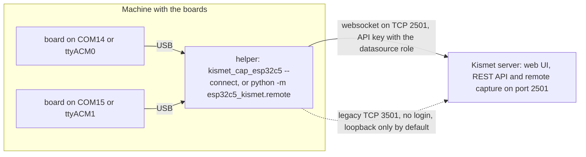

This page covers remote capture: boards plugged into one machine feeding a Kismet server on another. It explains the two ways the Kismet server accepts remote sources, the two helpers that can send them, how to log in with an API key, what happens when a connection drops, and how to keep it secure. It is for anyone whose boards and Kismet server are not on the same machine, including every Windows user, since Kismet does not run on Windows.

> **Note:** Only capture on networks and devices you own or are authorised to test. This holds for the machine with the boards too: a helper at another site records what is around it, and its packets cross the network unencrypted (see "Security and firewalls").

## When you need it

- **Boards on a Windows PC.** The Python remote helper feeds them to Kismet in WSL2, in Docker Desktop, on a Raspberry Pi or on a Linux PC. See [Install on Windows](Install-on-Windows).
- **Kismet in Docker Desktop.** Its containers do not see USB boards. Attaching them to WSL with usbipd should pass them in, but that has not been tested, so the tested set-up keeps the boards on Windows and a helper feeds them in.
  <!-- VERIFY: boards attached to WSL with usbipd reaching a Docker Desktop container (docker.md 12: UNVERIFIED) -->
- **Boards on one machine, Kismet on another.** For example, a Raspberry Pi with the boards in one room and the Kismet server elsewhere, or several machines feeding one Kismet.

When the boards and Kismet are on the same Linux machine you do not need any of this. Kismet starts the C helper itself for each local source ([Source Definitions](Source-Definitions)).

## How it fits together



The helper does everything a local source's helper does. It opens the port, switches the board to its radio, moves it from channel to channel on Kismet's schedule, and sends every frame on. To the Kismet server a remote source is a source like any other: it appears under **Data Sources**, it can be locked or hopped ([Channel Control](Channel-Control)), and its packets are logged. The difference is that Kismet does not start or restart it. The helper connects, and reconnects when the connection drops.

**The Kismet server must know the `esp32c5` source type.** Build it with [Building Kismet with ESP32-C5 Support](Building-Kismet-with-ESP32-C5-Support), or run the project's Docker image ([Install with Docker](Install-with-Docker)). A stock Kismet refuses these sources with `Kismet could not find a datasource driver for incoming remote source 'esp32c5' ...`; Step 0 below checks the server before you start a helper.
<!-- VERIFY: the message a stock Kismet (without add-to-kismet.sh) logs when an esp32c5 remote source connects (read from Kismet's code, not run) -->

## The two helpers

| | The C helper | The Python remote helper |
|---|---|---|
| Command | `kismet_cap_esp32c5 --connect HOST:PORT --source DEF` | `python -m esp32c5_kismet.remote --connect HOST:PORT --source DEF` |
| Runs on | Linux, installed with Kismet. Also what the Docker image's `helper` role runs. macOS and the BSDs are untested. | Any system with Python 3.10 or newer and `pyserial`, `msgpack` and `websocket-client`. Tested on Windows 11 and Linux. Run it from the project folder; there is no package to install. |
| Boards per process | One `--source` | Any number: repeat `--source`. Each source gets its own connection. |
| Finds boards by | Linux sysfs | pyserial's port list |
| Board away for 15 s | Its capture ends, and the capture framework starts it again 5 s later | It tells Kismet, then reconnects 5 s later by itself |
| Login from the environment | Yes | Yes |

Both use the same source names, UUIDs, `channel=` rules and port lock, and both fill in the CRC for BTLE boards on older firmware. [Command-Line Reference](Command-Line-Reference) lists every option of both.

## Websocket or legacy TCP

The Kismet server takes remote sources two ways:

| | Websocket (the default) | Legacy TCP (`--tcp`) |
|---|---|---|
| Port | Kismet's web port, **2501** | **3501** |
| Login | **Required**: an API key with the `datasource` role, or a Kismet login | **None at all** |
| Where Kismet listens | Wherever the web UI does: all interfaces by default (`httpd_bind_address`) | `127.0.0.1` only by default (`remote_capture_listen`) |
| Turned on by | Always on with the web UI | `remote_capture_enabled=true`, the default |
| Encryption | None in Kismet itself; `--ssl` through a TLS proxy | None |

Use the websocket with an API key. Use `--tcp` only where Kismet and the helper share a machine, or through an SSH tunnel (see "Security and firewalls" below).

With `--connect HOST:3501` and no `--tcp`, both helpers warn you. The C helper prints `WARNING: It looks like you're using a legacy TCP remote capture port, but did not specify '--tcp'; this probably is not what you want!` and the Python remote helper prints `port 3501 is Kismet's legacy TCP port; did you mean --tcp, or port 2501?`.

## Step 0: Check that the server knows the esp32c5 type

A Kismet without this project's source cannot take these sources, so check first. With the admin login, from any machine that can reach the server, and with the address and password changed to yours:

```bash
curl -s -u admin:PASSWORD http://192.168.1.50:2501/datasource/types.json | grep -o esp32c5
```

It prints `esp32c5` when the type is there, and nothing when it is not. The type's description in that list reads `ESP32-C5 sniffer board: Wi-Fi (2.4/5 GHz), 802.15.4, or BTLE advertising`. A `datasource` API key cannot read this list, so use the admin login.
<!-- VERIFY: this command as written (the Windows Docker test found esp32c5 in /datasource/types.json; the command line was not recorded); that a datasource key gets 401 there, as it does on all_sources.json -->

## Step 1: Create an API key

Do this once, on the Kismet server, with Kismet's admin login. Give each machine that runs a helper a key of its own.

Why a key with the `datasource` role: it can feed sources to Kismet and nothing else. In the tests such a key got HTTP 401 when it asked for Kismet's list of sources. An admin login also works for remote capture, but it gives the helper's machine full control of Kismet and keeps the admin password there.

**In the web UI:**

1. Open Kismet's web UI, for example `http://192.168.1.50:2501`, and log in.
2. Open **Settings**, then **API Keys**.
3. Enter a **Name**, for example `windows-helper`, and choose the **Role** `datasource`.
4. Click **Create API Key**. The key appears in the table.

<!-- VERIFY: creating a datasource key from Kismet's web UI (read from the UI code, not tried) -->

**Over the REST API**, from any machine that can reach Kismet. Change the address, and change `admin` and `PASSWORD` to your Kismet login's user name and password. On a native Kismet the user name is whatever was chosen at the first login; only the Docker image's made-up login uses `admin`.

```bash
curl -u admin:PASSWORD --data-urlencode 'json={"name": "windows-helper", "role": "datasource", "duration": 0}' http://192.168.1.50:2501/auth/apikey/generate.cmd
```

The answer is the key itself, 32 hex characters such as `3F9A6C1E07B24D58A1C9E2F4608B7D35`. This call was tested against Kismet in Docker.

- **Names must be unique.** A second key with the same name fails with `cannot create duplicate auth`.
- **Keys do not expire** at this Kismet version, whatever `duration` says.
- **Keys are kept** in `.kismet/session.db` in the home directory of the user Kismet runs as, and survive restarts. In Docker they are in the `/root/.kismet` volume; a key survived `docker restart` in the tests.
- **List and revoke** keys with the same login:

  ```bash
  curl -u admin:PASSWORD http://192.168.1.50:2501/auth/apikey/list.json
  curl -u admin:PASSWORD --data-urlencode 'json={"name": "windows-helper"}' http://192.168.1.50:2501/auth/apikey/revoke.cmd
  ```
  <!-- VERIFY: revoke.cmd as written (list.json was run; revoke was read from Kismet's code) -->

> **Note:** On Windows, run these `curl` lines in Git Bash or WSL, or create the key in the web UI. They do not work as written in Windows PowerShell 5.1: there `curl` is another command (`Invoke-WebRequest`), and even with `curl.exe`, PowerShell strips the double quotes inside the JSON before `curl.exe` sees them, so Kismet gets invalid JSON and no key is created.

In PowerShell, `curl.exe` with a backslash before each inner quote works instead; [Kismet Configuration](Kismet-Configuration#creating-a-key-with-curl) has this form and the one for cmd:

```powershell
curl.exe -u admin:PASSWORD --data-urlencode 'json={\"name\": \"windows-helper\", \"role\": \"datasource\", \"duration\": 0}' http://192.168.1.50:2501/auth/apikey/generate.cmd
```
<!-- VERIFY: the PowerShell and cmd curl.exe forms against a real Kismet (checked only against a local echo server) -->

## Step 2: Start the helper

On the machine with the boards. The examples feed a Kismet server at 192.168.1.50; change the address, the key and the ports to yours.

**Python remote helper on Windows**, in PowerShell, from the project folder:

```powershell
$env:KISMET_CAP_APIKEY = "3F9A6C1E07B24D58A1C9E2F4608B7D35"
python -m esp32c5_kismet.remote --connect 192.168.1.50:2501 --source esp32c5-COM14 --source esp32c5zigbee-COM15
```

When Kismet runs in WSL2 or Docker Desktop on the same PC, connect to `127.0.0.1:2501`, or to the port you published. `localhost` also works: the helper tries `127.0.0.1` first. While Kismet is down, though, each refused attempt through `localhost` also tries `::1`, which costs about 2 s more per retry; [Install on Windows](Install-on-Windows) has the details.
<!-- VERIFY: --connect localhost with the current Python remote helper against WSL2 and Docker Desktop, with Kismet up and while it restarts -->

**Python remote helper on Linux**, from the project folder. Install its requirements once, with pip into a virtual environment. Do not use the distribution's packages: Ubuntu 24.04 ships websocket-client 1.7.0, older than `requirements.txt` asks for, and without `pyserial` and `msgpack` the helper stops with `ModuleNotFoundError`. The first line is for Debian, Raspberry Pi OS and Ubuntu, where a fresh install may not have the `venv` module:

```bash
sudo apt-get install -y python3-venv
python3 -m venv .venv
.venv/bin/pip install -r requirements.txt
```

Then start it with the environment's Python:

```bash
export KISMET_CAP_APIKEY=3F9A6C1E07B24D58A1C9E2F4608B7D35
.venv/bin/python -m esp32c5_kismet.remote --connect 192.168.1.50:2501 --source esp32c5btle-ttyACM0
```

The requirements need Python 3.10 or newer. The Raspberry Pi runs used the helper from a virtual environment, with Python 3.13.5 and websocket-client 1.9.2.
<!-- VERIFY: these three install lines as written on Debian 13 and Ubuntu 24.04 (the Pi's virtual environment was made earlier, and its commands were not recorded) -->

Two more things a Linux machine with the boards needs:

- The user that runs the helper needs the board's port group, `dialout` on Debian, Ubuntu and Raspberry Pi OS: `sudo usermod -aG dialout $USER`, then log out and in. Without it the open fails with `[Errno 13] ... Permission denied`, which Kismet shows as the source's error.
- Name boards by their `/dev/serial/by-id/` link, for example `--source esp32c5:device=/dev/serial/by-id/usb-Espressif_USB_JTAG_serial_debug_unit_F0:F5:BD:01:02:03-if00,mode=btle`. After the helper gives up on a board for 15 s, it waits on the port it was given, so a board that comes back as another `ttyACM` is found again only through its link, or by a definition with no port.

<!-- VERIFY: dialout and the by-id advice with the current Python remote helper on Linux (python-helper.md 8.3 and 12; inferred from the code) -->

**C helper on Linux**, one board per process:

```bash
export KISMET_CAP_APIKEY=3F9A6C1E07B24D58A1C9E2F4608B7D35
kismet_cap_esp32c5 --connect 192.168.1.50:2501 --source esp32c5zigbee-ttyACM0:name=pi-zigbee
```
<!-- VERIFY: the C helper taking its API key from KISMET_CAP_APIKEY against a real Kismet (the tested remote runs passed --user and --password) -->

**The Docker image's `helper` role** runs the C helper for every board it finds, or for the sources in `KISMET_SOURCES`. It takes the server from `KISMET_SERVER` and the key from `KISMET_APIKEY`, and restarts each helper 5 s after it stops. Both are required: without `KISMET_SERVER` the container stops with `KISMET_SERVER must be HOST:PORT of the Kismet to feed`, and without a key or login with `helper: set KISMET_APIKEY, or KISMET_USER and KISMET_PASSWORD`.

The steps below need Docker Compose and the project files. Debian's `docker.io` package, which the test Pi used, has no Compose; [Install with Docker](Install-with-Docker) covers installing it, or doing without it with plain `docker run`. If the image cannot be pulled, for example because it has not been published yet, the first start builds it on this machine. On the test Raspberry Pi 4 a first build took about 80 minutes, almost all of it compiling Kismet.
<!-- VERIFY: whether ghcr.io/oshri-almog/esp32c5-kismet:latest is published by the time this page goes live; drop the build sentence if it is -->

1. In the project folder, next to `compose.yaml`, create a file named `.env` with the server's address and the key. Change both to yours:

   ```ini
   KISMET_SERVER=192.168.1.50:2501
   KISMET_APIKEY=3F9A6C1E07B24D58A1C9E2F4608B7D35
   ```

   Add a `KISMET_SOURCES=` line to choose the boards and radios. Without it, every board found is fed in the radio `ESP32C5_MODE` names, Wi-Fi unless set.
2. Start the helper service from the same folder:

   ```bash
   sudo docker compose --profile helper up -d helper
   ```

Use `.env` rather than variables typed before the command: `sudo` does not pass your shell's variables on to Docker. [Install with Docker](Install-with-Docker) walks through it, and [Docker Reference](Docker-Reference) lists the variables.

Anything else you would put in a source definition goes in `--source`: `name=`, `channel=` with `channel_hop=false`, Kismet's `channels=`. See [Source Definitions](Source-Definitions).

## Step 3: Check it in Kismet

- Kismet logs `New remote source <name> (<uuid>) connected`, then the helper's `capturing` message, prefixed with the source's name.
- The source appears under **Data Sources**, with the helper's address in its **Address** row. Its **Retry on Error** row reads "Remote sources are not re-opened by Kismet, but will be re-opened when the remote source reconnects."
- The Python remote helper logs, one line per event:

  ```text
  14:02:11 INFO: esp32c5-COM14: connected, offering it to Kismet as E5C50001-0000-0000-0000-F0F5BD010203
  14:02:11 INFO: esp32c5-COM14: opening COM14 for wifi
  14:02:11 INFO: COM14 opened
  14:02:11 INFO: COM14 capturing
  ```

  Add `--debug` to see every protocol message except the packets.
- With several machines feeding one Kismet, give each source a `name=` that says where it is. The default name is the interface, such as `esp32c5-ttyACM0`, which repeats from one machine to the next. The UUIDs do not clash, because each comes from its board's MAC.

## Logins and the environment

| Where the login comes from | Example |
|---|---|
| An API key on the command line | `--apikey 3F9A6C1E07B24D58A1C9E2F4608B7D35` |
| A Kismet login on the command line | `--user admin --password PASSWORD` |
| An API key in the environment | `KISMET_CAP_APIKEY` |
| A Kismet login in the environment | `KISMET_CAP_USER` and `KISMET_CAP_PASSWORD`, both |

**Prefer the environment.** Anything on a command line can be read by every user of the machine in the process list. Both helpers read the same three variables. The rules:

- A value on the command line wins over the environment.
- The environment is read only for the websocket, never with `--tcp`, which has no login.
- With no login on the command line, `KISMET_CAP_APIKEY` is used if set, otherwise `KISMET_CAP_USER` and `KISMET_CAP_PASSWORD` together. An empty variable counts as unset.
- Both helpers complete half a login from the environment: `--user` alone takes the password from `KISMET_CAP_PASSWORD`, and `--password` alone takes the user from `KISMET_CAP_USER`. An API key in the environment never completes a login. If the other half is not in the environment either, the C helper stops with `FATAL:  Must specify both username and password`, and the Python remote helper with `give both --user and --password (the one left out may also be in KISMET_CAP_USER or KISMET_CAP_PASSWORD)`.
<!-- VERIFY: half-login completion in the final Python remote helper against a real Kismet (remote.py login_from_env) -->
- With both a login and a key on the command line, the login is used. The C helper warns `WARNING: Ignoring APIKEY and using login information`; the Python remote helper warns `ignoring --apikey and using the login`.
- With no login anywhere, the helper stops. The C helper prints `FATAL: User and password or API key required for remote capture`; the Python remote helper prints `a user and password, or an API key, are required for the websocket protocol (...)` and exits with status 2.

<!-- VERIFY: the environment-variable rules in the current Python remote helper after its review -->

**Passwords with `&`, a space or `%` followed by two hex digits cannot be used for remote capture.** The login travels in the websocket URL, and Kismet decodes the whole query before it splits it at `&`, so such characters cannot get through however they are escaped. The Docker `helper` role refuses such a login up front. API keys are plain hex and never have the problem.
<!-- VERIFY: that this password character limit applies to the Python remote helper (read from Kismet's code for the C helper; the Docker helper role refuses such logins) -->

To keep a key out of your shell history on Linux, you can keep it in a file only you can read and load it from there: `export KISMET_CAP_APIKEY=$(cat ~/.esp32c5-apikey)`.

## When the connection drops

**What Kismet does.** Kismet never re-opens a remote source itself; it waits for the helper to come back. It pings every 5 s and puts a source in error when there is no answer for more than 15 s. When a helper stops or loses its connection, the source shows an error with the reason `websocket connection closed`, or `IPC connection closed` over `--tcp`. That is expected.

When the helper comes back with the same UUID, Kismet picks up the same source, with its history and devices:

```text
Matching new remote source 'esp32c5-COM14' with known source with UUID 'E5C50001-0000-0000-0000-F0F5BD010203'
Remote source esp32c5-COM14 (E5C50001-0000-0000-0000-F0F5BD010203) reconnected
```

The UUID comes from the board's MAC and the radio ([Multiple Boards](Multiple-Boards)), so it stays the same across reconnects, restarts and port renames. After a reconnect Kismet may keep showing the old error text on a running source. That is an upstream display quirk.

**The C helper.** Unless you pass `--disable-retry`, Kismet's capture framework runs the capture in a child process and starts it again 5 s after it ends. It logs:

```text
INFO: capture process exited <code> signal <sig>
INFO: Sleeping 5 seconds before attempting to reconnect to remote server
```

That covers a Kismet server that is not up yet (`FATAL: Datasource could not connect websocket`, then the 5 s wait; seen in the Docker tests), a Kismet restart, and a board that stayed away for 15 s. A board that is missing when the helper starts depends on the definition:

- A definition that names no port (a bare `esp32c5`, or a free-form name such as `esp32c5-kitchen`) stops the helper before it connects when there is no board or more than one: `FATAL: Could not probe local source prior to connecting to the remote host: <reason>`.
- A definition that names a port (`esp32c5-ttyACM0`, `device=`, a `/dev/serial/by-id/` link) connects anyway, and Kismet shows the open error as the source's error, for example `cannot open /dev/ttyACM0: No such file or directory`.

<!-- VERIFY: whether the capture framework restarts a C helper that stopped with "Could not probe local source" every 5 s, or exits; that a remote C helper whose named port is missing connects and reports the open error (read from capture_esp32c5.c probe_callback and resolve_device) -->

The Docker `helper` role runs each C helper in a loop that starts it again 5 s after it exits, whatever the reason.

**The Python remote helper.** Each `--source` runs in a loop until you stop the helper: find the board, connect, capture. Whatever goes wrong, it waits 5 s and starts again.

| What happens | What the helper does |
|---|---|
| The Kismet server is down or restarting | Logs the refused connection, such as `[Errno 111] Connection refused` or `[WinError 10061] ...`, and retries every 5 s |
| The board is not plugged in | Does not contact Kismet. Logs the reason every 5 s, for example `COM14 is not there; is the board plugged in? (waiting for it)` |
| The board stops capturing for 15 s | Tells Kismet (the source's error reads `remote connection triggered shutdown: the board on COM14 has not been capturing for 15 s ...`), closes the connection and reconnects 5 s later |
| Kismet refuses the key or login (HTTP 401) | `Kismet refused the websocket: ... (check --user/--password, or --apikey: the key needs the datasource role)`, retried every 5 s |

After a `docker restart` of the Kismet container, the Python remote helper was connected again 7 s later: its 5 s wait plus about 2 s. It exits with status 0 when you stop it (Ctrl+C, Ctrl+Break on Windows, or SIGTERM), and with status 1 only when every source has ended by itself, so a service manager can restart it.
<!-- VERIFY: reconnect timings with the current Python remote helper (measured with the earlier code) -->

## Start-up time, latency and timestamps

Measured on the Raspberry Pi, with older builds of the helpers and Kismet on the same Pi:

| Helper and transport | From connecting to capturing |
|---|---|
| C helper, websocket | 2.96 s, 3.63 s and 5.38 s in three sessions; then packets in bursts (0, then 24 at +3.5 s, then 461 at +6 s) |
| C helper, `--tcp` | 0.51 s, packets from +0.9 s (one session) |
| Python remote helper, websocket | 0.35 s; 0.34 s and 0.36 s on a rerun |

The C helper's websocket delay is thought to be in Kismet's own capture framework, which seems to send queued data only when something else wakes it. That has not been confirmed. It is harmless for normal use. `--tcp` avoids it, at the price of having no login.
<!-- VERIFY: re-measure websocket and --tcp start-up with the current C helper -->

**Timestamps.** The Kismet server stamps each packet from a remote source with the time it arrived, not the time the board recorded it (Kismet's `override_remote_timestamp=true`). With bursty delivery, arrival times bunch up. To keep the board's own times, add `timestamp=false` to the source definition. The helper sets the board's clock from its own machine's clock when capture starts, so that machine's clock should be right.
<!-- VERIFY: timestamp=false on an esp32c5 remote source keeps the board's timestamps (a Kismet option read from the code; not tried) -->

## Security and firewalls

Port 2501 carries Kismet's web UI, its REST API and websocket remote capture, and Kismet listens on it on all network interfaces by default.

1. **Set Kismet's admin login before the port is reachable.** Until a login exists, the first visitor to port 2501 chooses it. The project's Docker image always sets one at start. See [Kismet Configuration](Kismet-Configuration) and Kismet's own [web server documentation](https://www.kismetwireless.net/docs/readme/configuring/webserver/).
2. **Use a `datasource` API key per helper machine**, not the admin login. Revoke a machine's key when you retire it.
3. **Firewall the Kismet server.** Allow TCP 2501 only from the machines that run helpers and from where you use the web UI. The machine with the boards needs no inbound rule: the helpers only connect out.
4. **Nothing is encrypted.** Kismet has no TLS of its own at this version, and both the login and the API key travel in the websocket URL (`?KISMET=<key>`), where a proxy may log them. Across a network you do not trust, put a TLS reverse proxy in front of Kismet and give the helper `--ssl`, plus `--ssl-certificate CAFILE` for a private certificate authority. If the proxy serves Kismet under a path such as `/kismet`, set Kismet's `httpd_uri_prefix=/kismet` and give the helper `--endpoint /kismet/datasource/remote/remotesource.ws`. Or use an SSH tunnel.
   <!-- VERIFY: --ssl, --ssl-certificate and --endpoint through a TLS reverse proxy (options read from the code; not tested) -->
5. **Keep legacy TCP on loopback.** Port 3501 has no login at all: anyone who can reach it can feed Kismet. Kismet listens on it on `127.0.0.1` by default. To use `--tcp` from another machine with a native Kismet, keep it that way and tunnel with SSH, as Kismet's own configuration advises. On the machine with the boards:

   ```bash
   ssh -N -L 3501:127.0.0.1:3501 user@192.168.1.50
   ```

   Change `user` to your login on the Kismet server and `192.168.1.50` to its address. Then, in a second terminal on the same machine:

   ```bash
   kismet_cap_esp32c5 --connect 127.0.0.1:3501 --tcp --source esp32c5btle-ttyACM0
   ```
   <!-- VERIFY: --tcp through an SSH tunnel (not tested) -->

   **With the project's Docker image this tunnel reaches nothing.** The image keeps 3501 on the container's own loopback and does not publish it, so nothing outside the container can connect to it. Use the websocket with the image. If you need `--tcp` there, mount your own `kismet_site.conf` over `/etc/kismet/kismet_site.conf` with `remote_capture_listen=0.0.0.0` (and the image's `log_prefix=/data/`), and publish the port on the host's loopback only, with `-p 127.0.0.1:3501:3501`. The same tunnel then reaches it.
   <!-- VERIFY: --tcp to the Docker image with remote_capture_listen=0.0.0.0 in a mounted kismet_site.conf and -p 127.0.0.1:3501:3501, through an SSH tunnel (not tested) -->

   Setting `remote_capture_listen=0.0.0.0` in `kismet_site.conf` without such a loopback-only publish opens 3501 to the whole network. Do that only on a network you trust completely.
6. **Docker:** a port published with `-p` or in `compose.yaml` bypasses host firewall tools such as ufw. That is general Docker behaviour and was not tested here. See [Install with Docker](Install-with-Docker).
   <!-- VERIFY: published Docker ports bypassing ufw on the tested hosts -->

**Discovery.** The C helper also has `--autodetect`, from Kismet's capture framework. It listens for the Kismet server's announcements on UDP 2501. The server does not send them by default (`server_announce=false`), and when it does, they point helpers at the legacy TCP port. The Python remote helper has no such option. It has not been tested with these boards; name the server with `--connect` instead.
<!-- VERIFY: that --autodetect connects to the announced legacy TCP port (read from Kismet's code) -->

## What was tested

- **Windows 11 to Kismet in WSL2 on the same PC:** the Python remote helper with a Kismet login and a board on COM32, about 3 minutes each for Wi-Fi and BTLE. A Zigbee source with `channel=20,channel_hop=false` showed that the helper then ignored `channel=`; that has been fixed since.
- **Windows 11 to Kismet in Docker Desktop on the same PC:** the Python remote helper, first with a login and then with a `datasource` API key. The Wi-Fi source hopped all 42 channels at 5 a second with no error packets. A channel lock over the REST API worked. After `docker restart` the helper was connected again in 7 s, and the key survived.
- **Raspberry Pi 4:** the C helper over the websocket and over `--tcp`, and the Python remote helper over the websocket with two sources, each feeding Kismet on the same Pi.
- **Without hardware (WSL2):** `tests/remote_e2e.sh` runs the Python remote helper against a real Kismet and the fake board, over the websocket and `--tcp`. It covers the login from the environment and a Kismet restart, which must give back the same UUID. `tests/docker_smoke.sh` runs the Docker `helper` role, feeding Kismet in a second container. See [Development and Testing](Development-and-Testing).
- The hardware runs used builds of the helpers from before their final review.
- **Not tested: a helper on one machine feeding a Kismet server on another across a real network.** Every run so far had both on one computer.

<!-- VERIFY: a helper feeding a Kismet server on another machine across a LAN -->

## Troubleshooting

| Message | From | Cause | Fix |
|---|---|---|---|
| `FATAL: User and password or API key required for remote capture` | C helper | No login anywhere | Set `KISMET_CAP_APIKEY`, or pass `--apikey` |
| `a user and password, or an API key, are required for the websocket protocol ...` | Python remote helper | No login anywhere | The same |
| `Kismet refused the websocket: ...` | Python remote helper | Wrong key or login, or a key without the `datasource` role | Create a `datasource` key (step 1) |
| `port 3501 is Kismet's legacy TCP port; did you mean --tcp, or port 2501?` | Python remote helper | Port 3501 without `--tcp` | Use port 2501, or add `--tcp` |
| `[Errno 111] Connection refused`, `[WinError 10061] ...` | Python remote helper | Kismet is not running, or is on another address or port, or a firewall is in the way | Check `--connect` and the firewall. The helper keeps retrying. |
| `FATAL: Could not probe local source prior to connecting to the remote host: ...` | C helper | `--source` names no port, and there is no board or more than one | Plug it in, or name its port |
| `Kismet could not find a datasource driver for incoming remote source ...` | Kismet server | Kismet was built without the `esp32c5` source | Build it with `add-to-kismet.sh`, or use the Docker image |
| Source in error: `websocket connection closed` | Kismet server | The helper stopped or lost its connection | Expected. The source resumes when the helper reconnects. |

More on [Troubleshooting](Troubleshooting) and, for Windows, [Install on Windows](Install-on-Windows).

## See also

- [Install on Windows](Install-on-Windows): the Python remote helper step by step
- [Guide: Windows Boards to a Pi](Guide-Windows-Boards-to-a-Pi): a worked example
- [Command-Line Reference](Command-Line-Reference): every option of both helpers
- [Docker Reference](Docker-Reference): the `helper` role
- [Multiple Boards](Multiple-Boards): naming boards, UUIDs, one board per source
- The Python remote helper's source: [esp32c5_kismet/remote.py](https://github.com/oshri-almog/esp32c5-kismet-wifi-interface/blob/main/esp32c5_kismet/remote.py)
